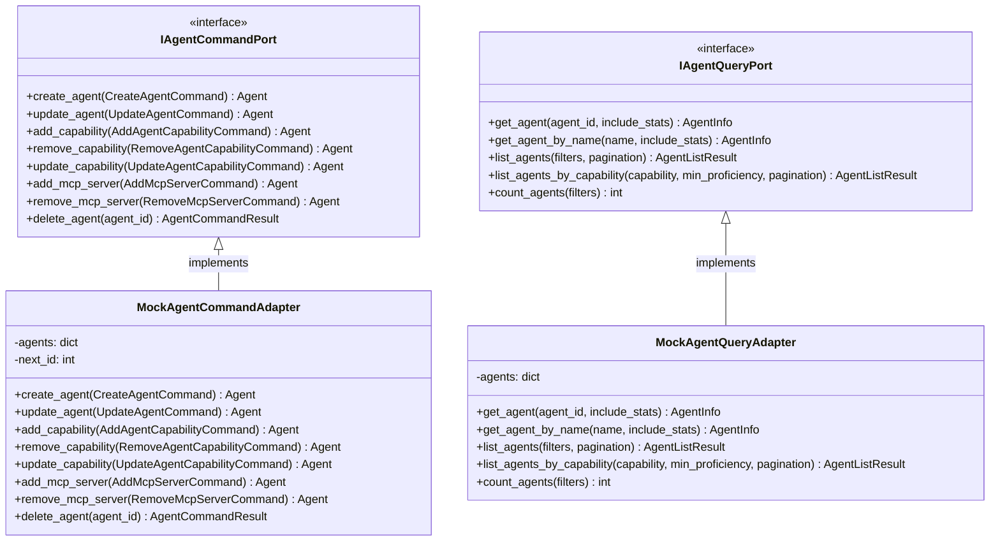

# Agent Management Input Ports

This documentation covers the input ports responsible for agent registry and management operations, including both command (write) and query (read) operations.

## Purpose

The agent management input ports provide the system boundary for all agent registry operations. These ports abstract the agent lifecycle, including creation, updates, capability management, and agent discovery. Agents are the specialized AI components that perform work items, so managing their registry, capabilities, and configuration is a core responsibility.

The ports follow CQRS (Command Query Responsibility Segregation) principles:
- **IAgentCommandPort**: Write operations for agent creation, updates, and capability management
- **IAgentQueryPort**: Read-only access to agent registry information and execution statistics

## Interface Definition

### IAgentCommandPort

```python
from abc import ABC, abstractmethod
from dataclasses import dataclass
from codetoreum.domain.agent import Agent, AgentCapability, AgentType

@dataclass
class CreateAgentCommand:
    """Command to create a new agent."""
    name: str
    display_name: str
    agent_type: AgentType
    role_description: str
    model: str
    capabilities: dict[str, AgentCapability]
    timeout_seconds: int = 300
    max_retries: int = 3
    requires_docker: bool = True
    requires_dev_container: bool = False
    makes_code_changes: bool = False
    filesystem_write_allowed: bool = True
    mcp_servers: list[str] | None = None

@dataclass
class UpdateAgentCommand:
    """Command to update an existing agent."""
    agent_id: str
    display_name: str | None = None
    role_description: str | None = None
    model: str | None = None
    timeout_seconds: int | None = None
    max_retries: int | None = None
    requires_docker: bool | None = None
    requires_dev_container: bool | None = None
    makes_code_changes: bool | None = None
    filesystem_write_allowed: bool | None = None

@dataclass
class AddAgentCapabilityCommand:
    """Command to add a capability to an agent."""
    agent_id: str
    capability: AgentCapability

@dataclass
class RemoveAgentCapabilityCommand:
    """Command to remove a capability from an agent."""
    agent_id: str
    skill: str

@dataclass
class UpdateAgentCapabilityCommand:
    """Command to update capability proficiency."""
    agent_id: str
    skill: str
    proficiency: float

@dataclass
class AddMcpServerCommand:
    """Command to add an MCP server to agent configuration."""
    agent_id: str
    server_name: str

@dataclass
class RemoveMcpServerCommand:
    """Command to remove an MCP server from agent configuration."""
    agent_id: str
    server_name: str

class IAgentCommandPort(ABC):
    """
    Agent Command Input Port.

    Provides write operations for agent registry management.
    """

    @abstractmethod
    async def create_agent(self, command: CreateAgentCommand) -> Agent:
        """Create a new agent."""
        pass

    @abstractmethod
    async def update_agent(self, command: UpdateAgentCommand) -> Agent:
        """Update an existing agent."""
        pass

    @abstractmethod
    async def add_capability(self, command: AddAgentCapabilityCommand) -> Agent:
        """Add a capability to an agent."""
        pass

    @abstractmethod
    async def remove_capability(self, command: RemoveAgentCapabilityCommand) -> Agent:
        """Remove a capability from an agent."""
        pass

    @abstractmethod
    async def update_capability(self, command: UpdateAgentCapabilityCommand) -> Agent:
        """Update capability proficiency."""
        pass

    @abstractmethod
    async def add_mcp_server(self, command: AddMcpServerCommand) -> Agent:
        """Add an MCP server to agent configuration."""
        pass

    @abstractmethod
    async def remove_mcp_server(self, command: RemoveMcpServerCommand) -> Agent:
        """Remove an MCP server from agent configuration."""
        pass

    @abstractmethod
    async def delete_agent(self, agent_id: str) -> AgentCommandResult:
        """Delete an agent (soft delete)."""
        pass
```

### IAgentQueryPort

```python
from abc import ABC, abstractmethod
from dataclasses import dataclass
from datetime import datetime
from enum import Enum

@dataclass
class AgentFilters:
    """Filters for agent queries."""
    capability: str | None = None
    agent_type: AgentType | None = None
    requires_docker: bool | None = None
    makes_code_changes: bool | None = None

class AgentSortField(Enum):
    """Fields available for sorting agents."""
    NAME = "name"
    DISPLAY_NAME = "display_name"
    AGENT_TYPE = "agent_type"
    CREATED_AT = "created_at"
    UPDATED_AT = "updated_at"

@dataclass
class AgentPaginationParams:
    """Pagination parameters for agent list."""
    offset: int = 0
    limit: int = 20
    sort_by: AgentSortField = AgentSortField.UPDATED_AT
    sort_order: SortOrder = SortOrder.DESC

@dataclass
class AgentExecutionStats:
    """Execution statistics for an agent."""
    total_executions: int
    successful_executions: int
    failed_executions: int
    timeout_executions: int
    average_duration_seconds: float | None
    last_execution_at: datetime | None

@dataclass
class AgentInfo:
    """Agent information for query results."""
    id: str
    name: str
    display_name: str
    agent_type: str
    role_description: str
    model: str
    timeout_seconds: int
    max_retries: int
    requires_docker: bool
    requires_dev_container: bool
    makes_code_changes: bool
    filesystem_write_allowed: bool
    mcp_servers: list[str]
    created_at: datetime
    updated_at: datetime
    capabilities: dict
    environment_variables: dict | None = None
    execution_stats: AgentExecutionStats | None = None

@dataclass
class AgentListResult:
    """Result for agent list queries."""
    agents: list[AgentInfo]
    total_count: int
    offset: int
    limit: int
    has_next: bool

class IAgentQueryPort(ABC):
    """
    Agent Query Input Port.

    Provides read-only access to agent registry information.
    """

    @abstractmethod
    async def get_agent(self, agent_id: str, include_stats: bool = False) -> AgentInfo:
        """Get agent by ID."""
        pass

    @abstractmethod
    async def get_agent_by_name(self, name: str, include_stats: bool = False) -> AgentInfo:
        """Get agent by name."""
        pass

    @abstractmethod
    async def list_agents(
        self, filters: AgentFilters | None = None, pagination: AgentPaginationParams | None = None
    ) -> AgentListResult:
        """List agents with optional filtering and pagination."""
        pass

    @abstractmethod
    async def list_agents_by_capability(
        self,
        capability: str,
        min_proficiency: float = 0.0,
        pagination: AgentPaginationParams | None = None,
    ) -> AgentListResult:
        """List agents that have a specific capability."""
        pass

    @abstractmethod
    async def count_agents(self, filters: AgentFilters | None = None) -> int:
        """Count agents matching filters."""
        pass
```

## Methods

### IAgentCommandPort Methods

| Method | Parameters | Return Type | Description |
|---|---|---|---|
| `create_agent()` | `command: CreateAgentCommand` | `Agent` | Create a new agent in the registry |
| `update_agent()` | `command: UpdateAgentCommand` | `Agent` | Update agent properties and settings |
| `add_capability()` | `command: AddAgentCapabilityCommand` | `Agent` | Add a skill/capability to an agent |
| `remove_capability()` | `command: RemoveAgentCapabilityCommand` | `Agent` | Remove a skill/capability from an agent |
| `update_capability()` | `command: UpdateAgentCapabilityCommand` | `Agent` | Update capability proficiency level |
| `add_mcp_server()` | `command: AddMcpServerCommand` | `Agent` | Add an MCP server to agent configuration |
| `remove_mcp_server()` | `command: RemoveMcpServerCommand` | `Agent` | Remove an MCP server from agent configuration |
| `delete_agent()` | `agent_id: str` | `AgentCommandResult` | Soft delete an agent from the registry |

### IAgentQueryPort Methods

| Method | Parameters | Return Type | Description |
|---|---|---|---|
| `get_agent()` | `agent_id: str, include_stats: bool` | `AgentInfo` | Retrieve agent by unique identifier |
| `get_agent_by_name()` | `name: str, include_stats: bool` | `AgentInfo` | Retrieve agent by name (unique field) |
| `list_agents()` | `filters: AgentFilters, pagination: AgentPaginationParams` | `AgentListResult` | List all agents with optional filtering and pagination |
| `list_agents_by_capability()` | `capability: str, min_proficiency: float, pagination: AgentPaginationParams` | `AgentListResult` | Find agents with specific capability above proficiency threshold |
| `count_agents()` | `filters: AgentFilters` | `int` | Count agents matching filters |

## Events Emitted

This port does not directly emit domain events. Events are emitted by the application services that invoke these commands, allowing for loosely coupled event handling. Operations such as agent creation, updates, and capability changes trigger corresponding events in the event bus.

## Error Contracts

- **AgentNotFoundError** — When attempting to access an agent that doesn't exist (get, update, delete, capability operations)
- **DomainError** — When agent creation or update fails validation (duplicate name, invalid proficiency, etc.)
- **ValidationError** — When command parameters fail validation (invalid agent type, timeout < 0, etc.)
- **ExternalServiceError** — When the adapter cannot persist the change to the backend storage
- **ConflictError** — When creating an agent with a name that already exists

## Adapter Implementations

| Adapter Class | Type | File Path | Notes |
|---|---|---|---|
| `MockAgentCommandAdapter` | Testing | `adapters/primary/input_port_adapters/mock/mock_agent_command_adapter.py` | In-memory implementation for testing and simulation |
| `MockAgentQueryAdapter` | Testing | `adapters/primary/input_port_adapters/mock/mock_agent_query_adapter.py` | In-memory implementation for testing and simulation |

## Diagram


