# Configuration and Metrics Input Ports

This documentation covers the input ports for system configuration management and metrics querying.

## Purpose

The configuration and metrics input ports provide:

- **IConfigurationCommandPort**: Write operations for project, agent, and pipeline configuration updates
- **IConfigurationQueryPort**: Read access to all system configuration
- **IMetricsQueryPort**: Access to system metrics and performance data

These ports abstract configuration storage and metrics collection.

## Interface Definition

### IConfigurationCommandPort

```python
class IConfigurationCommandPort(ABC):
    """Input port for configuration management."""

    @abstractmethod
    async def update_project_config(self, command: UpdateProjectConfigCommand) -> ConfigurationCommandResult:
        """Update project configuration."""
        pass

    @abstractmethod
    async def update_agent_config(self, command: UpdateAgentConfigCommand) -> ConfigurationCommandResult:
        """Update agent configuration."""
        pass

    @abstractmethod
    async def update_pipeline_config(self, command: UpdatePipelineConfigCommand) -> ConfigurationCommandResult:
        """Update pipeline configuration."""
        pass

    @abstractmethod
    async def add_environment_variable(self, command: AddEnvironmentVariableCommand) -> ConfigurationCommandResult:
        """Add environment variable."""
        pass

    @abstractmethod
    async def remove_environment_variable(self, command: RemoveEnvironmentVariableCommand) -> ConfigurationCommandResult:
        """Remove environment variable."""
        pass

    @abstractmethod
    async def mount_command(self, command: MountCommandCommand) -> ConfigurationCommandResult:
        """Mount command in configuration."""
        pass

    @abstractmethod
    async def unmount_command(self, command: UnmountCommandCommand) -> ConfigurationCommandResult:
        """Unmount command from configuration."""
        pass

    @abstractmethod
    async def mount_subagent(self, command: MountSubAgentCommand) -> ConfigurationCommandResult:
        """Mount subagent in configuration."""
        pass

    @abstractmethod
    async def unmount_subagent(self, command: UnmountSubAgentCommand) -> ConfigurationCommandResult:
        """Unmount subagent from configuration."""
        pass
```

### IConfigurationQueryPort

```python
class IConfigurationQueryPort(ABC):
    """Input port for configuration queries."""

    @abstractmethod
    async def get_project_config(self, project_id: str, include_secrets: bool = False) -> ProjectConfigInfo:
        """Get project configuration by ID."""
        pass

    @abstractmethod
    async def get_project_config_by_name(self, project_name: str, include_secrets: bool = False) -> ProjectConfigInfo:
        """Get project configuration by name."""
        pass

    @abstractmethod
    async def get_agent_config(self, project_id: str, agent_name: str) -> AgentConfigInfo:
        """Get agent configuration."""
        pass

    @abstractmethod
    async def get_pipeline_config(self, project_id: str, pipeline_name: str) -> PipelineConfigInfo:
        """Get pipeline configuration."""
        pass

    @abstractmethod
    async def list_projects(self, pagination: PaginationParams | None = None) -> list[ProjectConfigInfo]:
        """List all projects."""
        pass

    @abstractmethod
    async def list_agents(self, project_id: str, pagination: PaginationParams | None = None) -> list[AgentConfigInfo]:
        """List agents in project."""
        pass

    @abstractmethod
    async def list_pipelines(self, project_id: str, pagination: PaginationParams | None = None) -> list[PipelineConfigInfo]:
        """List pipelines in project."""
        pass

    @abstractmethod
    async def search_configs(self, query: str, config_type: str | None = None) -> list[dict]:
        """Search configuration."""
        pass

    @abstractmethod
    async def get_config_version_history(self, config_id: str, config_type: str) -> ConfigVersionHistoryResult:
        """Get configuration version history."""
        pass

    @abstractmethod
    async def get_config_version(self, config_id: str, config_type: str, version: int) -> dict[str, Any]:
        """Get specific configuration version."""
        pass

    @abstractmethod
    async def count_configs(self, config_type: str | None = None, project_id: str | None = None) -> int:
        """Count configurations matching criteria."""
        pass
```

### IMetricsQueryPort

```python
class IMetricsQueryPort(ABC):
    """Input port for metrics queries."""

    @abstractmethod
    async def get_metric(self, metric_name: str) -> MetricValue:
        """Get metric by name."""
        pass

    @abstractmethod
    async def get_metrics_range(
        self,
        metric_name: str,
        start_time: datetime,
        end_time: datetime,
        step: str = "1m"
    ) -> MetricsRangeResult:
        """Get metric values over time range."""
        pass

    @abstractmethod
    async def query_metrics(
        self,
        query: str,
        start_time: datetime | None = None,
        end_time: datetime | None = None
    ) -> MetricsQueryResult:
        """Query metrics with custom query."""
        pass

    @abstractmethod
    async def get_system_health(self) -> SystemHealthInfo:
        """Get current system health metrics."""
        pass

    @abstractmethod
    async def get_agent_metrics(self, agent_id: str) -> AgentMetricsInfo:
        """Get metrics for specific agent."""
        pass

    @abstractmethod
    async def get_project_metrics(self, project_id: str) -> ProjectMetricsInfo:
        """Get metrics for specific project."""
        pass
```

## Methods

### IConfigurationCommandPort Methods

| Method | Parameters | Return Type | Description |
|---|---|---|---|
| `update_project_config()` | `command: UpdateProjectConfigCommand` | `ConfigurationCommandResult` | Update project settings |
| `update_agent_config()` | `command: UpdateAgentConfigCommand` | `ConfigurationCommandResult` | Update agent configuration |
| `update_pipeline_config()` | `command: UpdatePipelineConfigCommand` | `ConfigurationCommandResult` | Update pipeline configuration |
| `add_environment_variable()` | `command: AddEnvironmentVariableCommand` | `ConfigurationCommandResult` | Add environment variable |
| `remove_environment_variable()` | `command: RemoveEnvironmentVariableCommand` | `ConfigurationCommandResult` | Remove environment variable |
| `mount_command()` | `command: MountCommandCommand` | `ConfigurationCommandResult` | Mount command in config |
| `unmount_command()` | `command: UnmountCommandCommand` | `ConfigurationCommandResult` | Unmount command from config |
| `mount_subagent()` | `command: MountSubAgentCommand` | `ConfigurationCommandResult` | Mount subagent in config |
| `unmount_subagent()` | `command: UnmountSubAgentCommand` | `ConfigurationCommandResult` | Unmount subagent from config |

### IConfigurationQueryPort Methods

| Method | Parameters | Return Type | Description |
|---|---|---|---|
| `get_project_config()` | `project_id, include_secrets` | `ProjectConfigInfo` | Get project configuration |
| `get_project_config_by_name()` | `project_name, include_secrets` | `ProjectConfigInfo` | Get project by name |
| `get_agent_config()` | `project_id, agent_name` | `AgentConfigInfo` | Get agent configuration |
| `get_pipeline_config()` | `project_id, pipeline_name` | `PipelineConfigInfo` | Get pipeline configuration |
| `list_projects()` | `pagination` | `list[ProjectConfigInfo]` | List all projects |
| `list_agents()` | `project_id, pagination` | `list[AgentConfigInfo]` | List project agents |
| `list_pipelines()` | `project_id, pagination` | `list[PipelineConfigInfo]` | List project pipelines |
| `search_configs()` | `query, config_type` | `list[dict]` | Search configurations |
| `get_config_version_history()` | `config_id, config_type` | `ConfigVersionHistoryResult` | Get version history |
| `get_config_version()` | `config_id, config_type, version` | `dict[str, Any]` | Get specific version |
| `count_configs()` | `config_type, project_id` | `int` | Count configurations |

### IMetricsQueryPort Methods

| Method | Parameters | Return Type | Description |
|---|---|---|---|
| `get_metric()` | `metric_name: str` | `MetricValue` | Get current metric value |
| `get_metrics_range()` | `metric_name, start_time, end_time, step` | `MetricsRangeResult` | Get metric over time range |
| `query_metrics()` | `query, start_time, end_time` | `MetricsQueryResult` | Query with custom query |
| `get_system_health()` | — | `SystemHealthInfo` | Get overall system health |
| `get_agent_metrics()` | `agent_id: str` | `AgentMetricsInfo` | Get agent metrics |
| `get_project_metrics()` | `project_id: str` | `ProjectMetricsInfo` | Get project metrics |

## Events Emitted

This port does not emit domain events. Configuration changes may trigger application-level events via services.

## Error Contracts

- **ProjectNotFoundError** — When project doesn't exist
- **ConfigNotFoundError** — When configuration doesn't exist
- **ValidationError** — When configuration invalid
- **VersionNotFoundError** — When configuration version doesn't exist
- **MetricsNotAvailableError** — When metrics data unavailable

## Adapter Implementations

| Adapter Class | Type | File Path | Notes |
|---|---|---|---|
| `MockConfigurationCommandAdapter` | Testing | `adapters/primary/input_port_adapters/mock/` | In-memory configuration command implementation |
| `MockConfigurationQueryAdapter` | Testing | `adapters/primary/input_port_adapters/mock/` | In-memory configuration query implementation |
| `MockMetricsQueryAdapter` | Testing | `adapters/primary/input_port_adapters/mock/` | In-memory metrics query implementation |

## Diagram

```mermaid
classDiagram
    class IConfigurationCommandPort {
        <<interface>>
        +update_project_config(UpdateProjectConfigCommand) ConfigurationCommandResult
        +update_agent_config(UpdateAgentConfigCommand) ConfigurationCommandResult
        +update_pipeline_config(UpdatePipelineConfigCommand) ConfigurationCommandResult
        +add_environment_variable(AddEnvironmentVariableCommand) ConfigurationCommandResult
        +mount_command(MountCommandCommand) ConfigurationCommandResult
        +mount_subagent(MountSubAgentCommand) ConfigurationCommandResult
    }

    class IConfigurationQueryPort {
        <<interface>>
        +get_project_config(project_id, include_secrets) ProjectConfigInfo
        +get_project_config_by_name(project_name, include_secrets) ProjectConfigInfo
        +get_agent_config(project_id, agent_name) AgentConfigInfo
        +list_projects(pagination) list
        +search_configs(query, config_type) list
        +count_configs(config_type, project_id) int
    }

    class IMetricsQueryPort {
        <<interface>>
        +get_metric(metric_name) MetricValue
        +get_metrics_range(metric_name, start_time, end_time, step) MetricsRangeResult
        +query_metrics(query, start_time, end_time) MetricsQueryResult
        +get_system_health() SystemHealthInfo
        +get_agent_metrics(agent_id) AgentMetricsInfo
    }
```


