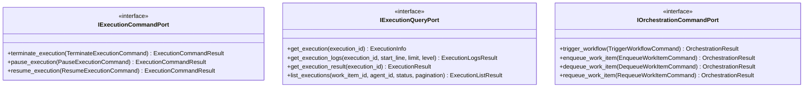

# Execution Management Input Ports

This documentation covers the input ports for agent execution lifecycle management and orchestration control.

## Purpose

The execution management input ports define the contract for:

- **IExecutionCommandPort**: Control execution lifecycle (terminate, pause, resume)
- **IExecutionQueryPort**: Query execution status, logs, and results
- **IOrchestrationCommandPort**: High-level orchestration commands (trigger workflows, manage queues)

These ports abstract the interaction with containerized agent executions.

## Interface Definition

### IExecutionCommandPort

```python
class IExecutionCommandPort(ABC):
    """Input port for execution lifecycle management."""
    
    @abstractmethod
    async def terminate_execution(self, command: TerminateExecutionCommand) -> ExecutionCommandResult:
        """Terminate a running execution."""
        pass
    
    @abstractmethod
    async def pause_execution(self, command: PauseExecutionCommand) -> ExecutionCommandResult:
        """Pause a running execution."""
        pass
    
    @abstractmethod
    async def resume_execution(self, command: ResumeExecutionCommand) -> ExecutionCommandResult:
        """Resume a paused execution."""
        pass
```

### IExecutionQueryPort

```python
class IExecutionQueryPort(ABC):
    """Input port for execution queries."""
    
    @abstractmethod
    async def get_execution(self, execution_id: str) -> ExecutionInfo:
        """Get execution details."""
        pass
    
    @abstractmethod
    async def get_execution_logs(
        self,
        execution_id: str,
        start_line: int = 0,
        limit: int = 1000,
        level: str | None = None
    ) -> ExecutionLogsResult:
        """Get execution logs."""
        pass
    
    @abstractmethod
    async def get_execution_result(self, execution_id: str) -> ExecutionResult:
        """Get execution result and output."""
        pass
    
    @abstractmethod
    async def list_executions(
        self,
        work_item_id: str | None = None,
        agent_id: str | None = None,
        status: ExecutionStatus | None = None,
        pagination: ExecutionPaginationParams | None = None
    ) -> ExecutionListResult:
        """List executions with filtering."""
        pass
```

### IOrchestrationCommandPort

```python
class IOrchestrationCommandPort(ABC):
    """Input port for orchestration commands."""
    
    @abstractmethod
    async def trigger_workflow(self, command: TriggerWorkflowCommand) -> OrchestrationResult:
        """Trigger a workflow."""
        pass
    
    @abstractmethod
    async def enqueue_work_item(self, command: EnqueueWorkItemCommand) -> OrchestrationResult:
        """Enqueue a work item for processing."""
        pass
    
    @abstractmethod
    async def dequeue_work_item(self, command: DequeueWorkItemCommand) -> OrchestrationResult:
        """Dequeue and process a work item."""
        pass
    
    @abstractmethod
    async def requeue_work_item(self, command: RequeueWorkItemCommand) -> OrchestrationResult:
        """Requeue a work item."""
        pass
```

## Methods

### IExecutionCommandPort Methods

| Method | Parameters | Return Type | Description |
|---|---|---|---|
| `terminate_execution()` | `command: TerminateExecutionCommand` | `ExecutionCommandResult` | Terminate running execution and cleanup |
| `pause_execution()` | `command: PauseExecutionCommand` | `ExecutionCommandResult` | Pause execution |
| `resume_execution()` | `command: ResumeExecutionCommand` | `ExecutionCommandResult` | Resume paused execution |

### IExecutionQueryPort Methods

| Method | Parameters | Return Type | Description |
|---|---|---|---|
| `get_execution()` | `execution_id: str` | `ExecutionInfo` | Get execution status and details |
| `get_execution_logs()` | `execution_id, start_line, limit, level` | `ExecutionLogsResult` | Get execution logs with filtering |
| `get_execution_result()` | `execution_id: str` | `ExecutionResult` | Get execution result and output |
| `list_executions()` | `work_item_id, agent_id, status, pagination` | `ExecutionListResult` | List executions with filtering |

### IOrchestrationCommandPort Methods

| Method | Parameters | Return Type | Description |
|---|---|---|---|
| `trigger_workflow()` | `command: TriggerWorkflowCommand` | `OrchestrationResult` | Trigger workflow execution |
| `enqueue_work_item()` | `command: EnqueueWorkItemCommand` | `OrchestrationResult` | Enqueue work item for processing |
| `dequeue_work_item()` | `command: DequeueWorkItemCommand` | `OrchestrationResult` | Dequeue and process work item |
| `requeue_work_item()` | `command: RequeueWorkItemCommand` | `OrchestrationResult` | Requeue work item |

## Events Emitted

This port does not directly emit domain events. Events are emitted by application services.

## Error Contracts

- **ExecutionNotFoundError** — When execution doesn't exist
- **InvalidStateError** — When operation invalid for current state
- **ExecutionTimeoutError** — When execution exceeds timeout
- **ContainerError** — When container operation fails
- **ValidationError** — When command parameters invalid

## Adapter Implementations

| Adapter Class | Type | File Path | Notes |
|---|---|---|---|
| `MockExecutionCommandAdapter` | Testing | `adapters/primary/input_port_adapters/mock/` | In-memory execution command implementation |
| `MockExecutionQueryAdapter` | Testing | `adapters/primary/input_port_adapters/mock/` | In-memory execution query implementation |
| `MockOrchestrationCommandAdapter` | Testing | `adapters/primary/input_port_adapters/mock/` | In-memory orchestration implementation |

## Diagram


