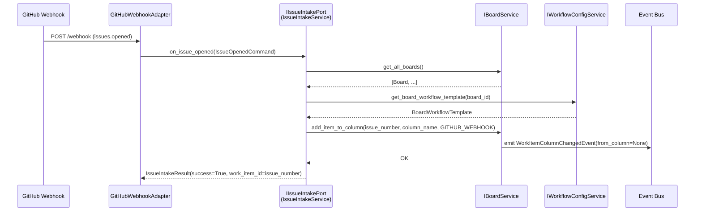

# System Services Input Ports

This documentation covers the input ports for authentication, audit logging, workspace management, and conversational loop orchestration.

## Purpose

The system services input ports provide:

- **IAuthenticationPort**: User authentication, authorization, and token management
- **IAuditQueryPort**: Access to audit trail and event history
- **IWorkspaceQueryPort**: Query workspace status, usage, and logs
- **IConversationalLoopService**: Multi-turn agent dialogue management
- **IIssueIntakePort**: Inbound webhook handler for issue creation events

These ports abstract critical cross-cutting system services.

## Interface Definition

### IAuthenticationPort

```python
class IAuthenticationPort(ABC):
    """Input port for authentication and authorization."""

    @abstractmethod
    async def create_user(self, command: CreateUserCommand) -> User:
        """Create a new user."""
        pass

    @abstractmethod
    async def update_user(self, command: UpdateUserCommand) -> User:
        """Update user information."""
        pass

    @abstractmethod
    async def get_user(self, user_id: UUID) -> User:
        """Get user by ID."""
        pass

    @abstractmethod
    async def get_user_by_username(self, username: str) -> User:
        """Get user by username."""
        pass

    @abstractmethod
    async def delete_user(self, user_id: UUID) -> None:
        """Delete user (soft delete)."""
        pass

    @abstractmethod
    async def login(self, command: LoginCommand) -> LoginResult:
        """Authenticate user with credentials."""
        pass

    @abstractmethod
    async def validate_token(self, token: str) -> AuthContext:
        """Validate authentication token."""
        pass

    @abstractmethod
    async def refresh_token(self, refresh_token: str) -> LoginResult:
        """Refresh authentication token."""
        pass

    @abstractmethod
    async def create_api_key(self, command: CreateAPIKeyCommand) -> tuple[APIKey, str]:
        """Create API key for programmatic access."""
        pass

    @abstractmethod
    async def validate_api_key(self, key: str) -> AuthContext:
        """Validate API key."""
        pass

    @abstractmethod
    async def revoke_api_key(self, key_id: UUID, requesting_user_id: UUID, is_admin: bool) -> None:
        """Revoke API key."""
        pass

    @abstractmethod
    async def list_api_keys(self, user_id: UUID) -> list[APIKey]:
        """List API keys for user."""
        pass

    @abstractmethod
    async def check_permission(self, auth_context: AuthContext, permission: str) -> bool:
        """Check if user has permission."""
        pass
```

### IAuditQueryPort

```python
class IAuditQueryPort(ABC):
    """Input port for audit log queries."""

    @abstractmethod
    async def query_audit_events(
        self,
        filters: AuditEventFilters | None = None,
        pagination: PaginationParams | None = None
    ) -> AuditEventListResult:
        """Query audit events with filtering."""
        pass

    @abstractmethod
    async def get_audit_trail(self, entity_id: str, entity_type: str) -> AuditTrailResult:
        """Get complete audit trail for entity."""
        pass

    @abstractmethod
    async def get_audit_event(self, event_id: str) -> AuditEvent:
        """Get specific audit event."""
        pass

    @abstractmethod
    async def count_audit_events(self, filters: AuditEventFilters | None = None) -> int:
        """Count audit events matching filters."""
        pass
```

### IWorkspaceQueryPort

```python
class IWorkspaceQueryPort(ABC):
    """Input port for workspace queries."""

    @abstractmethod
    async def get_workspace(self, workspace_id: str) -> WorkspaceInfo:
        """Get workspace by ID."""
        pass

    @abstractmethod
    async def get_workspace_by_execution(self, execution_id: str) -> WorkspaceInfo:
        """Get workspace for execution."""
        pass

    @abstractmethod
    async def list_workspaces(
        self,
        filters: WorkspaceFilters | None = None,
        pagination: PaginationParams | None = None
    ) -> WorkspaceListResult:
        """List workspaces with filtering."""
        pass

    @abstractmethod
    async def list_active_workspaces(self, pagination: PaginationParams | None = None) -> WorkspaceListResult:
        """List currently active workspaces."""
        pass

    @abstractmethod
    async def get_resource_usage_summary(self, project_id: str | None = None) -> dict[str, Any]:
        """Get resource usage summary."""
        pass

    @abstractmethod
    async def count_workspaces(self, filters: WorkspaceFilters | None = None) -> int:
        """Count workspaces matching filters."""
        pass

    @abstractmethod
    async def get_workspace_logs(
        self,
        workspace_id: str,
        limit: int = 1000,
        level: str | None = None
    ) -> WorkspaceLogsResult:
        """Get workspace logs."""
        pass
```

### IConversationalLoopService

```python
class IConversationalLoopService(ABC):
    """Input port for multi-turn agent dialogue management."""

    @abstractmethod
    async def initialize_loop(
        self,
        work_item_id: str,
        agent_id: str,
        initial_context: dict[str, Any]
    ) -> ConversationalSessionState:
        """Initialize new conversational loop."""
        pass

    @abstractmethod
    async def handle_comment_event(self, event: CommentNeedsResponseEvent) -> None:
        """Handle comment event in loop."""
        pass

    @abstractmethod
    async def handle_column_change_event(self, event: WorkItemColumnChangedEvent) -> None:
        """Handle workflow column change in loop."""
        pass

    @abstractmethod
    async def cleanup_loop(self, work_item_id: str, reason: str) -> None:
        """Clean up conversational loop."""
        pass

    @abstractmethod
    async def load_session_state(self, work_item_id: str) -> ConversationalSessionState | None:
        """Load conversational session state."""
        pass

    @abstractmethod
    async def save_session_state(self, state: ConversationalSessionState) -> None:
        """Save conversational session state."""
        pass
```

## Methods

### IAuthenticationPort Methods

| Method | Parameters | Return Type | Description |
|---|---|---|---|
| `create_user()` | `command: CreateUserCommand` | `User` | Create new system user |
| `update_user()` | `command: UpdateUserCommand` | `User` | Update user profile |
| `get_user()` | `user_id: UUID` | `User` | Get user by ID |
| `get_user_by_username()` | `username: str` | `User` | Get user by username |
| `delete_user()` | `user_id: UUID` | `None` | Delete user (soft delete) |
| `login()` | `command: LoginCommand` | `LoginResult` | Authenticate with credentials |
| `validate_token()` | `token: str` | `AuthContext` | Validate JWT token |
| `refresh_token()` | `refresh_token: str` | `LoginResult` | Get new token pair |
| `create_api_key()` | `command: CreateAPIKeyCommand` | `tuple[APIKey, str]` | Create API key |
| `validate_api_key()` | `key: str` | `AuthContext` | Validate API key |
| `revoke_api_key()` | `key_id, requesting_user_id, is_admin` | `None` | Revoke API key |
| `list_api_keys()` | `user_id: UUID` | `list[APIKey]` | List user API keys |
| `check_permission()` | `auth_context, permission` | `bool` | Check user permission |

### IAuditQueryPort Methods

| Method | Parameters | Return Type | Description |
|---|---|---|---|
| `query_audit_events()` | `filters, pagination` | `AuditEventListResult` | Query audit events |
| `get_audit_trail()` | `entity_id, entity_type` | `AuditTrailResult` | Get entity audit trail |
| `get_audit_event()` | `event_id: str` | `AuditEvent` | Get specific event |
| `count_audit_events()` | `filters` | `int` | Count matching events |

### IWorkspaceQueryPort Methods

| Method | Parameters | Return Type | Description |
|---|---|---|---|
| `get_workspace()` | `workspace_id: str` | `WorkspaceInfo` | Get workspace by ID |
| `get_workspace_by_execution()` | `execution_id: str` | `WorkspaceInfo` | Get workspace for execution |
| `list_workspaces()` | `filters, pagination` | `WorkspaceListResult` | List workspaces |
| `list_active_workspaces()` | `pagination` | `WorkspaceListResult` | List active workspaces |
| `get_resource_usage_summary()` | `project_id` | `dict[str, Any]` | Get resource usage metrics |
| `count_workspaces()` | `filters` | `int` | Count workspaces |
| `get_workspace_logs()` | `workspace_id, limit, level` | `WorkspaceLogsResult` | Get workspace logs |

### IConversationalLoopService Methods

| Method | Parameters | Return Type | Description |
|---|---|---|---|
| `initialize_loop()` | `work_item_id, agent_id, initial_context` | `ConversationalSessionState` | Start conversational loop |
| `handle_comment_event()` | `event: CommentNeedsResponseEvent` | `None` | Process comment event |
| `handle_column_change_event()` | `event: WorkItemColumnChangedEvent` | `None` | Process column change event |
| `cleanup_loop()` | `work_item_id, reason` | `None` | End conversational loop |
| `load_session_state()` | `work_item_id: str` | `ConversationalSessionState \| None` | Load session state |
| `save_session_state()` | `state: ConversationalSessionState` | `None` | Persist session state |

## Events Emitted

This port does not directly emit domain events. Events are emitted by application services.

## Error Contracts

- **UserNotFoundError** — When user doesn't exist
- **AuthenticationError** — When credentials invalid
- **InvalidTokenError** — When token invalid or expired
- **PermissionDeniedError** — When user lacks required permission
- **WorkspaceNotFoundError** — When workspace doesn't exist
- **ValidationError** — When input parameters invalid

## Adapter Implementations

| Adapter Class | Type | File Path | Notes |
|---|---|---|---|
| `MockAuthenticationAdapter` | Testing | `adapters/primary/input_port_adapters/mock/` | In-memory authentication implementation |
| `MockAuditQueryAdapter` | Testing | `adapters/primary/input_port_adapters/mock/` | In-memory audit log implementation |
| `MockWorkspaceQueryAdapter` | Testing | `adapters/primary/input_port_adapters/mock/` | In-memory workspace query implementation |
| `MockConversationalLoopAdapter` | Testing | `adapters/primary/input_port_adapters/mock/` | In-memory conversational loop implementation |

## Diagram

```mermaid
classDiagram
    class IAuthenticationPort {
        <<interface>>
        +create_user(CreateUserCommand) User
        +get_user(user_id) User
        +login(LoginCommand) LoginResult
        +validate_token(token) AuthContext
        +refresh_token(refresh_token) LoginResult
        +create_api_key(CreateAPIKeyCommand) tuple
        +check_permission(auth_context, permission) bool
    }

    class IAuditQueryPort {
        <<interface>>
        +query_audit_events(filters, pagination) AuditEventListResult
        +get_audit_trail(entity_id, entity_type) AuditTrailResult
        +get_audit_event(event_id) AuditEvent
        +count_audit_events(filters) int
    }

    class IWorkspaceQueryPort {
        <<interface>>
        +get_workspace(workspace_id) WorkspaceInfo
        +get_workspace_by_execution(execution_id) WorkspaceInfo
        +list_workspaces(filters, pagination) WorkspaceListResult
        +list_active_workspaces(pagination) WorkspaceListResult
        +get_resource_usage_summary(project_id) dict
    }

    class IConversationalLoopService {
        <<interface>>
        +initialize_loop(work_item_id, agent_id, initial_context) ConversationalSessionState
        +handle_comment_event(CommentNeedsResponseEvent) None
        +handle_column_change_event(WorkItemColumnChangedEvent) None
        +cleanup_loop(work_item_id, reason) None
        +load_session_state(work_item_id) ConversationalSessionState
    }
```



### IIssueIntakePort

**File**: `ports/input/issue_intake.py`

**Purpose**: Entry point for newly opened GitHub issues arriving via webhook. Accepts an `IssueOpenedCommand` and places the issue on the project's board initial column, which triggers downstream orchestration via `WorkItemColumnChangedEvent`.

**Design assessment**: Needs documentation only. The interface is fully realized — one abstract method with a concrete application service implementation (`IssueIntakeService`) wired in production bootstrap.

#### Command and Result Types

```python
@dataclass(frozen=True)
class IssueOpenedCommand:
    """Command to handle a newly opened GitHub issue."""
    project_id: str          # Non-empty project identifier
    issue_number: str        # Non-empty GitHub issue number (used as work_item_id)
    issue_title: str | None = None
    issue_url: str | None = None

@dataclass(frozen=True)
class IssueIntakeResult:
    """Result of an issue intake operation."""
    success: bool
    work_item_id: str        # Non-empty; equals issue_number on both success and failure
    message: str             # Human-readable outcome description
    errors: tuple[str, ...] = ()   # Empty on success; contains error messages on failure
```

#### Interface Definition

```python
class IIssueIntakePort(ABC):
    """
    Input port for issue intake operations.

    Accepts issues from external sources (e.g., GitHub webhooks) and places
    them on the project board's initial column. Placement triggers a
    WorkItemColumnChangedEvent (from_column=None) which drives all downstream
    workflow orchestration.
    """

    @abstractmethod
    async def on_issue_opened(self, command: IssueOpenedCommand) -> IssueIntakeResult:
        """
        Handle a newly opened GitHub issue.

        Places the issue in the initial column (position=0) on the project's
        board, which triggers a WorkItemColumnChangedEvent for orchestration.

        Args:
            command: IssueOpenedCommand with project_id and issue_number

        Returns:
            IssueIntakeResult with success=True and work_item_id on success,
            or success=False with errors tuple on failure.

        Raises:
            Does not raise — failures are returned as IssueIntakeResult(success=False).
        """
```

#### Methods

| Method | Parameters | Return Type | Description |
|---|---|---|---|
| `on_issue_opened()` | `command: IssueOpenedCommand` | `IssueIntakeResult` | Place newly opened issue on board initial column |

#### Port Dependencies (Output Ports Used by Implementation)

| Output Port | Usage |
|---|---|
| `IBoardService` | `get_all_boards()` to find project board; `add_item_to_column()` to place issue in initial column with `MovedByType.GITHUB_WEBHOOK` |
| `IWorkflowConfigService` | `get_board_workflow_template(board_id)` to resolve the column at position 0 |

#### Events Emitted

`IIssueIntakePort` does not directly emit events. Events are emitted indirectly:

- `WorkItemColumnChangedEvent` — emitted by `IBoardService.add_item_to_column()` when the issue is placed on the board (from_column=None indicates first placement). This event drives all downstream workflow orchestration.

#### Error Contracts

This port never raises exceptions. All failure modes are returned as `IssueIntakeResult(success=False, errors=(...))`:

| Failure Condition | Message Pattern |
|---|---|
| No board configured for project | `"No boards configured for project {project_id}"` |
| No workflow template for board | `"No workflow template configured for board {board_id}"` |
| No initial column (position 0) in template | `"No initial column (position 0) found in template for board {board_id}"` |
| `PortError` from downstream adapter | Logged at ERROR with `exc_info=True`; error message returned in `errors` tuple |

#### Caller / Subscriber

| Caller | Location | Notes |
|---|---|---|
| `GitHubWebhookAdapter` | `adapters/primary/github_webhook_adapter.py` | Calls `on_issue_opened()` when GitHub sends an `issues.opened` webhook event |

#### Adapter Implementations

| Adapter Class | Type | Notes |
|---|---|---|
| `IssueIntakeService` | Production | `application/issue_intake_service.py` — full implementation; wired by `ProductionBootstrap` |

No mock adapter exists for this port. The webhook adapter guards with `if not self.issue_intake_port` and skips issue intake gracefully when not wired (e.g., simulation mode).

#### Diagram



### Diagnostics Endpoints

**Paths**: 
- `GET /api/v2/diagnostics/state` — System state snapshot
- `GET /api/v2/triggers/{event_id}` — Trigger/event lifecycle tracking

**Purpose**: Observability and debugging interfaces for system state and event tracking. These endpoints provide a unified view for diagnostics without requiring direct Redis introspection.

#### GET /api/v2/diagnostics/state

**Response Schema**:

```python
@dataclass
class DiagnosticsStateResponse:
    """Complete diagnostics state snapshot."""
    
    active_runs: list[ActiveRunInfo]  # From IActiveWorkflowRunRegistry.get_all_runs()
    pipeline_locks: list[LockHolderInfo]  # From IDistributedLock.get_all_holders()
    pipeline_queues: list[PipelineQueueState]  # From IPipelineQueue.list() per known key
    failed_event_stats: FailedEventStats | None  # From IFailedEventStore.get_stats()
    last_orphan_scan: OrphanScanResultInfo | None  # From IOrphanScanRegistry.get_last_scan()
    timestamp: datetime  # Query timestamp
```

**Sub-structures**:

```python
@dataclass
class ActiveRunInfo:
    work_item_id: str
    run_id: str
    stage_name: str
    project_id: str
    board_id: str
    started_at: str

@dataclass
class LockHolderInfo:
    lock_key: str
    holder_id: str
    acquired_at: datetime
    ttl_seconds: int
    expires_at: datetime
    holder_metadata: dict[str, str]

@dataclass
class PipelineQueueState:
    queue_key: str
    entries: list[QueueEntryInfo]
    depth: int

@dataclass
class FailedEventStats:
    total_failed_events: int
    pending_retries: int
    exhausted_retries: int
    total_retries_attempted: int
    total_retries_succeeded: int
    total_retries_failed: int
    oldest_event: datetime | None
    newest_event: datetime | None
    failure_reasons: dict[str, int] | None

@dataclass
class OrphanScanResultInfo:
    scan_id: str
    scanned_at: datetime
    locks_scanned: int
    orphaned_locks_found: int
    orphaned_locks_released: int
    errors: list[str]
```

**Use Cases**:
- **Debugging**: Understand the current state of locks, queues, and active runs
- **Monitoring**: Track failed event accumulation and recovery metrics
- **Orphan Detection**: See results of the last startup orphan scan

#### GET /api/v2/triggers/{event_id}

**Response Schema**:

```python
@dataclass
class TriggerLifecycleResponse:
    """Trigger/event lifecycle information."""
    
    event_id: str  # The queried event/trigger ID
    received_at: datetime  # When the event was first received
    status: str  # One of: "received", "queued", "in-progress", "completed", "failed"
    queue_position: int | None  # 0-indexed queue position if queued, else None
    active_run_id: str | None  # Workflow run ID if in-progress, else None
    failure_reason: str | None  # Failure description if failed, else None
    last_updated: datetime  # Timestamp of last status change
```

**Status Transitions**:

- **received**: Event first arrived; no processing yet (default initial state)
- **queued**: Event is in a pipeline queue waiting for lock acquisition
- **in-progress**: Workflow/execution running (detected by `WorkflowStartedEvent` or `ExecutionStartedEvent`)
- **completed**: Workflow/execution finished successfully (detected by `WorkflowCompletedEvent` or `ExecutionCompletedEvent`)
- **failed**: Workflow/execution failed or was dead-lettered (detected by `WorkflowFailedEvent`, `ExecutionFailedEvent`, or `EventDeadLetterQueuedEvent`)

**Status Detection**:

Status is determined by querying the event store and cross-referencing with:
- `IActiveWorkflowRunRegistry` for in-progress status
- `IPipelineQueue` for queue position
- Event types in the stream for state transitions

**Use Cases**:
- **Trigger Tracking**: Poll to see where a trigger is in the pipeline
- **Debugging**: Understand why a trigger hasn't been processed
- **API-Driven Automation**: Monitor trigger status without polling the event store directly

#### Caller / Subscriber

| Caller | Location | Notes |
|---|---|---|
| `run-bootstrap` skill | `bootstrap/run-bootstrap.py` | Queries `/diagnostics/state` and `/triggers/{event_id}` instead of direct Redis reads |
| Observability clients | (external) | Direct HTTP calls for debugging and monitoring |

#### Adapter Implementations

These endpoints are implemented directly by the FastAPI router (`adapters/primary/routers/diagnostics.py`):

| Component | Implementation | Notes |
|---|---|---|
| Diagnostics state | `create_diagnostics_router()` | Aggregates data from IActiveWorkflowRunRegistry, IDistributedLock, IPipelineQueue, IFailedEventStore, IOrphanScanRegistry |
| Trigger lifecycle | `create_diagnostics_router()` | Queries IEventStore and IActiveWorkflowRunRegistry for status determination |
