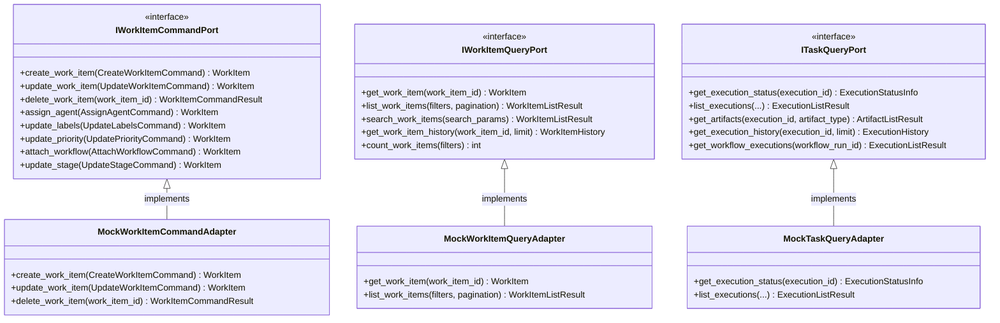

# Work Item Management Input Ports

This documentation covers the input ports for work item operations, including creation, updates, queries, and task/execution tracking.

## Purpose

The work item management input ports provide the system boundary for all work item lifecycle operations. Work items represent units of work that flow through the pipeline, and these ports abstract the ability to create, update, query, and track execution of work items. The ports follow CQRS patterns with separate command and query responsibilities:

- **IWorkItemCommandPort**: Write operations (creation, updates, assignments, status changes)
- **IWorkItemQueryPort**: Read operations (retrieval, listing, filtering, search)
- **ITaskQueryPort**: Execution task tracking and artifact management

## Interface Definition

### IWorkItemCommandPort

```python
from abc import ABC, abstractmethod
from dataclasses import dataclass
from codetoreum.domain.work_item import WorkItem, WorkItemPriority

@dataclass
class CreateWorkItemCommand:
    """Command to create a new work item"""
    project_id: str
    title: str
    description: str
    labels: list[str] | None = None
    priority: WorkItemPriority = WorkItemPriority.MEDIUM
    external_id: str | None = None
    external_url: str | None = None

@dataclass
class UpdateWorkItemCommand:
    """Command to update an existing work item"""
    work_item_id: str
    title: str | None = None
    description: str | None = None
    labels: list[str] | None = None
    priority: WorkItemPriority | None = None

@dataclass
class AssignAgentCommand:
    """Command to assign an agent to a work item"""
    work_item_id: str
    agent_id: str
    reason: str

@dataclass
class UpdateLabelsCommand:
    """Command to update work item labels"""
    work_item_id: str
    labels: list[str]

@dataclass
class UpdatePriorityCommand:
    """Command to update work item priority"""
    work_item_id: str
    priority: WorkItemPriority

@dataclass
class AttachWorkflowCommand:
    """Command to attach a workflow to a work item"""
    work_item_id: str
    workflow_id: str

@dataclass
class UpdateStageCommand:
    """Command to update work item stage"""
    work_item_id: str
    stage: str

class IWorkItemCommandPort(ABC):
    """
    Input port for work item commands.

    Provides write operations for work item creation, updates, and management.
    """

    @abstractmethod
    async def create_work_item(self, command: CreateWorkItemCommand) -> WorkItem:
        """Create a new work item."""
        pass

    @abstractmethod
    async def update_work_item(self, command: UpdateWorkItemCommand) -> WorkItem:
        """Update an existing work item."""
        pass

    @abstractmethod
    async def delete_work_item(self, work_item_id: str) -> WorkItemCommandResult:
        """Soft delete a work item."""
        pass

    @abstractmethod
    async def assign_agent(self, command: AssignAgentCommand) -> WorkItem:
        """Assign an agent to a work item."""
        pass

    @abstractmethod
    async def update_labels(self, command: UpdateLabelsCommand) -> WorkItem:
        """Update work item labels."""
        pass

    @abstractmethod
    async def update_priority(self, command: UpdatePriorityCommand) -> WorkItem:
        """Update work item priority."""
        pass

    @abstractmethod
    async def attach_workflow(self, command: AttachWorkflowCommand) -> WorkItem:
        """Attach a workflow to a work item."""
        pass

    @abstractmethod
    async def update_stage(self, command: UpdateStageCommand) -> WorkItem:
        """Update work item stage."""
        pass
```

### IWorkItemQueryPort

```python
from abc import ABC, abstractmethod
from dataclasses import dataclass
from datetime import datetime
from enum import Enum

class SortOrder(Enum):
    ASC = "asc"
    DESC = "desc"

class SortField(Enum):
    CREATED_AT = "created_at"
    UPDATED_AT = "updated_at"
    PRIORITY = "priority"
    TITLE = "title"
    STATUS = "status"

@dataclass
class WorkItemFilters:
    """Filters for querying work items"""
    project_id: str | None = None
    status: WorkItemStatus | None = None
    assignee: str | None = None
    labels: list[str] | None = None
    workflow_stage: str | None = None
    priority: WorkItemPriority | None = None
    external_id: str | None = None
    created_after: datetime | None = None
    created_before: datetime | None = None
    updated_after: datetime | None = None
    updated_before: datetime | None = None

@dataclass
class PaginationParams:
    """Pagination parameters"""
    offset: int = 0
    limit: int = 20
    sort_by: SortField = SortField.UPDATED_AT
    sort_order: SortOrder = SortOrder.DESC

@dataclass
class WorkItemSearchParams:
    """Search parameters for work items"""
    query: str
    filters: WorkItemFilters | None = None
    pagination: PaginationParams = field(default_factory=PaginationParams)

@dataclass
class WorkItemListResult:
    """Result of listing work items"""
    work_items: list[WorkItem]
    total_count: int
    offset: int
    limit: int
    has_next: bool

@dataclass
class WorkItemHistory:
    """History of a work item including all events"""
    work_item: WorkItem
    events: list[dict]
    total_events: int

class IWorkItemQueryPort(ABC):
    """
    Input port for work item queries.

    Provides read-only access to work item information.
    """

    @abstractmethod
    async def get_work_item(self, work_item_id: str) -> WorkItem:
        """Retrieve a single work item by ID."""
        pass

    @abstractmethod
    async def list_work_items(
        self, filters: WorkItemFilters | None = None, pagination: PaginationParams | None = None
    ) -> WorkItemListResult:
        """List work items with optional filtering and pagination."""
        pass

    @abstractmethod
    async def search_work_items(self, search_params: WorkItemSearchParams) -> WorkItemListResult:
        """Search work items by title and description."""
        pass

    @abstractmethod
    async def get_work_item_history(self, work_item_id: str, limit: int | None = None) -> WorkItemHistory:
        """Retrieve work item history including all events."""
        pass

    @abstractmethod
    async def count_work_items(self, filters: WorkItemFilters | None = None) -> int:
        """Count work items matching filters."""
        pass
```

### ITaskQueryPort

```python
from abc import ABC, abstractmethod
from dataclasses import dataclass, field
from datetime import datetime
from enum import Enum
from typing import Any

class ExecutionStatus(Enum):
    PENDING = "pending"
    RUNNING = "running"
    COMPLETED = "completed"
    FAILED = "failed"
    CANCELLED = "cancelled"
    PAUSED = "paused"

@dataclass
class ExecutionStatusInfo:
    """Detailed status information for an execution"""
    execution_id: str
    workflow_run_id: str
    work_item_id: str
    project_name: str
    pipeline_name: str
    stage_name: str
    agent_name: str
    status: ExecutionStatus
    started_at: datetime | None = None
    completed_at: datetime | None = None
    duration_seconds: float | None = None
    error_message: str | None = None
    retry_count: int = 0
    metadata: dict[str, Any] = field(default_factory=dict)

@dataclass
class ExecutionListItem:
    """Summary information for execution in a list"""
    execution_id: str
    workflow_run_id: str
    work_item_id: str
    stage_name: str
    agent_name: str
    status: ExecutionStatus
    started_at: datetime | None = None
    duration_seconds: float | None = None

@dataclass
class ExecutionListResult:
    """Result of listing executions"""
    executions: list[ExecutionListItem]
    total_count: int
    page: int
    page_size: int
    has_next: bool

@dataclass
class ArtifactInfo:
    """Information about an execution artifact"""
    artifact_id: str
    execution_id: str
    artifact_type: str
    name: str
    path: str
    size_bytes: int
    created_at: datetime
    mime_type: str | None = None
    metadata: dict[str, Any] = field(default_factory=dict)

@dataclass
class ArtifactListResult:
    """Result of listing artifacts"""
    artifacts: list[ArtifactInfo]
    total_count: int

@dataclass
class ExecutionHistoryEntry:
    """Single entry in execution history"""
    timestamp: datetime
    event_type: str
    message: str
    details: dict[str, Any] | None = None

@dataclass
class ExecutionHistory:
    """Complete execution history"""
    execution_id: str
    entries: list[ExecutionHistoryEntry]
    total_entries: int

class ITaskQueryPort(ABC):
    """
    Input port for task and execution queries.

    Provides read-only access to execution status, history, and artifacts.
    """

    @abstractmethod
    async def get_execution_status(self, execution_id: str) -> ExecutionStatusInfo:
        """Retrieve detailed status information for a specific execution."""
        pass

    @abstractmethod
    async def list_executions(
        self,
        workflow_run_id: str | None = None,
        work_item_id: str | None = None,
        project_name: str | None = None,
        status: ExecutionStatus | None = None,
        page: int = 1,
        page_size: int = 50,
    ) -> ExecutionListResult:
        """List executions matching specified criteria."""
        pass

    @abstractmethod
    async def get_artifacts(self, execution_id: str, artifact_type: str | None = None) -> ArtifactListResult:
        """Retrieve artifacts produced by an execution."""
        pass

    @abstractmethod
    async def get_execution_history(self, execution_id: str, limit: int | None = None) -> ExecutionHistory:
        """Retrieve the event history for an execution."""
        pass

    @abstractmethod
    async def get_workflow_executions(self, workflow_run_id: str) -> ExecutionListResult:
        """Retrieve all executions for a specific workflow run."""
        pass
```

## Methods

### IWorkItemCommandPort Methods

| Method | Parameters | Return Type | Description |
|---|---|---|---|
| `create_work_item()` | `command: CreateWorkItemCommand` | `WorkItem` | Create a new work item in a project |
| `update_work_item()` | `command: UpdateWorkItemCommand` | `WorkItem` | Update work item properties |
| `delete_work_item()` | `work_item_id: str` | `WorkItemCommandResult` | Soft delete a work item |
| `assign_agent()` | `command: AssignAgentCommand` | `WorkItem` | Assign an agent to work item |
| `update_labels()` | `command: UpdateLabelsCommand` | `WorkItem` | Update work item labels |
| `update_priority()` | `command: UpdatePriorityCommand` | `WorkItem` | Update work item priority level |
| `attach_workflow()` | `command: AttachWorkflowCommand` | `WorkItem` | Attach a workflow process to work item |
| `update_stage()` | `command: UpdateStageCommand` | `WorkItem` | Update work item workflow stage |

### IWorkItemQueryPort Methods

| Method | Parameters | Return Type | Description |
|---|---|---|---|
| `get_work_item()` | `work_item_id: str` | `WorkItem` | Retrieve a single work item by ID |
| `list_work_items()` | `filters: WorkItemFilters, pagination: PaginationParams` | `WorkItemListResult` | List work items with filtering and pagination |
| `search_work_items()` | `search_params: WorkItemSearchParams` | `WorkItemListResult` | Search work items by title/description |
| `get_work_item_history()` | `work_item_id: str, limit: int` | `WorkItemHistory` | Retrieve complete event history for work item |
| `count_work_items()` | `filters: WorkItemFilters` | `int` | Count work items matching filters |

### ITaskQueryPort Methods

| Method | Parameters | Return Type | Description |
|---|---|---|---|
| `get_execution_status()` | `execution_id: str` | `ExecutionStatusInfo` | Get detailed execution status |
| `list_executions()` | `workflow_run_id, work_item_id, project_name, status, page, page_size` | `ExecutionListResult` | List executions with filtering |
| `get_artifacts()` | `execution_id: str, artifact_type: str` | `ArtifactListResult` | Retrieve execution artifacts |
| `get_execution_history()` | `execution_id: str, limit: int` | `ExecutionHistory` | Retrieve execution event history |
| `get_workflow_executions()` | `workflow_run_id: str` | `ExecutionListResult` | Get all executions in workflow |

## Events Emitted

This port does not directly emit domain events. Events are emitted by application services that invoke these commands.

## Error Contracts

- **WorkItemNotFoundError** — When accessing a non-existent work item (get, update, delete)
- **ProjectNotFoundError** — When project doesn't exist (create)
- **AgentNotFoundError** — When assigning non-existent agent
- **WorkflowNotFoundError** — When attaching non-existent workflow
- **ExecutionNotFoundError** — When querying non-existent execution
- **ValidationError** — When command parameters fail validation
- **ConflictError** — When operation conflicts with work item state

## Adapter Implementations

| Adapter Class | Type | File Path | Notes |
|---|---|---|---|
| `MockWorkItemCommandAdapter` | Testing | `adapters/primary/input_port_adapters/mock/` | In-memory work item command implementation |
| `MockWorkItemQueryAdapter` | Testing | `adapters/primary/input_port_adapters/mock/` | In-memory work item query implementation |
| `MockTaskQueryAdapter` | Testing | `adapters/primary/input_port_adapters/mock/` | In-memory execution/task query implementation |

## Diagram


