# Workflow Management Input Ports

This documentation covers the input ports for workflow lifecycle management, including definition, execution control, and run monitoring.

## Purpose

The workflow management input ports provide system boundaries for workflow-related operations:

- **IWorkflowCommandPort**: Control workflow execution (start, pause, resume, cancel, retry)
- **IWorkflowQueryPort**: Query workflow definitions, versions, and validation
- **IWorkflowDefinitionCommandPort**: Manage workflow definition lifecycle (create, update, activate/deactivate)
- **IWorkflowRunQueryPort**: Query workflow run status, events, and audit trail

These ports coordinate the multi-stage pipeline execution and workflow state management.

## Interface Definition

### IWorkflowCommandPort

```python
class IWorkflowCommandPort(ABC):
    """Input port for workflow execution control."""
    
    @abstractmethod
    async def start_workflow(self, command: StartWorkflowCommand) -> WorkflowCommandResult:
        """Start a new workflow execution."""
        pass
    
    @abstractmethod
    async def pause_workflow(self, command: PauseWorkflowCommand) -> WorkflowCommandResult:
        """Pause an active workflow."""
        pass
    
    @abstractmethod
    async def resume_workflow(self, command: ResumeWorkflowCommand) -> WorkflowCommandResult:
        """Resume a paused workflow."""
        pass
    
    @abstractmethod
    async def cancel_workflow(self, command: CancelWorkflowCommand) -> WorkflowCommandResult:
        """Cancel a workflow."""
        pass
    
    @abstractmethod
    async def retry_stage(self, command: RetryStageCommand) -> WorkflowCommandResult:
        """Retry a failed workflow stage."""
        pass
```

### IWorkflowQueryPort

```python
class IWorkflowQueryPort(ABC):
    """Input port for workflow definition queries."""
    
    @abstractmethod
    async def get_workflow(self, workflow_id: str, version: int | None = None) -> WorkflowDefinitionInfo:
        """Get workflow definition by ID."""
        pass
    
    @abstractmethod
    async def list_workflows(
        self, filters: WorkflowFilters | None = None, pagination: WorkflowPaginationParams | None = None
    ) -> WorkflowListResult:
        """List workflow definitions."""
        pass
    
    @abstractmethod
    async def get_workflow_versions(self, workflow_id: str, limit: int = 10) -> WorkflowVersionHistoryResult:
        """Get workflow version history."""
        pass
    
    @abstractmethod
    async def validate_workflow(self, workflow_id: str, version: int | None = None) -> WorkflowValidationResult:
        """Validate workflow definition."""
        pass
    
    @abstractmethod
    async def get_workflows_for_work_item_type(self, work_item_type: str) -> list[WorkflowSummaryInfo]:
        """Get workflows applicable to a work item type."""
        pass
```

### IWorkflowDefinitionCommandPort

```python
class IWorkflowDefinitionCommandPort(ABC):
    """Input port for workflow definition management."""
    
    @abstractmethod
    async def create_workflow_definition(self, command: CreateWorkflowDefinitionCommand) -> WorkflowDefinitionInfo:
        """Create a new workflow definition."""
        pass
    
    @abstractmethod
    async def update_workflow_definition(self, command: UpdateWorkflowDefinitionCommand) -> WorkflowDefinitionInfo:
        """Update a workflow definition."""
        pass
    
    @abstractmethod
    async def delete_workflow_definition(self, workflow_id: str) -> WorkflowDefinitionCommandResult:
        """Delete a workflow definition."""
        pass
    
    @abstractmethod
    async def activate_workflow_definition(self, workflow_id: str) -> WorkflowDefinitionCommandResult:
        """Activate a workflow definition."""
        pass
    
    @abstractmethod
    async def deactivate_workflow_definition(self, workflow_id: str) -> WorkflowDefinitionCommandResult:
        """Deactivate a workflow definition."""
        pass
```

### IWorkflowRunQueryPort

```python
class IWorkflowRunQueryPort(ABC):
    """Input port for workflow run queries."""
    
    @abstractmethod
    async def get_workflow_run(self, workflow_run_id: str) -> WorkflowRunInfo:
        """Get workflow run status and details."""
        pass
    
    @abstractmethod
    async def list_workflow_runs(
        self,
        workflow_id: str | None = None,
        status: WorkflowRunStatus | None = None,
        pagination: WorkflowRunPaginationParams | None = None
    ) -> WorkflowRunListResult:
        """List workflow runs with filtering."""
        pass
    
    @abstractmethod
    async def get_workflow_run_events(self, workflow_run_id: str) -> WorkflowRunEventResult:
        """Get events for a workflow run."""
        pass
    
    @abstractmethod
    async def get_workflow_run_audit(self, workflow_run_id: str) -> WorkflowRunAuditResult:
        """Get complete audit trail for workflow run."""
        pass
```

## Methods

### IWorkflowCommandPort Methods

| Method | Parameters | Return Type | Description |
|---|---|---|---|
| `start_workflow()` | `command: StartWorkflowCommand` | `WorkflowCommandResult` | Start new workflow execution for work item |
| `pause_workflow()` | `command: PauseWorkflowCommand` | `WorkflowCommandResult` | Pause active workflow at stage |
| `resume_workflow()` | `command: ResumeWorkflowCommand` | `WorkflowCommandResult` | Resume paused workflow |
| `cancel_workflow()` | `command: CancelWorkflowCommand` | `WorkflowCommandResult` | Cancel workflow execution |
| `retry_stage()` | `command: RetryStageCommand` | `WorkflowCommandResult` | Retry failed workflow stage |

### IWorkflowQueryPort Methods

| Method | Parameters | Return Type | Description |
|---|---|---|---|
| `get_workflow()` | `workflow_id, version` | `WorkflowDefinitionInfo` | Get workflow definition |
| `list_workflows()` | `filters, pagination` | `WorkflowListResult` | List workflow definitions |
| `get_workflow_versions()` | `workflow_id, limit` | `WorkflowVersionHistoryResult` | Get workflow version history |
| `validate_workflow()` | `workflow_id, version` | `WorkflowValidationResult` | Validate workflow structure |
| `get_workflows_for_work_item_type()` | `work_item_type` | `list[WorkflowSummaryInfo]` | Get applicable workflows |

### IWorkflowDefinitionCommandPort Methods

| Method | Parameters | Return Type | Description |
|---|---|---|---|
| `create_workflow_definition()` | `command: CreateWorkflowDefinitionCommand` | `WorkflowDefinitionInfo` | Create new workflow definition |
| `update_workflow_definition()` | `command: UpdateWorkflowDefinitionCommand` | `WorkflowDefinitionInfo` | Update workflow definition |
| `delete_workflow_definition()` | `workflow_id: str` | `WorkflowDefinitionCommandResult` | Delete workflow definition |
| `activate_workflow_definition()` | `workflow_id: str` | `WorkflowDefinitionCommandResult` | Activate workflow for use |
| `deactivate_workflow_definition()` | `workflow_id: str` | `WorkflowDefinitionCommandResult` | Deactivate workflow |

### IWorkflowRunQueryPort Methods

| Method | Parameters | Return Type | Description |
|---|---|---|---|
| `get_workflow_run()` | `workflow_run_id: str` | `WorkflowRunInfo` | Get workflow run details |
| `list_workflow_runs()` | `workflow_id, status, pagination` | `WorkflowRunListResult` | List workflow runs |
| `get_workflow_run_events()` | `workflow_run_id: str` | `WorkflowRunEventResult` | Get workflow run events |
| `get_workflow_run_audit()` | `workflow_run_id: str` | `WorkflowRunAuditResult` | Get complete audit trail |

## Events Emitted

This port does not directly emit domain events. Events are emitted by application services that invoke these commands.

## Error Contracts

- **WorkflowNotFoundError** — When accessing non-existent workflow
- **WorkflowRunNotFoundError** — When accessing non-existent workflow run
- **ValidationError** — When workflow definition is invalid
- **ConflictError** — When operation conflicts with current state (e.g., pause already paused)
- **StageNotFoundError** — When stage doesn't exist in workflow
- **WorkflowStateError** — When operation not allowed in current state

## Adapter Implementations

| Adapter Class | Type | File Path | Notes |
|---|---|---|---|
| `MockWorkflowCommandAdapter` | Testing | `adapters/primary/input_port_adapters/mock/` | In-memory workflow command implementation |
| `MockWorkflowQueryAdapter` | Testing | `adapters/primary/input_port_adapters/mock/` | In-memory workflow query implementation |
| `MockWorkflowDefinitionCommandAdapter` | Testing | `adapters/primary/input_port_adapters/mock/` | In-memory workflow definition management |
| `MockWorkflowRunQueryAdapter` | Testing | `adapters/primary/input_port_adapters/mock/` | In-memory workflow run query implementation |

## Diagram

```mermaid
classDiagram
    class IWorkflowCommandPort {
        <<interface>>
        +start_workflow(StartWorkflowCommand) WorkflowCommandResult
        +pause_workflow(PauseWorkflowCommand) WorkflowCommandResult
        +resume_workflow(ResumeWorkflowCommand) WorkflowCommandResult
        +cancel_workflow(CancelWorkflowCommand) WorkflowCommandResult
        +retry_stage(RetryStageCommand) WorkflowCommandResult
    }
    
    class IWorkflowQueryPort {
        <<interface>>
        +get_workflow(workflow_id, version) WorkflowDefinitionInfo
        +list_workflows(filters, pagination) WorkflowListResult
        +get_workflow_versions(workflow_id, limit) WorkflowVersionHistoryResult
        +validate_workflow(workflow_id, version) WorkflowValidationResult
        +get_workflows_for_work_item_type(work_item_type) list
    }
    
    class IWorkflowDefinitionCommandPort {
        <<interface>>
        +create_workflow_definition(CreateWorkflowDefinitionCommand) WorkflowDefinitionInfo
        +update_workflow_definition(UpdateWorkflowDefinitionCommand) WorkflowDefinitionInfo
        +delete_workflow_definition(workflow_id) WorkflowDefinitionCommandResult
        +activate_workflow_definition(workflow_id) WorkflowDefinitionCommandResult
        +deactivate_workflow_definition(workflow_id) WorkflowDefinitionCommandResult
    }
    
    class IWorkflowRunQueryPort {
        <<interface>>
        +get_workflow_run(workflow_run_id) WorkflowRunInfo
        +list_workflow_runs(workflow_id, status, pagination) WorkflowRunListResult
        +get_workflow_run_events(workflow_run_id) WorkflowRunEventResult
        +get_workflow_run_audit(workflow_run_id) WorkflowRunAuditResult
    }
```


