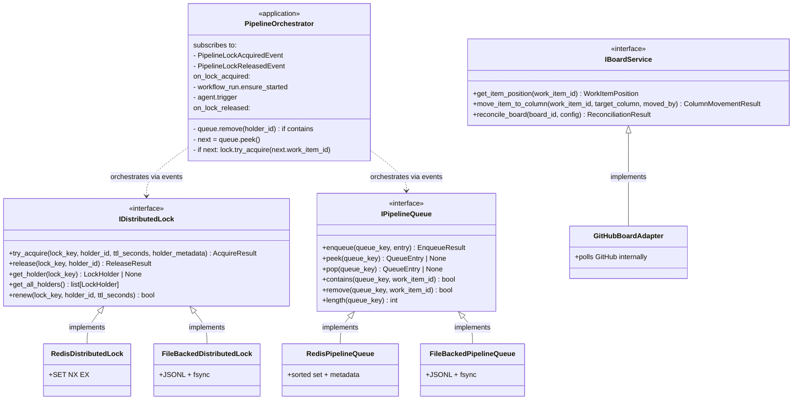

# Board Management Output Ports

This documentation covers the output ports for project board operations and pipeline coordination.

## Purpose

The board management output ports define contracts for:

- **IBoardService**: Project board management (columns, work item positioning). The board adapter is the **single source of truth for current column state** — see `bootstrap/implementation-review-2026-05-31.md §7.1` and Architectural Authority below.
- **IDistributedLock**: Distributed lock primitive. Knows nothing about queues, work items, or workflow runs.
- **IPipelineQueue**: FIFO queue with metadata. Knows nothing about locks.

`IDistributedLock` and `IPipelineQueue` are intentionally independent. The application's `PipelineOrchestrator` (an event-bus subscriber, not part of these ports) wires them together via lock-acquired and lock-released events. This decomposition replaces the prior `IPipelineLockService` triune (lock + queue + side-effect orchestration in one port). See GitHub issue #904 Work item 2 for the rationale.

## Architectural Authority

> **The board adapter is the single source of truth for which column a given work item is currently in.** Internal `WorkItem.current_column` is being deleted as a breaking REST change; reads go through `IBoardService.get_item_position()`. Writes go through `IBoardService.move_item_to_column()`, which projects the change to the external system (e.g. GitHub Projects v2) and emits `WorkItemColumnChangedEvent`. Project config remains authoritative for workflow *structure* (which columns exist); the adapter reconciles the external board to match project config on startup and on demand.

This authority rule is enforced by INV-19 (see `bootstrap/ARCHITECTURE.md` §6).

## Interface Definition

### IBoardService

```python
class IBoardService(IEventEmitter, IMonitoredService, ABC):
    """
    Board management with event emission and monitoring.

    The single source of truth for current column state of work items in the
    project board. Implementations project state changes to the external system
    (GitHub Projects v2, Jira, etc.) and emit WorkItemColumnChangedEvent on
    every column transition.

    Reconciles the external board structure with project config (the authority
    for workflow structure) on startup and on demand.
    """

    # Query Operations
    async def get_board(self, project_id: str, board_id: str) -> ProjectBoard:
        """Retrieve board configuration and structure."""

    async def get_columns(self, board_id: str) -> list[BoardColumn]:
        """Get all columns for a board."""

    async def get_items_in_column(self, board_id: str, column_name: str) -> list[WorkItemPosition]:
        """Get all work items in a specific column ordered by position."""

    async def get_item_position(self, work_item_id: str) -> WorkItemPosition:
        """Get current column position of a work item.

        This is the authoritative read for current column state.
        """

    # Command Operations
    async def move_item_to_column(self, work_item_id: str, target_column: str, moved_by: MovedByType) -> ColumnMovementResult:
        """Move work item to target column.

        Updates the external board, then emits WorkItemColumnChangedEvent.
        Idempotent: moving to the current column is a no-op (no event emitted).
        """

    async def add_item_to_column(self, work_item_id: str, target_column: str, moved_by: MovedByType) -> ColumnMovementResult:
        """Add newly created work item to initial column."""

    async def reconcile_board(self, board_id: str, config: BoardConfig) -> ReconciliationResult:
        """Reconcile board structure with project config.

        Creates missing columns, surfaces unsafe drift. Project config defines
        the workflow structure; the adapter pushes the external board to match.
        """

    async def get_all_boards(self) -> list[ProjectBoard]:
        """Get all boards across all projects."""

    async def get_board_items(self, project_id: str, board_id: str) -> list[WorkItemPosition]:
        """Get all work items on a board with their column positions and entry times."""
```

### IDistributedLock

```python
class IDistributedLock(ABC):
    """Distributed lock primitive.

    Knows nothing about queues, work items, workflow runs, or downstream
    orchestration. A lock has a key and a holder; operations are atomic at
    the storage layer.

    Production implementation: RedisDistributedLock (SET NX EX).
    Local-dev / harness: FileBackedDistributedLock (JSONL + fsync).

    The adapter emits PipelineLockAcquiredEvent on every successful acquire
    and PipelineLockReleasedEvent on every successful release. Callers and
    subscribers MUST treat these events as the only public signal of state
    change — no other side effects are emitted from the adapter.
    """

    @abstractmethod
    async def try_acquire(
        self,
        lock_key: str,
        holder_id: str,
        ttl_seconds: int = 7200,
        holder_metadata: dict[str, str] | None = None,
    ) -> AcquireResult:
        """Attempt to acquire the lock for the given holder.

        Args:
            lock_key: Opaque namespaced identifier (e.g. f"{project_id}:{board_id}").
                The adapter treats this as a black box; key namespacing is the
                caller's concern.
            holder_id: Opaque holder identity (codetoreum convention: work_item_id).
            ttl_seconds: Safety TTL. The lock auto-releases after this if not
                refreshed. Default 7200 (2h). The TTL is a last-resort safety
                net; the primary recovery mechanism is the orchestrator's
                startup orphan scan.
            holder_metadata: Optional opaque dict stored alongside the holder
                and included in emitted events. Lets subscribers (e.g.
                PipelineOrchestrator) recover context like project_id and
                board_id without parsing lock_key. The adapter does not
                interpret the contents.

        Returns:
            AcquireResult with status ∈ {ACQUIRED, ALREADY_HELD_BY_OTHER, ALREADY_HELD_BY_SELF}.

        Emits:
            PipelineLockAcquiredEvent on ACQUIRED. Not on ALREADY_HELD_BY_* —
            those are no-op transitions.
        """

    @abstractmethod
    async def release(
        self,
        lock_key: str,
        holder_id: str,
    ) -> ReleaseResult:
        """Release the lock if held by the given holder.

        Idempotent. Calling release when the lock is not held returns
        ReleaseResult(released=False, reason="not_held") with no error.
        Calling release when the lock is held by a different holder returns
        ReleaseResult(released=False, reason="held_by_other") with no error.

        Emits:
            PipelineLockReleasedEvent on successful release. Not on no-op cases.
        """

    @abstractmethod
    async def get_holder(self, lock_key: str) -> LockHolder | None:
        """Return the current holder, or None if unlocked.

        Used for diagnostics and the orphan-scan startup behaviour.
        """

    @abstractmethod
    async def get_all_holders(self) -> list[LockHolder]:
        """Return all currently held locks across all keys.

        Used by PipelineOrchestrator's startup orphan scan (each holder cross-
        referenced against IActiveWorkflowRunRegistry; mismatches release
        through the normal release() path).
        """

    @abstractmethod
    async def renew(
        self,
        lock_key: str,
        holder_id: str,
        ttl_seconds: int,
    ) -> bool:
        """Extend the TTL on a held lock. Returns False if not held by this holder.

        Optional in practice — only callers that hold long-running locks need
        to refresh. Codetoreum's current usage relies on the default 2h TTL
        and never renews.
        """
```

### IPipelineQueue

```python
class IPipelineQueue(ABC):
    """FIFO queue of work items waiting on a coordinated resource.

    Knows nothing about locks. A queue has a key and an ordered list of
    entries; operations are atomic at the storage layer.

    Production implementation: RedisPipelineQueue (sorted set + sibling
    metadata hash).
    Local-dev / harness: FileBackedPipelineQueue (JSONL + fsync).

    The adapter emits WorkItemQueuedEvent on fresh enqueues and
    WorkItemDequeuedEvent on pop/remove. These events are used by metrics
    and diagnostics; the orchestrator's primary trigger for state transitions
    is the lock's events (PipelineLockAcquiredEvent / PipelineLockReleasedEvent).
    """

    @abstractmethod
    async def enqueue(
        self,
        queue_key: str,
        entry: QueueEntry,
    ) -> EnqueueResult:
        """Add an entry to the back of the queue.

        Idempotent on (queue_key, entry.work_item_id): if the work_item_id is
        already in the queue, returns EnqueueResult(already_present=True,
        position=existing_position) with no mutation. This is the de-dup
        guarantee that lets callers retry safely (e.g. the same trigger event
        firing twice).

        Args:
            queue_key: Opaque namespaced identifier (codetoreum convention:
                same key as the corresponding lock — f"{project_id}:{board_id}").
            entry: QueueEntry { work_item_id, stage_name, board_position,
                enqueued_at, metadata }. board_position is the external
                board's position (used as a tiebreaker when two items race
                to enqueue at the same logical time).

        Returns:
            EnqueueResult { position: int, already_present: bool }.

        Emits:
            WorkItemQueuedEvent on a fresh enqueue. Not on idempotent no-op.
        """

    @abstractmethod
    async def peek(self, queue_key: str) -> QueueEntry | None:
        """Return the head entry without removing. None if empty."""

    @abstractmethod
    async def pop(self, queue_key: str) -> QueueEntry | None:
        """Atomically remove and return the head entry. None if empty.

        Emits:
            WorkItemDequeuedEvent on success.
        """

    @abstractmethod
    async def contains(self, queue_key: str, work_item_id: str) -> bool:
        """Check whether a specific work item is in the queue.

        Used by PipelineOrchestrator to maintain the "lock holder is not in
        queue" invariant — on every PipelineLockAcquiredEvent, the
        orchestrator checks contains() and removes if present.
        """

    @abstractmethod
    async def remove(self, queue_key: str, work_item_id: str) -> bool:
        """Remove a specific entry by work_item_id.

        Returns True if removed, False if not present (idempotent).

        Emits:
            WorkItemDequeuedEvent on successful removal.
        """

    @abstractmethod
    async def length(self, queue_key: str) -> int:
        """Return queue depth. For diagnostics and back-pressure checks."""

    @abstractmethod
    async def list(self, queue_key: str) -> list[QueueEntry]:
        """Return all entries in FIFO order. For diagnostics."""

    @abstractmethod
    async def position_of(self, queue_key: str, work_item_id: str) -> int | None:
        """Return 0-indexed position of work_item_id, or None if not present.

        For diagnostics; not used in the main coordination flow.
        """
```

## Value Objects

```python
@dataclass(frozen=True)
class AcquireResult:
    status: AcquireStatus              # ACQUIRED | ALREADY_HELD_BY_OTHER | ALREADY_HELD_BY_SELF
    lock_key: str
    holder_id: str                     # The current holder (may be != requested on ALREADY_HELD_BY_OTHER)
    acquired_at: datetime | None       # Set if status == ACQUIRED; None otherwise

class AcquireStatus(Enum):
    ACQUIRED = "acquired"              # Lock was free; now held by requested holder
    ALREADY_HELD_BY_SELF = "already_held_by_self"   # Reentrant — same holder, no-op
    ALREADY_HELD_BY_OTHER = "already_held_by_other" # Different holder has the lock

@dataclass(frozen=True)
class ReleaseResult:
    released: bool                     # True if the lock was held and is now free
    reason: ReleaseReason | None       # Set if released=False; explains why
    lock_key: str

class ReleaseReason(Enum):
    NOT_HELD = "not_held"
    HELD_BY_OTHER = "held_by_other"

@dataclass(frozen=True)
class LockHolder:
    lock_key: str
    holder_id: str
    acquired_at: datetime
    ttl_seconds: int
    expires_at: datetime
    holder_metadata: dict[str, str]    # Empty dict if none provided at acquire time

@dataclass(frozen=True)
class QueueEntry:
    work_item_id: str
    stage_name: str
    board_position: int                # Position on the external board at enqueue time
    enqueued_at: datetime
    metadata: dict[str, str]           # Opaque; surfaces in events. Codetoreum stashes
                                       # project_id, board_id, etc.

@dataclass(frozen=True)
class EnqueueResult:
    position: int                      # 0-indexed position in the queue (after enqueue)
    already_present: bool              # True if no-op due to existing entry
```

## Key namespacing convention

`IDistributedLock` and `IPipelineQueue` keys are opaque to the adapters. By codetoreum convention:

- Lock key: `f"{project_id}:{board_id}"` — one lock per project board, ensuring serialized agent execution per board.
- Queue key: same as the corresponding lock — `f"{project_id}:{board_id}"`. A WI waiting on the lock is in the queue under the same key.

The application's `PipelineOrchestrator` is the only component that constructs these keys. Future use cases (e.g. per-stage locks) are accommodated by changing the key format without touching the port contracts.

## Methods

### IBoardService Methods (9 methods)

| Method | Parameters | Return Type | Description |
|---|---|---|---|
| `get_board()` | `project_id: str, board_id: str` | `ProjectBoard` | Retrieve board with all columns and current work item positions |
| `get_columns()` | `board_id: str` | `list[BoardColumn]` | Get all columns ordered by position |
| `get_items_in_column()` | `board_id: str, column_name: str` | `list[WorkItemPosition]` | Get work items in column ordered by position |
| `get_item_position()` | `work_item_id: str` | `WorkItemPosition` | Authoritative read for current column |
| `move_item_to_column()` | `work_item_id, target_column, moved_by` | `ColumnMovementResult` | Move item between columns; emits `WorkItemColumnChangedEvent` |
| `add_item_to_column()` | `work_item_id, target_column, moved_by` | `ColumnMovementResult` | Add newly created item to initial column |
| `reconcile_board()` | `board_id, config: BoardConfig` | `ReconciliationResult` | Reconcile board structure with project config |
| `get_all_boards()` | none | `list[ProjectBoard]` | Get all boards across all projects |
| `get_board_items()` | `project_id, board_id` | `list[WorkItemPosition]` | Get all items on board with column positions and entry times |

### IDistributedLock Methods (5 methods)

| Method | Parameters | Return Type | Description |
|---|---|---|---|
| `try_acquire()` | `lock_key, holder_id, ttl_seconds=7200, holder_metadata=None` | `AcquireResult` | Attempt to acquire the lock; emits `PipelineLockAcquiredEvent` on ACQUIRED |
| `release()` | `lock_key, holder_id` | `ReleaseResult` | Release the lock if held by holder; emits `PipelineLockReleasedEvent` on success; idempotent |
| `get_holder()` | `lock_key` | `LockHolder \| None` | Current holder, or None if unlocked |
| `get_all_holders()` | none | `list[LockHolder]` | All currently held locks (for diagnostics + orphan scan) |
| `renew()` | `lock_key, holder_id, ttl_seconds` | `bool` | Extend TTL on a held lock; False if not held by holder |

### IPipelineQueue Methods (8 methods)

| Method | Parameters | Return Type | Description |
|---|---|---|---|
| `enqueue()` | `queue_key, entry: QueueEntry` | `EnqueueResult` | Add to queue tail; idempotent on (key, work_item_id); emits `WorkItemQueuedEvent` |
| `peek()` | `queue_key` | `QueueEntry \| None` | Head entry without removing |
| `pop()` | `queue_key` | `QueueEntry \| None` | Atomically remove + return head; emits `WorkItemDequeuedEvent` |
| `contains()` | `queue_key, work_item_id` | `bool` | Membership check |
| `remove()` | `queue_key, work_item_id` | `bool` | Remove specific entry; idempotent; emits `WorkItemDequeuedEvent` on removal |
| `length()` | `queue_key` | `int` | Queue depth |
| `list()` | `queue_key` | `list[QueueEntry]` | All entries in FIFO order (diagnostics) |
| `position_of()` | `queue_key, work_item_id` | `int \| None` | 0-indexed position (diagnostics) |

## Race conditions and idempotency contracts

The lock + queue + orchestrator design relies on eventual consistency through events, not atomic cross-port coordination. The following race-and-idempotency contracts MUST hold:

1. **Two callers `try_acquire` simultaneously on the same key**: exactly one gets `ACQUIRED`; the other gets `ALREADY_HELD_BY_OTHER`. Both calls return; neither blocks.
2. **Two callers `release` simultaneously on the same key**: exactly one gets `released=True`; the other gets `released=False, reason=NOT_HELD`. Both calls return; neither raises.
3. **`enqueue` called twice for the same `work_item_id`**: second call is a no-op, returns `already_present=True`. No duplicate emissions.
4. **`remove` called when work_item_id is not in queue**: returns `False`. No emission. No error.
5. **Orchestrator races with the lock service**: orchestrator subscribes to `PipelineLockReleasedEvent`, peeks queue, calls `try_acquire` for next WI. If another caller acquires concurrently, orchestrator gets `ALREADY_HELD_BY_OTHER` and no-ops — the next release will fire another cycle.
6. **Duplicate event delivery**: subscribers must be idempotent. `PipelineOrchestrator.on_lock_acquired` calls `queue.remove` (idempotent), then `workflow_run.ensure_started` (idempotent — no-op if registry has an entry).
7. **Lock TTL expiry vs. legitimate hold**: if a lock TTL expires while the holder is still active, the next `try_acquire` may succeed for a different holder. This is acceptable for the 2h default — work items don't legitimately run that long. Adjusting TTL upward is allowed via config.

## Events emitted

From `IBoardService`:
- **WorkItemColumnChangedEvent** — emitted by the board adapter on every column transition. Carries `from_column`, `to_column`, `work_item_id`, `project_id`, `board_id`, `moved_by`.
- **BoardReconciledEvent** — emitted on successful reconcile_board.
- **BoardColumnAddedEvent / BoardColumnRemovedEvent** — emitted during reconciliation when structure drift is corrected.
- **BoardSyncFailedEvent** — emitted when the adapter fails to push a state change to the external system (drift surfaced to audit consumers).

From `IDistributedLock`:
- **PipelineLockAcquiredEvent** — emitted on every successful acquire. Payload: `lock_key`, `holder_id`, `acquired_at`, `holder_metadata`.
- **PipelineLockReleasedEvent** — emitted on every successful release. Payload: `lock_key`, `released_holder_id`, `released_at`.

From `IPipelineQueue`:
- **WorkItemQueuedEvent** — emitted on every fresh `enqueue`. Payload: `queue_key`, `work_item_id`, `position`, `metadata`.
- **WorkItemDequeuedEvent** — emitted on every `pop` and successful `remove`. Payload: `queue_key`, `work_item_id`, `reason` (popped|removed).

Note that `LockAcquiredEvent` (the old name) is **deleted** as part of GitHub issue #904 Work item 2. The replacement is `PipelineLockAcquiredEvent`, with a single emission semantic — see the issue for the rationale on dropping the queue-handoff vs. initial-acquire distinction.

## Error contracts

From `IBoardService`:
- **ProjectNotFoundError** — Project doesn't exist
- **ResourceNotFoundError** — Board, column, or work item doesn't exist
- **ValidationError** — Invalid target column or config
- **ExternalServiceError** — Service communication failure
- **BoardStructureDriftError** — `reconcile_board` detected structure drift that can't be safely auto-corrected (e.g. a renamed column that already contains work items)

From `IDistributedLock`:
- Operations do not raise on contention. Return statuses (`ALREADY_HELD_BY_OTHER`, `NOT_HELD`) encode all non-error outcomes.
- **ExternalServiceError** — storage (Redis / disk) communication failure. Propagates to caller.

From `IPipelineQueue`:
- Operations do not raise on empty / not-found. Return `None` or `False`.
- **ExternalServiceError** — storage communication failure. Propagates to caller.

## Adapter Implementations

| Adapter Class | Type | File Path | Notes |
|---|---|---|---|
| `GitHubBoardAdapter` | Production | `src/codetoreum/adapters/secondary/github_board_adapter.py` | GitHub Projects v2 implementation; polls internally to detect external column changes (adapter-private polling — see §Architectural Authority above) |
| `MockBoardAdapter` | Testing | `src/codetoreum/adapters/testing/mock_board_adapter.py` | Mock board adapter for testing IBoardService |
| `RedisDistributedLock` | Production | `src/codetoreum/adapters/secondary/redis_distributed_lock.py` | Redis SET NX EX; emits `PipelineLockAcquiredEvent` / `PipelineLockReleasedEvent` via injected event bus |
| `FileBackedDistributedLock` | Local-dev / harness | `src/codetoreum/adapters/secondary/file_backed_distributed_lock.py` | JSONL append-only + fsync; single-process via PID lockfile; for dev / unit tests |
| `RedisPipelineQueue` | Production | `src/codetoreum/adapters/secondary/redis_pipeline_queue.py` | Sorted set + sibling metadata hash; emits `WorkItemQueuedEvent` / `WorkItemDequeuedEvent` |
| `FileBackedPipelineQueue` | Local-dev / harness | `src/codetoreum/adapters/secondary/file_backed_pipeline_queue.py` | JSONL append-only + fsync; single-process |

The retired implementations from GitHub issue #904 Work item 2:
- `RedisPipelineLockService`, `InMemoryPipelineLockService`, `InMemoryQueueLockService` — superseded by the lock + queue decomposition above.

## Diagram



## Cross-references

- `bootstrap/implementation-review-2026-05-31.md §7` — architect decisions on board authority, lock+queue decomposition, current_column deletion.
- GitHub issue #904 — Work item 2 (pipeline coordination redesign), Work item 3 (board adapter authority).
- `bootstrap/ARCHITECTURE.md` — INV-19 (board adapter authoritative), INV-13 (event-driven app, no application-layer polling).
