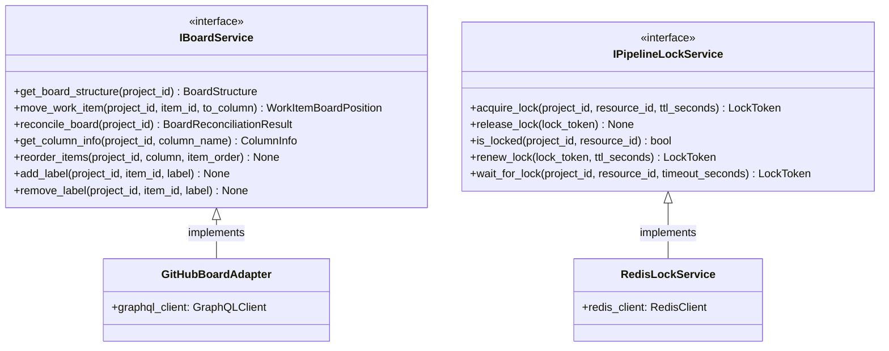

# Board Management Output Ports

This documentation covers the output ports for project board operations and pipeline coordination.

## Purpose

The board management output ports define contracts for:

- **IBoardService**: Project board management (columns, lanes, work item positioning)
- **IPipelineLockService**: Distributed locking for workflow coordination

These ports abstract board systems (GitHub Projects v2, Jira Boards, Trello, etc.) and provide coordination mechanisms.

## Interface Definition

### IBoardService

```python
class IBoardService(ABC):
    """
    Project board management (GitHub Projects v2, Trello, etc.).
    
    Vendor-agnostic board structure and work item positioning.
    """
    
    @abstractmethod
    async def get_board_structure(self, project_id: ProjectId) -> BoardStructure:
        """Query columns, lanes, and work items."""
        pass
    
    @abstractmethod
    async def move_work_item(self, project_id: ProjectId, item_id: WorkItemId, to_column: str) -> WorkItemBoardPosition:
        """Transition work item between columns."""
        pass
    
    @abstractmethod
    async def reconcile_board(self, project_id: ProjectId) -> BoardReconciliationResult:
        """Sync orchestrator state with external board."""
        pass
    
    @abstractmethod
    async def get_column_info(self, project_id: ProjectId, column_name: str) -> ColumnInfo:
        """Get column details."""
        pass
    
    @abstractmethod
    async def reorder_items(self, project_id: ProjectId, column: str, item_order: list[WorkItemId]) -> None:
        """Reorder work items in column."""
        pass
    
    @abstractmethod
    async def add_label(self, project_id: ProjectId, item_id: WorkItemId, label: str) -> None:
        """Add label to work item."""
        pass
    
    @abstractmethod
    async def remove_label(self, project_id: ProjectId, item_id: WorkItemId, label: str) -> None:
        """Remove label from work item."""
        pass
```

### IPipelineLockService

```python
class IPipelineLockService(ABC):
    """
    Distributed locking for workflow coordination.
    
    Prevents concurrent pipeline execution.
    """
    
    @abstractmethod
    async def acquire_lock(self, project_id: ProjectId, resource_id: str, ttl_seconds: int = 300) -> LockToken:
        """Acquire execution lock."""
        pass
    
    @abstractmethod
    async def release_lock(self, lock_token: LockToken) -> None:
        """Release execution lock."""
        pass
    
    @abstractmethod
    async def is_locked(self, project_id: ProjectId, resource_id: str) -> bool:
        """Check lock status."""
        pass
    
    @abstractmethod
    async def renew_lock(self, lock_token: LockToken, ttl_seconds: int = 300) -> LockToken:
        """Renew lock lease."""
        pass
    
    @abstractmethod
    async def wait_for_lock(self, project_id: ProjectId, resource_id: str, timeout_seconds: int = 60) -> LockToken:
        """Block until lock acquired."""
        pass
```

## Methods

### IBoardService Methods

| Method | Parameters | Return Type | Description |
|---|---|---|---|
| `get_board_structure()` | `project_id: ProjectId` | `BoardStructure` | Query board columns and work items |
| `move_work_item()` | `project_id, item_id, to_column` | `WorkItemBoardPosition` | Transition work item to column |
| `reconcile_board()` | `project_id: ProjectId` | `BoardReconciliationResult` | Sync external board with orchestrator |
| `get_column_info()` | `project_id, column_name` | `ColumnInfo` | Get column details |
| `reorder_items()` | `project_id, column, item_order` | `None` | Reorder items in column |
| `add_label()` | `project_id, item_id, label` | `None` | Add label to item |
| `remove_label()` | `project_id, item_id, label` | `None` | Remove label from item |

### IPipelineLockService Methods

| Method | Parameters | Return Type | Description |
|---|---|---|---|
| `acquire_lock()` | `project_id, resource_id, ttl_seconds` | `LockToken` | Acquire lock with TTL |
| `release_lock()` | `lock_token: LockToken` | `None` | Release lock |
| `is_locked()` | `project_id, resource_id` | `bool` | Check if locked |
| `renew_lock()` | `lock_token, ttl_seconds` | `LockToken` | Renew lock lease |
| `wait_for_lock()` | `project_id, resource_id, timeout_seconds` | `LockToken` | Block until lock available |

## Events Emitted

- **WorkItemMovedEvent** — When work item transitions between columns
- **BoardReconciledEvent** — When board structure synchronized
- **LockAcquiredEvent** — When pipeline lock acquired
- **LockReleasedEvent** — When pipeline lock released

## Error Contracts

- **BoardNotFoundError** — When board doesn't exist
- **ColumnNotFoundError** — When column doesn't exist
- **WorkItemNotFoundError** — When work item not on board
- **LockTimeoutError** — When lock cannot be acquired within timeout
- **LockConflictError** — When lock already held by another process
- **ExternalServiceError** — When board service unavailable

## Adapter Implementations

| Adapter Class | Type | File Path | Notes |
|---|---|---|---|
| `GitHubBoardAdapter` | Production | `adapters/secondary/github/` | GitHub Projects v2 implementation |
| `MockBoardAdapter` | Testing | `adapters/testing/` | In-memory board implementation |
| `RedisLockService` | Production | `adapters/secondary/redis/` | Redis-based distributed lock |
| `MockLockService` | Testing | `adapters/testing/` | In-memory lock service |

## Diagram


