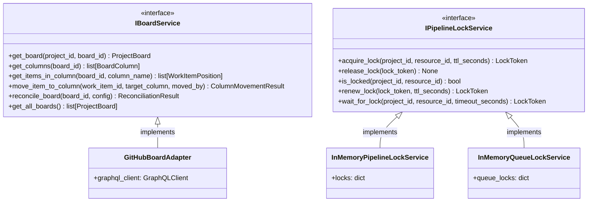

# Board Management Output Ports

This documentation covers the output ports for project board operations and pipeline coordination.

## Purpose

The board management output ports define contracts for:

- **IBoardService**: Project board management (columns, work item positioning)
- **IPipelineLockService**: Distributed locking for workflow coordination

These ports abstract board systems (GitHub Projects v2, Jira Boards, Trello, etc.) and provide coordination mechanisms.

## Interface Definition

### IBoardService

```python
class IBoardService(IEventEmitter, IMonitoredService, ABC):
    """
    Board management with event emission and monitoring.

    Provides vendor-agnostic abstraction for project boards (GitHub Projects v2,
    Trello, JIRA boards, etc.). Enables:
    1. Querying board structure and work item positions
    2. Moving work items between columns
    3. Reconciling board state with expected configuration
    4. Reacting to work item movement via events
    """
    
    # Query Operations
    async def get_board(self, project_id: str, board_id: str) -> ProjectBoard:
        """Retrieve board configuration and structure."""
        
    async def get_columns(self, board_id: str) -> list[BoardColumn]:
        """Get all columns for a board."""
        
    async def get_items_in_column(self, board_id: str, column_name: str) -> list[WorkItemPosition]:
        """Get all work items in a specific column ordered by position."""
        
    async def get_item_position(self, work_item_id: str) -> WorkItemPosition:
        """Get current column position of a work item."""
    
    # Command Operations
    async def move_item_to_column(self, work_item_id: str, target_column: str, moved_by: MovedByType) -> ColumnMovementResult:
        """Move work item to target column."""
        
    async def add_item_to_column(self, work_item_id: str, target_column: str, moved_by: MovedByType) -> ColumnMovementResult:
        """Add newly created work item to initial column."""
        
    async def reconcile_board(self, board_id: str, config: BoardConfig) -> ReconciliationResult:
        """Reconcile board structure with expected configuration."""
        
    async def get_all_boards(self) -> list[ProjectBoard]:
        """Get all boards across all projects."""
        
    async def get_board_items(self, project_id: str, board_id: str) -> list[WorkItemPosition]:
        """Get all work items on a board with their column positions and entry times."""
```

### IPipelineLockService

```python
class IPipelineLockService(ABC):
    """
    Distributed locking for workflow coordination.
    
    Prevents concurrent pipeline execution.
    """
    
    @abstractmethod
    async def acquire_lock(self, project_id: str, resource_id: str, ttl_seconds: int = 300) -> LockToken:
        """Acquire execution lock."""
        pass
    
    @abstractmethod
    async def release_lock(self, lock_token: LockToken) -> None:
        """Release execution lock."""
        pass
    
    @abstractmethod
    async def is_locked(self, project_id: str, resource_id: str) -> bool:
        """Check lock status."""
        pass
    
    @abstractmethod
    async def renew_lock(self, lock_token: LockToken, ttl_seconds: int = 300) -> LockToken:
        """Renew lock lease."""
        pass
    
    @abstractmethod
    async def wait_for_lock(self, project_id: str, resource_id: str, timeout_seconds: int = 60) -> LockToken:
        """Block until lock acquired."""
        pass
```

## Methods

### IBoardService Methods (9 methods)

| Method | Parameters | Return Type | Description |
|---|---|---|---|
| `get_board()` | `project_id: str, board_id: str` | `ProjectBoard` | Retrieve board with all columns and current work item positions |
| `get_columns()` | `board_id: str` | `list[BoardColumn]` | Get all columns ordered by position |
| `get_items_in_column()` | `board_id: str, column_name: str` | `list[WorkItemPosition]` | Get work items in column ordered by position |
| `get_item_position()` | `work_item_id: str` | `WorkItemPosition` | Get current column position of work item |
| `move_item_to_column()` | `work_item_id, target_column, moved_by` | `ColumnMovementResult` | Move item between columns |
| `add_item_to_column()` | `work_item_id, target_column, moved_by` | `ColumnMovementResult` | Add newly created item to initial column |
| `reconcile_board()` | `board_id, config: BoardConfig` | `ReconciliationResult` | Reconcile board structure with expected configuration |
| `get_all_boards()` | none | `list[ProjectBoard]` | Get all boards across all projects |
| `get_board_items()` | `project_id, board_id` | `list[WorkItemPosition]` | Get all items on board with column positions and entry times |

### IPipelineLockService Methods

| Method | Parameters | Return Type | Description |
|---|---|---|---|
| `acquire_lock()` | `project_id, resource_id, ttl_seconds` | `LockToken` | Acquire lock with TTL |
| `release_lock()` | `lock_token: LockToken` | `None` | Release lock |
| `is_locked()` | `project_id, resource_id` | `bool` | Check if locked |
| `renew_lock()` | `lock_token, ttl_seconds` | `LockToken` | Renew lock lease |
| `wait_for_lock()` | `project_id, resource_id, timeout_seconds` | `LockToken` | Block until lock available |

## Events Emitted

- **workitem.column_changed** (WorkItemColumnChangedEvent) — When work item transitions between columns
- **board.reconciled** (BoardReconciledEvent) — When board structure synchronized
- **board.column_added** — When new column created during reconciliation
- **board.column_removed** — When column deleted during reconciliation
- **LockAcquiredEvent** — When pipeline lock acquired
- **LockReleasedEvent** — When pipeline lock released

## Error Contracts

- **ProjectNotFoundError** — Project doesn't exist
- **ResourceNotFoundError** — Board, column, or work item doesn't exist
- **ValidationError** — Invalid target column or config
- **ExternalServiceError** — Service communication failure
- **LockTimeoutError** — Lock cannot be acquired within timeout
- **LockConflictError** — Lock already held by another process

## Adapter Implementations

| Adapter Class | Type | File Path | Notes |
|---|---|---|---|
| `GitHubBoardAdapter` | Production | `src/codetoreum/adapters/secondary/github_board_adapter.py` | GitHub Projects v2 implementation |
| `InMemoryPipelineLockService` | Testing | `src/codetoreum/adapters/secondary/in_memory_pipeline_lock_service.py` | In-memory lock service for testing |
| `InMemoryQueueLockService` | Testing | `src/codetoreum/adapters/secondary/in_memory_queue_lock_service.py` | In-memory queue lock for testing |

## Diagram


