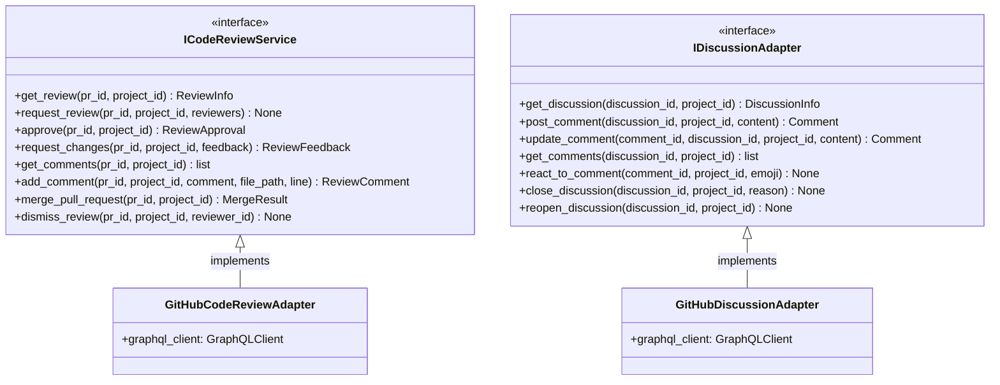

# Code Review Output Ports

This documentation covers the output ports for pull request management and code review lifecycle.

## Purpose

The code review output ports define contracts for:

- **ICodeReviewService**: Code review lifecycle (GitHub PRs, GitLab MRs, etc.)
- **IDiscussionAdapter**: Discussion/comment thread management

These ports abstract code review systems and enable multi-platform support.

## Interface Definition

### ICodeReviewService

```python
class ICodeReviewService(ABC):
    """
    Code review lifecycle (GitHub PRs, GitLab MRs, etc.).
    
    Manages review status, approvals, and comments.
    """
    
    @abstractmethod
    async def get_review(self, pr_id: str, project_id: ProjectId) -> ReviewInfo:
        """Get review status and approvals."""
        pass
    
    @abstractmethod
    async def request_review(self, pr_id: str, project_id: ProjectId, reviewers: list[UserId]) -> None:
        """Request review from users."""
        pass
    
    @abstractmethod
    async def approve(self, pr_id: str, project_id: ProjectId) -> ReviewApproval:
        """Approve code review."""
        pass
    
    @abstractmethod
    async def request_changes(self, pr_id: str, project_id: ProjectId, feedback: str) -> ReviewFeedback:
        """Request changes with feedback."""
        pass
    
    @abstractmethod
    async def get_comments(self, pr_id: str, project_id: ProjectId) -> list[ReviewComment]:
        """Retrieve review comments."""
        pass
    
    @abstractmethod
    async def add_comment(self, pr_id: str, project_id: ProjectId, comment: str, file_path: str | None = None, line: int | None = None) -> ReviewComment:
        """Add comment to review."""
        pass
    
    @abstractmethod
    async def merge_pull_request(self, pr_id: str, project_id: ProjectId) -> MergeResult:
        """Merge approved pull request."""
        pass
    
    @abstractmethod
    async def dismiss_review(self, pr_id: str, project_id: ProjectId, reviewer_id: UserId) -> None:
        """Dismiss review from reviewer."""
        pass
```

### IDiscussionAdapter

```python
class IDiscussionAdapter(ABC):
    """
    Discussion thread management (GitHub discussions, issue comments, etc.).
    
    Manages discussion and comment interactions.
    """
    
    @abstractmethod
    async def get_discussion(self, discussion_id: str, project_id: ProjectId) -> DiscussionInfo:
        """Retrieve discussion thread."""
        pass
    
    @abstractmethod
    async def post_comment(self, discussion_id: str, project_id: ProjectId, content: str) -> Comment:
        """Add comment to discussion."""
        pass
    
    @abstractmethod
    async def update_comment(self, comment_id: str, discussion_id: str, project_id: ProjectId, content: str) -> Comment:
        """Edit existing comment."""
        pass
    
    @abstractmethod
    async def get_comments(self, discussion_id: str, project_id: ProjectId) -> list[Comment]:
        """List thread comments."""
        pass
    
    @abstractmethod
    async def react_to_comment(self, comment_id: str, project_id: ProjectId, emoji: str) -> None:
        """Add reaction/emoji to comment."""
        pass
    
    @abstractmethod
    async def close_discussion(self, discussion_id: str, project_id: ProjectId, reason: str | None = None) -> None:
        """Close discussion thread."""
        pass
    
    @abstractmethod
    async def reopen_discussion(self, discussion_id: str, project_id: ProjectId) -> None:
        """Reopen closed discussion."""
        pass
```

## Methods

### ICodeReviewService Methods

| Method | Parameters | Return Type | Description |
|---|---|---|---|
| `get_review()` | `pr_id, project_id` | `ReviewInfo` | Get review status |
| `request_review()` | `pr_id, project_id, reviewers` | `None` | Request reviewers |
| `approve()` | `pr_id, project_id` | `ReviewApproval` | Approve PR |
| `request_changes()` | `pr_id, project_id, feedback` | `ReviewFeedback` | Request changes |
| `get_comments()` | `pr_id, project_id` | `list[ReviewComment]` | Get review comments |
| `add_comment()` | `pr_id, project_id, comment, file_path, line` | `ReviewComment` | Add review comment |
| `merge_pull_request()` | `pr_id, project_id` | `MergeResult` | Merge PR |
| `dismiss_review()` | `pr_id, project_id, reviewer_id` | `None` | Dismiss reviewer |

### IDiscussionAdapter Methods

| Method | Parameters | Return Type | Description |
|---|---|---|---|
| `get_discussion()` | `discussion_id, project_id` | `DiscussionInfo` | Get discussion |
| `post_comment()` | `discussion_id, project_id, content` | `Comment` | Add comment |
| `update_comment()` | `comment_id, discussion_id, project_id, content` | `Comment` | Edit comment |
| `get_comments()` | `discussion_id, project_id` | `list[Comment]` | List comments |
| `react_to_comment()` | `comment_id, project_id, emoji` | `None` | Add reaction |
| `close_discussion()` | `discussion_id, project_id, reason` | `None` | Close discussion |
| `reopen_discussion()` | `discussion_id, project_id` | `None` | Reopen discussion |

## Events Emitted

- **ReviewStatusChangedEvent** — When review status changes
- **ReviewApprovedEvent** — When review approved
- **ReviewChangesRequestedEvent** — When changes requested
- **CommentNeedsResponseEvent** — When comment requires response

## Error Contracts

- **PullRequestNotFoundError** — When PR doesn't exist
- **DiscussionNotFoundError** — When discussion doesn't exist
- **ReviewerNotFoundError** — When reviewer doesn't exist
- **NotAuthorizedError** — When user lacks permission for operation
- **ExternalServiceError** — When external service unavailable
- **ConflictError** — When operation conflicts with current state

## Adapter Implementations

| Adapter Class | Type | File Path | Notes |
|---|---|---|---|
| `GitHubCodeReviewAdapter` | Production | `adapters/secondary/github/` | GitHub PR implementation |
| `MockCodeReviewAdapter` | Testing | `adapters/testing/` | In-memory code review |
| `GitHubDiscussionAdapter` | Production | `adapters/secondary/github/` | GitHub discussions implementation |
| `MockDiscussionAdapter` | Testing | `adapters/testing/` | In-memory discussions |

## Diagram


