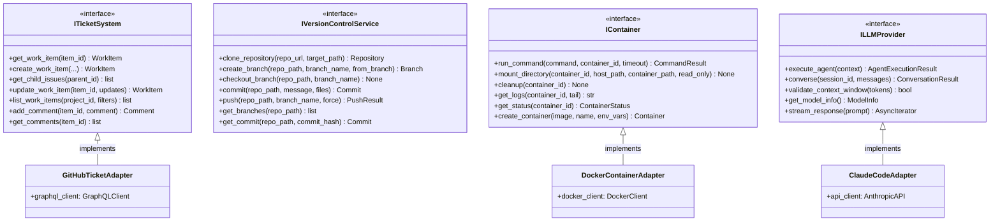

# Core System Output Ports

This documentation covers the fundamental output ports that abstract basic system operations: ticket management, version control, containers, and LLM providers.

## Purpose

The core system output ports define contracts for the foundational external systems that Codetoreum depends on:

- **ITicketSystem**: Vendor-agnostic interface for issue/ticket management (GitHub Issues, Jira, Linear, etc.)
- **IVersionControlService**: Abstract version control operations (Git, Mercurial, etc.)
- **IContainer**: Container runtime abstraction (Docker, Kubernetes, etc.) for agent execution
- **ILLMProvider**: Language model provider abstraction (Claude, GPT-4, etc.) for agent interactions

These ports enable vendor-agnostic implementations and seamless system switching.

## Interface Definition

### ITicketSystem

```python
class ITicketSystem(ABC):
    """
    Interface for ticket/issue management systems.
    
    Vendor-agnostic abstraction over GitHub Issues, Jira, Linear, etc.
    """
    
    @abstractmethod
    async def get_work_item(self, item_id: WorkItemId) -> WorkItem:
        """Retrieve a work item by ID."""
        pass
    
    @abstractmethod
    async def create_work_item(
        self,
        title: str,
        description: str,
        project_id: ProjectId,
        labels: list[str] | None = None,
        assignee: UserId | None = None,
        priority: WorkItemPriority | None = None,
        metadata: dict[str, Any] | None = None,
        parent_issue_id: str | None = None,
        pr_id: str | None = None,
        discussion_id: str | None = None,
    ) -> WorkItem:
        """Create a new work item."""
        pass
    
    @abstractmethod
    async def get_child_issues(self, parent_id: WorkItemId) -> list[WorkItem]:
        """Retrieve all child work items for a given parent."""
        pass
    
    @abstractmethod
    async def update_work_item(self, item_id: WorkItemId, updates: dict[str, Any]) -> WorkItem:
        """Update an existing work item."""
        pass
    
    @abstractmethod
    async def list_work_items(self, project_id: ProjectId, **filters) -> list[WorkItem]:
        """List work items in a project with optional filtering."""
        pass
    
    @abstractmethod
    async def add_comment(self, item_id: WorkItemId, comment: str) -> Comment:
        """Add a comment to a work item."""
        pass
    
    @abstractmethod
    async def get_comments(self, item_id: WorkItemId) -> list[Comment]:
        """Get all comments on a work item."""
        pass
```

### IVersionControlService

```python
class IVersionControlService(ABC):
    """
    Abstract version control operations (Git, Mercurial, etc.).
    
    Handles clone, checkout, commit, push operations on repositories.
    """
    
    @abstractmethod
    async def clone_repository(self, repo_url: str, target_path: str) -> Repository:
        """Clone a repository."""
        pass
    
    @abstractmethod
    async def create_branch(self, repo_path: str, branch_name: str, from_branch: str = "main") -> Branch:
        """Create feature branch."""
        pass
    
    @abstractmethod
    async def checkout_branch(self, repo_path: str, branch_name: str) -> None:
        """Checkout a branch."""
        pass
    
    @abstractmethod
    async def commit(self, repo_path: str, message: str, files: list[str] | None = None) -> Commit:
        """Create commit with message."""
        pass
    
    @abstractmethod
    async def push(self, repo_path: str, branch_name: str, force: bool = False) -> PushResult:
        """Push commits to remote."""
        pass
    
    @abstractmethod
    async def get_branches(self, repo_path: str) -> list[Branch]:
        """List existing branches."""
        pass
    
    @abstractmethod
    async def get_commit(self, repo_path: str, commit_hash: str) -> Commit:
        """Get commit details."""
        pass
```

### IContainer

```python
class IContainer(ABC):
    """
    Container runtime abstraction (Docker, Kubernetes, etc.).
    
    Manages agent execution environments and containerized workloads.
    """
    
    @abstractmethod
    async def run_command(self, command: str, container_id: str, timeout: int | None = None) -> CommandResult:
        """Execute command in container."""
        pass
    
    @abstractmethod
    async def mount_directory(self, container_id: str, host_path: str, container_path: str, read_only: bool = False) -> None:
        """Mount host directory into container."""
        pass
    
    @abstractmethod
    async def cleanup(self, container_id: str) -> None:
        """Clean up container resources."""
        pass
    
    @abstractmethod
    async def get_logs(self, container_id: str, tail: int | None = None) -> str:
        """Retrieve container output."""
        pass
    
    @abstractmethod
    async def get_status(self, container_id: str) -> ContainerStatus:
        """Get container status."""
        pass
    
    @abstractmethod
    async def create_container(self, image: str, name: str, env_vars: dict[str, str] | None = None) -> Container:
        """Create and start a new container."""
        pass
```

### ILLMProvider

```python
class ILLMProvider(ABC):
    """
    Language model provider abstraction (Claude, GPT-4, etc.).
    
    Orchestrates agent interactions with LLM APIs.
    """
    
    @abstractmethod
    async def execute_agent(self, context: AgentContext) -> AgentExecutionResult:
        """Run agent with context."""
        pass
    
    @abstractmethod
    async def converse(self, session_id: str, messages: list[Message]) -> ConversationResult:
        """Multi-turn conversation."""
        pass
    
    @abstractmethod
    async def validate_context_window(self, tokens: int) -> bool:
        """Check token budget."""
        pass
    
    @abstractmethod
    async def get_model_info(self) -> ModelInfo:
        """Get model capabilities and limits."""
        pass
    
    @abstractmethod
    async def stream_response(self, prompt: str) -> AsyncIterator[str]:
        """Stream response tokens."""
        pass
```

## Methods

### ITicketSystem Methods

| Method | Parameters | Return Type | Description |
|---|---|---|---|
| `get_work_item()` | `item_id: WorkItemId` | `WorkItem` | Retrieve work item by ID |
| `create_work_item()` | `title, description, project_id, labels, assignee, priority, metadata, parent_issue_id, pr_id, discussion_id` | `WorkItem` | Create new work item |
| `get_child_issues()` | `parent_id: WorkItemId` | `list[WorkItem]` | Get child issues for parent |
| `update_work_item()` | `item_id, updates` | `WorkItem` | Update work item properties |
| `list_work_items()` | `project_id, **filters` | `list[WorkItem]` | List work items with filters |
| `add_comment()` | `item_id, comment` | `Comment` | Add comment to work item |
| `get_comments()` | `item_id` | `list[Comment]` | Get work item comments |

### IVersionControlService Methods

| Method | Parameters | Return Type | Description |
|---|---|---|---|
| `clone_repository()` | `repo_url, target_path` | `Repository` | Clone a repository |
| `create_branch()` | `repo_path, branch_name, from_branch` | `Branch` | Create feature branch |
| `checkout_branch()` | `repo_path, branch_name` | `None` | Switch to branch |
| `commit()` | `repo_path, message, files` | `Commit` | Create commit |
| `push()` | `repo_path, branch_name, force` | `PushResult` | Push commits to remote |
| `get_branches()` | `repo_path` | `list[Branch]` | List branches |
| `get_commit()` | `repo_path, commit_hash` | `Commit` | Get commit details |

### IContainer Methods

| Method | Parameters | Return Type | Description |
|---|---|---|---|
| `run_command()` | `command, container_id, timeout` | `CommandResult` | Execute command in container |
| `mount_directory()` | `container_id, host_path, container_path, read_only` | `None` | Mount host directory |
| `cleanup()` | `container_id` | `None` | Clean up resources |
| `get_logs()` | `container_id, tail` | `str` | Get container logs |
| `get_status()` | `container_id` | `ContainerStatus` | Get container status |
| `create_container()` | `image, name, env_vars` | `Container` | Create and start container |

### ILLMProvider Methods

| Method | Parameters | Return Type | Description |
|---|---|---|---|
| `execute_agent()` | `context: AgentContext` | `AgentExecutionResult` | Run agent with context |
| `converse()` | `session_id, messages` | `ConversationResult` | Multi-turn conversation |
| `validate_context_window()` | `tokens: int` | `bool` | Validate token budget |
| `get_model_info()` | — | `ModelInfo` | Get model capabilities |
| `stream_response()` | `prompt: str` | `AsyncIterator[str]` | Stream response tokens |

## Events Emitted

These ports do not emit domain events directly. Events are emitted by adapters when state changes occur in external systems.

## Error Contracts

- **ExternalServiceError** — When service communication fails
- **RepositoryNotFoundError** — When repository doesn't exist
- **WorkItemNotFoundError** — When work item doesn't exist
- **ContainerError** — When container operation fails
- **TokenLimitExceededError** — When LLM token budget exceeded
- **TimeoutError** — When external system doesn't respond in time
- **ValidationError** — When input parameters invalid

## Adapter Implementations

| Adapter Class | Type | File Path | Notes |
|---|---|---|---|
| `GitHubTicketAdapter` | Production | `adapters/secondary/github/` | GitHub Issues implementation |
| `GitVersionControlAdapter` | Production | `adapters/secondary/git/` | Git version control |
| `DockerContainerAdapter` | Production | `adapters/secondary/docker/` | Docker container runtime |
| `ClaudeCodeAdapter` | Production | `adapters/secondary/llm/` | Claude API provider |
| `MockTicketAdapter` | Testing | `adapters/testing/` | In-memory ticket system |
| `MockContainerAdapter` | Testing | `adapters/testing/` | In-memory container runtime |
| `MockLLMAdapter` | Testing | `adapters/testing/` | In-memory LLM provider |

## Diagram


