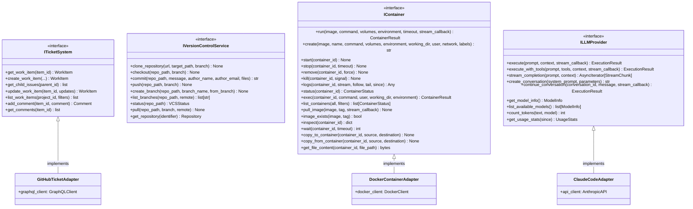

# Core System Output Ports

This documentation covers the fundamental output ports that abstract basic system operations: ticket management, version control, containers, and LLM providers.

## Purpose

The core system output ports define contracts for the foundational external systems that Codetoreum depends on:

- **ITicketSystem**: Vendor-agnostic interface for issue/ticket management (GitHub Issues, Jira, Linear, etc.)
- **IVersionControlService**: Abstract version control operations (Git, Mercurial, etc.)
- **IContainer**: Container runtime abstraction (Docker, Kubernetes, etc.) for agent execution
- **ILLMProvider**: Language model provider abstraction (Claude, GPT-4, etc.) for agent interactions

These ports enable vendor-agnostic implementations and seamless system switching.

## Interface Definition

### ITicketSystem

```python
class ITicketSystem(ABC):
    """
    Interface for ticket/issue management systems.

    Vendor-agnostic abstraction over GitHub Issues, Jira, Linear, etc.
    Supports work item CRUD, comments, relationships, webhooks, and streaming.
    """

    # Work Item Operations
    @abstractmethod
    async def get_work_item(self, item_id: WorkItemId) -> WorkItem:
        """Retrieve a work item by ID."""

    @abstractmethod
    async def create_work_item(self, title: str, description: str, project_id: ProjectId,
                              labels: list[str] | None = None, assignee: UserId | None = None,
                              priority: WorkItemPriority | None = None, metadata: dict[str, Any] | None = None,
                              parent_issue_id: str | None = None, pr_id: str | None = None,
                              discussion_id: str | None = None) -> WorkItem:
        """Create a new work item."""

    @abstractmethod
    async def get_child_issues(self, parent_id: WorkItemId) -> list[WorkItem]:
        """Retrieve all child work items for a given parent."""

    @abstractmethod
    async def update_work_item(self, item_id: WorkItemId, updates: dict[str, Any]) -> WorkItem:
        """Update an existing work item."""

    @abstractmethod
    async def delete_work_item(self, item_id: WorkItemId) -> None:
        """Delete a work item."""

    @abstractmethod
    async def update_status(self, item_id: WorkItemId, status: WorkItemStatus, reason: str | None = None) -> WorkItem:
        """Update work item status."""

    # Query Operations
    @abstractmethod
    async def list_work_items(self, project_id: ProjectId | None = None, status: WorkItemStatus | None = None,
                             assignee: UserId | None = None, labels: list[str] | None = None,
                             created_after: datetime | None = None, updated_after: datetime | None = None,
                             limit: int = 100, offset: int = 0) -> list[WorkItem]:
        """List work items with filters."""

    @abstractmethod
    async def search_work_items(self, query: str, project_id: ProjectId | None = None, limit: int = 100) -> list[WorkItem]:
        """Full-text search for work items."""

    @abstractmethod
    async def get_work_item_stream(self, project_id: ProjectId | None = None, since: datetime | None = None) -> AsyncIterator[WorkItem]:
        """Stream work item updates in real-time."""

    # Comment Operations
    @abstractmethod
    async def add_comment(self, item_id: WorkItemId, body: str, author: UserId | None = None,
                         metadata: dict[str, Any] | None = None) -> Comment:
        """Add a comment to a work item."""

    @abstractmethod
    async def get_comments(self, item_id: WorkItemId, since: datetime | None = None, limit: int = 100) -> list[Comment]:
        """Get comments for a work item."""

    # Relationship Operations
    @abstractmethod
    async def link_work_items(self, source_id: WorkItemId, target_id: WorkItemId, relationship: str) -> None:
        """Create relationship between work items."""

    @abstractmethod
    async def get_related_items(self, item_id: WorkItemId, relationship: str | None = None) -> list[WorkItem]:
        """Get related work items."""

    # Webhook Operations
    @abstractmethod
    async def register_webhook(self, url: str, events: list[str], project_id: ProjectId | None = None) -> str:
        """Register a webhook for events."""

    @abstractmethod
    async def unregister_webhook(self, webhook_id: str) -> None:
        """Unregister a webhook."""
```

### IVersionControlService

```python
class IVersionControlService(ABC):
    """
    Version control operations (synchronous, no events).

    Provides vendor-agnostic abstraction for version control systems
    (Git, Mercurial, etc.). These are synchronous command operations
    without event emission, used for repository setup and state management.
    """

    @abstractmethod
    async def clone_repository(self, url: str, target_path: str, branch: str | None = None) -> None:
        """Clone a repository to local path."""
        pass

    @abstractmethod
    async def checkout(self, repo_path: str, branch: str) -> None:
        """Checkout specific branch."""
        pass

    @abstractmethod
    async def commit(self, repo_path: str, message: str, author_name: str | None = None,
                    author_email: str | None = None, files: list[str] | None = None) -> str:
        """Create commit with staged changes. Returns commit SHA."""
        pass

    @abstractmethod
    async def push(self, repo_path: str, branch: str) -> None:
        """Push branch to remote."""
        pass

    @abstractmethod
    async def create_branch(self, repo_path: str, branch_name: str, from_branch: str | None = None) -> None:
        """Create a new branch."""
        pass

    @abstractmethod
    async def list_branches(self, repo_path: str, remote: bool = False) -> list[str]:
        """List all branches."""
        pass

    @abstractmethod
    async def status(self, repo_path: str) -> VCSStatus:
        """Return repository status."""
        pass

    @abstractmethod
    async def pull(self, repo_path: str, branch: str, remote: str = "origin") -> None:
        """Pull latest changes from remote for the given branch."""
        pass

    @abstractmethod
    async def get_repository(self, identifier: str) -> Repository:
        """Retrieve repository metadata."""
        pass
```

### IContainer

```python
class IContainer(ABC):
    """
    Container runtime abstraction (Docker, Kubernetes, etc.).

    Manages container lifecycle, execution, and file operations for agent execution environments.
    """

    @abstractmethod
    async def run(self, image: str, command: list[str] | tuple[str, ...],
                 volumes: dict[str, str] | Mapping[str, str],
                 environment: dict[str, str] | Mapping[str, str],
                 timeout: int = 300,
                 stream_callback: Callable | None = None) -> ContainerResult:
        """Run a command in a container."""
        pass

    @abstractmethod
    async def create(self, image: str, name: str | None = None,
                    command: list[str] | tuple[str, ...] | None = None,
                    volumes: dict[str, str] | Mapping[str, str] | None = None,
                    environment: dict[str, str] | Mapping[str, str] | None = None,
                    working_dir: str | None = None, user: str | None = None,
                    network: str | None = None, labels: dict[str, str] | None = None) -> str:
        """Create a container without starting it. Returns container ID."""
        pass

    @abstractmethod
    async def start(self, container_id: str) -> None:
        """Start a container."""
        pass

    @abstractmethod
    async def stop(self, container_id: str, timeout: int = 10) -> None:
        """Stop a container."""
        pass

    @abstractmethod
    async def remove(self, container_id: str, force: bool = False) -> None:
        """Remove a container."""
        pass

    @abstractmethod
    async def kill(self, container_id: str, signal: str = "SIGKILL") -> None:
        """Kill a container."""
        pass

    @abstractmethod
    async def logs(self, container_id: str, stream: bool = False,
                  follow: bool = False, tail: int | None = None,
                  since: datetime | None = None) -> Any:
        """Get container logs."""
        pass

    @abstractmethod
    async def status(self, container_id: str) -> ContainerStatus:
        """Get container status."""
        pass

    @abstractmethod
    async def exec(self, container_id: str, command: list[str] | tuple[str, ...],
                  user: str | None = None, working_dir: str | None = None,
                  environment: dict[str, str] | Mapping[str, str] | None = None) -> ContainerResult:
        """Execute a command in a running container."""
        pass

    @abstractmethod
    async def list_containers(self, all: bool = False,
                             filters: dict[str, Any] | None = None) -> list[ContainerStatus]:
        """List containers."""
        pass

    @abstractmethod
    async def pull_image(self, image: str, tag: str = "latest",
                        stream_callback: Callable | None = None) -> None:
        """Pull a container image."""
        pass

    @abstractmethod
    async def image_exists(self, image: str, tag: str = "latest") -> bool:
        """Check if an image exists locally."""
        pass

    @abstractmethod
    async def inspect(self, container_id: str) -> dict[str, Any]:
        """Get detailed container information."""
        pass

    @abstractmethod
    async def wait(self, container_id: str, timeout: int | None = None) -> int:
        """Wait for a container to stop. Returns exit code."""
        pass

    @abstractmethod
    async def copy_to_container(self, container_id: str, source: str, destination: str) -> None:
        """Copy files to a container."""
        pass

    @abstractmethod
    async def copy_from_container(self, container_id: str, source: str, destination: str) -> None:
        """Copy files from a container."""
        pass

    @abstractmethod
    async def get_file_content(self, container_id: str, file_path: str) -> bytes:
        """Get file content from a container's output directory."""
        pass
```

### ILLMProvider

```python
class ILLMProvider(ABC):
    """
    Interface for Large Language Model providers.

    This port abstracts LLM operations, supporting various providers
    like Claude, GPT-4, and local models. For Codetoreum, providers
    run in containerized environments with context mounted as files.
    """

    @abstractmethod
    async def execute(self, prompt: str, context: ExecutionContext | None = None,
                     stream_callback: StreamCallback | None = None) -> ExecutionResult:
        """Execute a prompt with the LLM."""
        pass

    @abstractmethod
    async def execute_with_tools(self, prompt: str, tools: list[ToolDefinition],
                                context: ExecutionContext | None = None,
                                stream_callback: StreamCallback | None = None) -> ExecutionResult:
        """Execute prompt with tool/function calling capabilities."""
        pass

    @abstractmethod
    async def stream_completion(self, prompt: str,
                               context: ExecutionContext | None = None) -> AsyncIterator[StreamChunk]:
        """Stream completion tokens as they're generated."""
        pass

    @abstractmethod
    async def create_conversation(self, system_prompt: str | None = None,
                                 parameters: ExecutionContext | None = None) -> str:
        """Create a new conversation session. Returns conversation ID."""
        pass

    @abstractmethod
    async def continue_conversation(self, conversation_id: str, message: str,
                                   stream_callback: StreamCallback | None = None) -> ExecutionResult:
        """Continue an existing conversation."""
        pass

    @abstractmethod
    async def get_model_info(self) -> ModelInfo:
        """Get information about the current model."""
        pass

    @abstractmethod
    async def list_available_models(self) -> list[ModelInfo]:
        """List all available models from this provider."""
        pass

    @abstractmethod
    async def count_tokens(self, text: str, model: str | None = None) -> int:
        """Count tokens in text."""
        pass

    @abstractmethod
    async def get_usage_stats(self, since: datetime | None = None) -> UsageStats:
        """Get usage statistics (token usage and costs)."""
        pass
```

### IRepository

```python
class IRepository(ABC):
    """
    Generic repository operations for version-controlled source code.

    Abstracts git operations (clone, branch, commit, push, merge, etc.)
    """

    @abstractmethod
    async def clone(self, repo_url: str, repo_path: Path, branch: str | None = None) -> None:
        """Clone a repository."""

    @abstractmethod
    async def checkout(self, repo_path: Path, branch: str) -> None:
        """Checkout a branch."""

    @abstractmethod
    async def create_branch(self, repo_path: Path, branch_name: str, from_branch: str | None = None) -> None:
        """Create a new branch."""

    @abstractmethod
    async def stage_files(self, repo_path: Path, files: list[str]) -> None:
        """Stage files for commit."""

    @abstractmethod
    async def commit(self, repo_path: Path, message: str, author: CommitAuthor | None = None) -> CommitHash:
        """Create a commit."""

    @abstractmethod
    async def push(self, repo_path: Path, branch: str | None = None, force: bool = False) -> None:
        """Push commits to remote."""

    @abstractmethod
    async def pull(self, repo_path: Path, branch: str | None = None) -> None:
        """Pull changes from remote."""

    @abstractmethod
    async def fetch(self, repo_path: Path) -> None:
        """Fetch from remote without merging."""

    @abstractmethod
    async def diff(self, repo_path: Path, base_branch: str, head_branch: str) -> str:
        """Get diff between branches."""

    @abstractmethod
    async def status(self, repo_path: Path) -> RepositoryStatus:
        """Get repository status."""

    @abstractmethod
    async def list_branches(self, repo_path: Path, remote: bool = False) -> list[BranchName]:
        """List branches."""

    @abstractmethod
    async def merge(self, repo_path: Path, source_branch: str, target_branch: str) -> MergeResult:
        """Merge branch."""

    @abstractmethod
    async def get_file_content(self, repo_path: Path, file_path: str, ref: str | None = None) -> bytes:
        """Get file content at ref."""

    @abstractmethod
    async def get_commit_info(self, repo_path: Path, commit_hash: CommitHash) -> CommitInfo:
        """Get commit information."""

    @abstractmethod
    async def get_commit_history(self, repo_path: Path, max_count: int = 50) -> list[CommitInfo]:
        """Get commit history."""

    @abstractmethod
    async def add_remote(self, repo_path: Path, name: str, url: str) -> None:
        """Add remote repository."""

    @abstractmethod
    async def remove_remote(self, repo_path: Path, name: str) -> None:
        """Remove remote repository."""
```

## Methods

### ITicketSystem Methods (15 methods)

| Method | Parameters | Return Type | Description |
|---|---|---|---|
| `get_work_item()` | `item_id: WorkItemId` | `WorkItem` | Retrieve work item by ID |
| `create_work_item()` | `title, description, project_id, labels, assignee, priority, metadata, parent_issue_id, pr_id, discussion_id` | `WorkItem` | Create new work item with optional parent/PR/discussion links |
| `get_child_issues()` | `parent_id: WorkItemId` | `list[WorkItem]` | Get child issues for parent |
| `update_work_item()` | `item_id, updates: dict` | `WorkItem` | Update work item properties |
| `delete_work_item()` | `item_id: WorkItemId` | `None` | Delete a work item |
| `update_status()` | `item_id, status, reason` | `WorkItem` | Update work item status with optional reason |
| `list_work_items()` | `project_id, status, assignee, labels, created_after, updated_after, limit, offset` | `list[WorkItem]` | List work items with comprehensive filtering |
| `search_work_items()` | `query, project_id, limit` | `list[WorkItem]` | Full-text search for work items |
| `get_work_item_stream()` | `project_id, since` | `AsyncIterator[WorkItem]` | Stream work item updates in real-time |
| `add_comment()` | `item_id, body, author, metadata` | `Comment` | Add comment to work item |
| `get_comments()` | `item_id, since, limit` | `list[Comment]` | Get comments with pagination and time filter |
| `link_work_items()` | `source_id, target_id, relationship` | `None` | Create relationship between work items |
| `get_related_items()` | `item_id, relationship` | `list[WorkItem]` | Get related work items optionally filtered by relationship |
| `register_webhook()` | `url, events, project_id` | `str` | Register webhook, returns webhook ID |
| `unregister_webhook()` | `webhook_id` | `None` | Unregister webhook by ID |

### IVersionControlService Methods

| Method | Parameters | Return Type | Description |
|---|---|---|---|
| `clone_repository()` | `url, target_path, branch` | `None` | Clone repository to local path |
| `checkout()` | `repo_path, branch` | `None` | Checkout specific branch |
| `commit()` | `repo_path, message, author_name, author_email, files` | `str` | Create commit, returns SHA |
| `push()` | `repo_path, branch` | `None` | Push branch to remote |
| `create_branch()` | `repo_path, branch_name, from_branch` | `None` | Create new branch |
| `list_branches()` | `repo_path, remote` | `list[str]` | List all branches |
| `status()` | `repo_path` | `VCSStatus` | Get repository status |
| `pull()` | `repo_path, branch, remote` | `None` | Pull latest changes from remote |
| `get_repository()` | `identifier` | `Repository` | Retrieve repository metadata |

### IContainer Methods

| Method | Parameters | Return Type | Description |
|---|---|---|---|
| `run()` | `image, command, volumes, environment, timeout, stream_callback` | `ContainerResult` | Run command in container |
| `create()` | `image, name, command, volumes, environment, working_dir, user, network, labels` | `str` | Create container without starting |
| `start()` | `container_id` | `None` | Start container |
| `stop()` | `container_id, timeout` | `None` | Stop container |
| `remove()` | `container_id, force` | `None` | Remove container |
| `kill()` | `container_id, signal` | `None` | Kill container |
| `logs()` | `container_id, stream, follow, tail, since` | `Any` | Get container logs |
| `status()` | `container_id` | `ContainerStatus` | Get container status |
| `exec()` | `container_id, command, user, working_dir, environment` | `ContainerResult` | Execute in running container |
| `list_containers()` | `all, filters` | `list[ContainerStatus]` | List containers |
| `pull_image()` | `image, tag, stream_callback` | `None` | Pull container image |
| `image_exists()` | `image, tag` | `bool` | Check if image exists locally |
| `inspect()` | `container_id` | `dict[str, Any]` | Get detailed container info |
| `wait()` | `container_id, timeout` | `int` | Wait for container to stop |
| `copy_to_container()` | `container_id, source, destination` | `None` | Copy files to container |
| `copy_from_container()` | `container_id, source, destination` | `None` | Copy files from container |
| `get_file_content()` | `container_id, file_path` | `bytes` | Get file content from container |

### ILLMProvider Methods

| Method | Parameters | Return Type | Description |
|---|---|---|---|
| `execute()` | `prompt, context, stream_callback` | `ExecutionResult` | Execute prompt with LLM |
| `execute_with_tools()` | `prompt, tools, context, stream_callback` | `ExecutionResult` | Execute with tool calling |
| `stream_completion()` | `prompt, context` | `AsyncIterator[StreamChunk]` | Stream completion tokens |
| `create_conversation()` | `system_prompt, parameters` | `str` | Create conversation session |
| `continue_conversation()` | `conversation_id, message, stream_callback` | `ExecutionResult` | Continue conversation |
| `get_model_info()` | — | `ModelInfo` | Get model information |
| `list_available_models()` | — | `list[ModelInfo]` | List available models |
| `count_tokens()` | `text, model` | `int` | Count tokens in text |
| `get_usage_stats()` | `since` | `UsageStats` | Get usage statistics |

### IRepository Methods (17 methods)

| Method | Parameters | Return Type | Description |
|---|---|---|---|
| `clone()` | `repo_url, repo_path, branch` | `None` | Clone a repository |
| `checkout()` | `repo_path, branch` | `None` | Checkout a branch |
| `create_branch()` | `repo_path, branch_name, from_branch` | `None` | Create a new branch |
| `stage_files()` | `repo_path, files: list[str]` | `None` | Stage files for commit |
| `commit()` | `repo_path, message, author` | `CommitHash` | Create a commit |
| `push()` | `repo_path, branch, force` | `None` | Push commits to remote |
| `pull()` | `repo_path, branch` | `None` | Pull changes from remote |
| `fetch()` | `repo_path` | `None` | Fetch from remote without merging |
| `diff()` | `repo_path, base_branch, head_branch` | `str` | Get diff between branches |
| `status()` | `repo_path` | `RepositoryStatus` | Get repository status |
| `list_branches()` | `repo_path, remote` | `list[BranchName]` | List branches |
| `merge()` | `repo_path, source_branch, target_branch` | `MergeResult` | Merge branch |
| `get_file_content()` | `repo_path, file_path, ref` | `bytes` | Get file content at ref |
| `get_commit_info()` | `repo_path, commit_hash` | `CommitInfo` | Get commit information |
| `get_commit_history()` | `repo_path, max_count` | `list[CommitInfo]` | Get commit history |
| `add_remote()` | `repo_path, name, url` | `None` | Add remote repository |
| `remove_remote()` | `repo_path, name` | `None` | Remove remote repository |

## Events Emitted

These ports do not emit domain events directly. Events are emitted by adapters when state changes occur in external systems.

## Error Contracts

- **ExternalServiceError** — When service communication fails
- **RepositoryNotFoundError** — When repository doesn't exist
- **WorkItemNotFoundError** — When work item doesn't exist
- **ContainerError** — When container operation fails
- **TokenLimitExceededError** — When LLM token budget exceeded
- **TimeoutError** — When external system doesn't respond in time
- **ValidationError** — When input parameters invalid

## Adapter Implementations

| Adapter Class | Type | File Path | Notes |
|---|---|---|---|
| `GitHubTicketAdapter` | Production | `src/codetoreum/adapters/secondary/github_ticket_adapter.py` | GitHub Issues implementation |
| `GitRepositoryAdapter` | Production | `src/codetoreum/adapters/secondary/git_repository_adapter.py` | Git version control operations |
| `DockerContainerAdapter` | Production | `src/codetoreum/adapters/secondary/docker_container_adapter.py` | Docker container runtime |
| `ClaudeCodeAdapter` | Production | `src/codetoreum/adapters/secondary/claude_code_adapter.py` | Claude API provider |
| `DockerContainerRecoveryAdapter` | Production | `src/codetoreum/adapters/secondary/docker_container_recovery_adapter.py` | Docker recovery operations |

## Diagram


