# Domain Services Output Ports

This documentation covers the output ports for specialized domain business logic: review cycles, repair cycles, agent execution, and identity services.

## Purpose

The domain services output ports define contracts for:

- **IReviewCycleService**: Maker-checker review cycle orchestration
- **IPRReviewCycleService**: PR review cycle state management
- **IRepairCycleService**: Build/test failure repair cycles
- **IContainerRecoveryService**: Container failure recovery
- **ICIPipelineService**: CI pipeline management
- **IAgentExecutor**: Agent code execution interface
- **IAgentRepository**: Agent registry persistence
- **IIdentityService**: Bot/human user identification

These ports encapsulate business logic for complex workflows.

## Interface Definition

### IReviewCycleService

```python
class IReviewCycleService(ABC):
    """Maker-checker review cycle orchestration."""
    
    @abstractmethod
    async def start_review_cycle(self, command: StartReviewCycleCommand) -> ReviewCycleInfo:
        """Initiate review."""
        pass
    
    @abstractmethod
    async def submit_feedback(self, command: SubmitFeedbackCommand) -> ReviewCycleInfo:
        """Submit review feedback."""
        pass
    
    @abstractmethod
    async def get_cycle_status(self, cycle_id: str) -> ReviewCycleInfo:
        """Query review status."""
        pass
    
    @abstractmethod
    async def complete_cycle(self, cycle_id: str, approved: bool, reason: str | None = None) -> None:
        """Complete review cycle."""
        pass
```

### IPRReviewCycleService

```python
class IPRReviewCycleService(ABC):
    """PR review cycle state management."""
    
    @abstractmethod
    async def start_pr_review_cycle(self, pr_id: str, project_id: str) -> ReviewCycleState:
        """Initiate new PR review cycle."""
        pass
    
    @abstractmethod
    async def get_cycle_state(self, pr_id: str, project_id: str) -> ReviewCycleState:
        """Retrieve current cycle state."""
        pass
    
    @abstractmethod
    async def save_cycle_state(self, state: ReviewCycleState) -> None:
        """Persist cycle state."""
        pass
    
    @abstractmethod
    async def remove_cycle_state(self, pr_id: str, project_id: str) -> None:
        """Remove completed cycle state."""
        pass
    
    @abstractmethod
    async def load_active_cycles(self, project_id: str) -> list[ReviewCycleState]:
        """Load all in-progress cycles."""
        pass
```

### IRepairCycleService

```python
class IRepairCycleService(ABC):
    """Repair cycle orchestration for build/test failures."""
    
    @abstractmethod
    async def start_repair_cycle(self, command: StartRepairCycleCommand) -> RepairCycleInfo:
        """Initiate repair."""
        pass
    
    @abstractmethod
    async def submit_fix(self, command: SubmitFixCommand) -> RepairCycleInfo:
        """Submit potential fix."""
        pass
    
    @abstractmethod
    async def validate_fix(self, command: ValidateFixCommand) -> ValidationResult:
        """Validate fix with tests."""
        pass
    
    @abstractmethod
    async def get_cycle_status(self, cycle_id: str) -> RepairCycleInfo:
        """Query repair status."""
        pass
    
    @abstractmethod
    async def complete_cycle(self, cycle_id: str, success: bool) -> None:
        """Complete repair cycle."""
        pass
```

### IContainerRecoveryService

```python
class IContainerRecoveryService(ABC):
    """Container failure recovery."""
    
    @abstractmethod
    async def can_recover(self, failure: ContainerFailure) -> bool:
        """Check if failure is recoverable."""
        pass
    
    @abstractmethod
    async def recover(self, failure: ContainerFailure) -> RecoveryResult:
        """Execute recovery strategy."""
        pass
    
    @abstractmethod
    async def get_retry_count(self, execution_id: str) -> int:
        """Query retry attempts."""
        pass
    
    @abstractmethod
    async def get_recovery_history(self, execution_id: str) -> list[RecoveryAttempt]:
        """Get recovery history."""
        pass
```

### ICIPipelineService

```python
class ICIPipelineService(ABC):
    """CI pipeline management."""
    
    @abstractmethod
    async def get_pr_ci_status(
        self,
        pr_id: str,
        project_id: str,
        timeout_seconds: int = 300
    ) -> CIPipelineStatus:
        """Query CI status for pull request."""
        pass
    
    @abstractmethod
    async def run_ci_checks(
        self,
        project_id: str,
        working_directory: str,
        timeout_seconds: int = 600
    ) -> CIRunResult:
        """Execute CI checks locally."""
        pass
    
    @abstractmethod
    async def get_check_result(self, check_id: str) -> CICheckResult:
        """Get individual check result."""
        pass
```

### IAgentExecutor

```python
class IAgentExecutor(ABC):
    """Agent code execution interface."""
    
    @abstractmethod
    async def execute(self, execution_request: AgentExecutionRequest) -> AgentExecutionResult:
        """Execute agent code."""
        pass
    
    @abstractmethod
    async def validate_execution_context(self, context: ExecutionContext) -> ValidationResult:
        """Validate execution context."""
        pass
    
    @abstractmethod
    async def get_execution_logs(self, execution_id: str) -> str:
        """Get execution logs."""
        pass
```

### IAgentRepository

```python
class IAgentRepository(ABC):
    """Agent registry persistence."""
    
    @abstractmethod
    async def save_agent(self, agent: Agent) -> None:
        """Persist agent."""
        pass
    
    @abstractmethod
    async def get_agent(self, agent_id: str) -> Agent | None:
        """Retrieve agent."""
        pass
    
    @abstractmethod
    async def list_agents(self, filters: dict[str, Any] | None = None) -> list[Agent]:
        """List agents."""
        pass
    
    @abstractmethod
    async def delete_agent(self, agent_id: str) -> None:
        """Delete agent."""
        pass
```

### IIdentityService

```python
class IIdentityService(ABC):
    """Bot/human user identification."""
    
    @abstractmethod
    async def is_bot(self, user_id: str) -> bool:
        """Check if user is bot."""
        pass
    
    @abstractmethod
    async def get_user_info(self, user_id: str) -> UserInfo:
        """Get user information."""
        pass
    
    @abstractmethod
    async def is_authorized(self, user_id: str, action: str, resource: str) -> bool:
        """Check authorization."""
        pass
```

## Methods

| Service | Key Methods | Purpose |
|---|---|---|
| IReviewCycleService | `start_review_cycle()`, `submit_feedback()`, `get_cycle_status()`, `complete_cycle()` | Review orchestration |
| IPRReviewCycleService | `start_pr_review_cycle()`, `get_cycle_state()`, `save_cycle_state()`, `load_active_cycles()` | PR review state |
| IRepairCycleService | `start_repair_cycle()`, `submit_fix()`, `validate_fix()`, `complete_cycle()` | Repair orchestration |
| IContainerRecoveryService | `can_recover()`, `recover()`, `get_retry_count()`, `get_recovery_history()` | Failure recovery |
| ICIPipelineService | `get_pr_ci_status()`, `run_ci_checks()`, `get_check_result()` | CI pipeline |
| IAgentExecutor | `execute()`, `validate_execution_context()`, `get_execution_logs()` | Agent execution |
| IAgentRepository | `save_agent()`, `get_agent()`, `list_agents()`, `delete_agent()` | Agent persistence |
| IIdentityService | `is_bot()`, `get_user_info()`, `is_authorized()` | Identity & auth |

## Events Emitted

- **ReviewCycleStartedEvent** — When review cycle starts
- **ReviewCycleCompletedEvent** — When review cycle completes
- **RepairCycleStartedEvent** — When repair cycle starts
- **RepairCycleCompletedEvent** — When repair cycle completes
- **ContainerRecoveredEvent** — When container recovery succeeds
- **ContainerRecoveryFailedEvent** — When recovery fails
- **CIPipelineStatusCheckedEvent** — When PR CI status checked
- **CIRunCompletedEvent** — When CI run completes

## Error Contracts

- **ReviewCycleNotFoundError** — When cycle doesn't exist
- **RepairCycleNotFoundError** — When repair cycle doesn't exist
- **RecoveryFailedError** — When recovery strategy fails
- **CIPipelineError** — When CI pipeline unavailable
- **ExecutionError** — When agent execution fails
- **AgentNotFoundError** — When agent doesn't exist
- **UnauthorizedError** — When user lacks permission

## Adapter Implementations

| Adapter Class | Type | File Path | Notes |
|---|---|---|---|
| `ReviewCycleAdapter` | Production | `adapters/secondary/` | Review cycle orchestration |
| `RepairCycleAdapter` | Production | `adapters/secondary/` | Repair cycle management |
| `ContainerRecoveryAdapter` | Production | `adapters/secondary/` | Container failure recovery |
| `GitHubCIPipelineAdapter` | Production | `adapters/secondary/github/` | GitHub Actions integration |
| `ExecutionServiceAgentExecutor` | Production | `adapters/secondary/` | Agent execution orchestration |
| `InMemoryAgentRepository` | Testing | `adapters/testing/` | In-memory agent repository |
| `MockContainerRecoveryAdapter` | Testing | `adapters/testing/` | In-memory container recovery |

## Diagram

```mermaid
classDiagram
    class IReviewCycleService {
        <<interface>>
        +start_review_cycle(StartReviewCycleCommand) ReviewCycleInfo
        +submit_feedback(SubmitFeedbackCommand) ReviewCycleInfo
        +get_cycle_status(cycle_id) ReviewCycleInfo
        +complete_cycle(cycle_id, approved, reason) None
    }
    
    class IRepairCycleService {
        <<interface>>
        +start_repair_cycle(StartRepairCycleCommand) RepairCycleInfo
        +submit_fix(SubmitFixCommand) RepairCycleInfo
        +validate_fix(ValidateFixCommand) ValidationResult
        +get_cycle_status(cycle_id) RepairCycleInfo
        +complete_cycle(cycle_id, success) None
    }
    
    class IContainerRecoveryService {
        <<interface>>
        +can_recover(failure) bool
        +recover(failure) RecoveryResult
        +get_retry_count(execution_id) int
        +get_recovery_history(execution_id) list
    }
    
    class ICIPipelineService {
        <<interface>>
        +get_pr_ci_status(pr_id, project_id, timeout_seconds) CIPipelineStatus
        +run_ci_checks(project_id, working_directory, timeout_seconds) CIRunResult
        +get_check_result(check_id) CICheckResult
    }
```


