# Infrastructure Services Output Ports

This documentation covers the output ports for cross-cutting infrastructure concerns: event handling, storage, monitoring, and tracing.

## Purpose

The infrastructure services output ports define contracts for:

- **IEventEmitter**: Event publication interface
- **IEventStore**: Event sourcing storage and audit trail
- **IStorage**: Artifact storage (S3, local filesystem, etc.)
- **IMetrics**: Observability metrics interface
- **IMonitoring**: Lifecycle monitoring for services
- **IMessageBroker**: Message queue/pub-sub infrastructure
- **IFailedEventStore**: Dead letter queue for failed events
- **ITracer**: Distributed tracing

These ports abstract infrastructure concerns and enable swappable implementations.

## Interface Definition

### IEventEmitter

```python
class IEventEmitter(ABC):
    """Event publication interface."""
    
    @abstractmethod
    async def emit(self, event_type: str, event: DomainEvent) -> None:
        """Publish domain event."""
        pass
    
    @abstractmethod
    async def emit_batch(self, events: list[DomainEvent]) -> None:
        """Publish multiple events atomically."""
        pass
```

### IEventStore

```python
class IEventStore(ABC):
    """Interface for event sourcing and persistence.
    
    Manages event streams with support for optimistic concurrency,
    snapshots, and comprehensive querying capabilities.
    """
    
    @abstractmethod
    async def append(self, stream_id: str, events: list[DomainEvent], expected_version: int | None = None) -> None:
        """Append events to a stream with optimistic concurrency control."""
        
    @abstractmethod
    async def get_events(self, stream_id: str, from_version: int = 0, to_version: int | None = None) -> list[DomainEvent]:
        """Get events from a stream by version range."""
        
    @abstractmethod
    async def get_events_since(self, since: datetime, stream_id: str | None = None) -> list[DomainEvent]:
        """Get events since a timestamp."""
        
    @abstractmethod
    async def stream_events(self, stream_id: str | None = None, from_version: int = 0) -> AsyncIterator[DomainEvent]:
        """Stream events in real-time."""
        
    @abstractmethod
    async def get_stream_version(self, stream_id: str) -> int:
        """Get current version of a stream."""
        
    @abstractmethod
    async def stream_exists(self, stream_id: str) -> bool:
        """Check if a stream exists."""
        
    @abstractmethod
    async def save_snapshot(self, stream_id: str, version: int, snapshot: dict[str, Any]) -> None:
        """Save a snapshot for faster replay."""
        
    @abstractmethod
    async def get_latest_snapshot(self, stream_id: str) -> dict[str, Any] | None:
        """Get most recent snapshot."""
        
    @abstractmethod
    async def delete_stream(self, stream_id: str) -> None:
        """Delete an event stream."""
        
    @abstractmethod
    async def get_all_stream_ids(self, aggregate_type: str | None = None) -> list[str]:
        """Get all stream IDs, optionally filtered by aggregate type."""
        
    @abstractmethod
    async def get_events_by_type(self, event_type: str, since: datetime | None = None, limit: int = 1000) -> list[DomainEvent]:
        """Get events by event type."""
        
    @abstractmethod
    async def get_events_by_correlation_id(self, correlation_id: str) -> list[DomainEvent]:
        """Get all events with a specific correlation ID."""
        
    @abstractmethod
    async def replay_events(self, stream_id: str, from_version: int = 0, to_version: int | None = None) -> AsyncIterator[DomainEvent]:
        """Replay events from a stream for debugging/recovery."""
        
    @abstractmethod
    async def get_statistics(self) -> dict[str, Any]:
        """Get event store statistics."""
```

### IStorage

```python
class IStorage(ABC):
    """Artifact storage (S3, local filesystem, etc.)."""
    
    @abstractmethod
    async def put(self, key: str, content: bytes, metadata: dict[str, str] | None = None) -> str:
        """Store artifact."""
        pass
    
    @abstractmethod
    async def get(self, key: str) -> bytes:
        """Retrieve artifact."""
        pass
    
    @abstractmethod
    async def delete(self, key: str) -> None:
        """Remove artifact."""
        pass
    
    @abstractmethod
    async def list(self, prefix: str | None = None) -> list[StorageObject]:
        """List artifacts."""
        pass
    
    @abstractmethod
    async def get_url(self, key: str, expires_in: int | None = None) -> str:
        """Get artifact URL."""
        pass
```

### IMetrics

```python
class IMetrics(ABC):
    """Metrics/observability interface."""
    
    @abstractmethod
    async def record_counter(self, metric_name: str, value: int = 1, tags: dict[str, str] | None = None) -> None:
        """Increment metric counter."""
        pass
    
    @abstractmethod
    async def record_gauge(self, metric_name: str, value: float, tags: dict[str, str] | None = None) -> None:
        """Record gauge value."""
        pass
    
    @abstractmethod
    async def record_histogram(self, metric_name: str, value: float, tags: dict[str, str] | None = None) -> None:
        """Record distribution."""
        pass
    
    @abstractmethod
    async def record_timing(self, metric_name: str, duration_ms: float, tags: dict[str, str] | None = None) -> None:
        """Record operation timing."""
        pass
```

### IMonitoring

```python
class IMonitoring(ABC):
    """Lifecycle monitoring for services."""
    
    @abstractmethod
    async def start_monitoring(self, service_name: str, callback: Callable) -> str:
        """Begin active monitoring."""
        pass
    
    @abstractmethod
    async def stop_monitoring(self, monitor_id: str) -> None:
        """Cease monitoring."""
        pass
    
    @abstractmethod
    async def is_monitoring(self, monitor_id: str) -> bool:
        """Check monitoring status."""
        pass
```

### IMessageBroker

```python
class IMessageBroker(ABC):
    """Message queue/pub-sub infrastructure."""
    
    @abstractmethod
    async def publish(self, topic: str, message: str, metadata: dict[str, str] | None = None) -> str:
        """Publish message to topic."""
        pass
    
    @abstractmethod
    async def subscribe(self, topic: str, handler: Callable) -> str:
        """Subscribe to topic."""
        pass
    
    @abstractmethod
    async def unsubscribe(self, subscription_id: str) -> None:
        """Unsubscribe from topic."""
        pass
    
    @abstractmethod
    async def enqueue(self, queue: str, message: str) -> None:
        """Enqueue message."""
        pass
    
    @abstractmethod
    async def dequeue(self, queue: str, timeout: int | None = None) -> str | None:
        """Dequeue message."""
        pass
```

### IFailedEventStore

```python
class IFailedEventStore(ABC):
    """Dead letter queue for failed events."""
    
    @abstractmethod
    async def store_failed_event(self, event: DomainEvent, error: str, context: dict[str, Any]) -> None:
        """Store failed event."""
        pass
    
    @abstractmethod
    async def list_failed_events(self, filters: dict[str, Any] | None = None) -> list[FailedEventRecord]:
        """List failed events."""
        pass
    
    @abstractmethod
    async def retry_failed_event(self, event_id: str) -> None:
        """Retry failed event."""
        pass
    
    @abstractmethod
    async def purge_failed_events(self, older_than_days: int) -> int:
        """Remove old failed events."""
        pass
```

### ITracer

```python
class ITracer(ABC):
    """Distributed tracing."""
    
    @abstractmethod
    async def start_span(self, span_name: str, attributes: dict[str, Any] | None = None) -> Span:
        """Start new span."""
        pass
    
    @abstractmethod
    async def record_exception(self, exception: Exception, span: Span | None = None) -> None:
        """Record exception in trace."""
        pass
    
    @abstractmethod
    async def add_event(self, event_name: str, attributes: dict[str, Any] | None = None) -> None:
        """Add event to current span."""
        pass
```

## Methods

### IEventStore Methods (14 methods)

| Method | Parameters | Return Type | Description |
|---|---|---|---|
| `append()` | `stream_id, events, expected_version` | `None` | Append events to stream with optimistic concurrency |
| `get_events()` | `stream_id, from_version, to_version` | `list[DomainEvent]` | Get events by version range |
| `get_events_since()` | `since, stream_id` | `list[DomainEvent]` | Get events since timestamp |
| `stream_events()` | `stream_id, from_version` | `AsyncIterator[DomainEvent]` | Stream events in real-time |
| `get_stream_version()` | `stream_id` | `int` | Get current version of stream |
| `stream_exists()` | `stream_id` | `bool` | Check if stream exists |
| `save_snapshot()` | `stream_id, version, snapshot` | `None` | Save snapshot for faster replay |
| `get_latest_snapshot()` | `stream_id` | `dict[str, Any] \| None` | Get most recent snapshot |
| `delete_stream()` | `stream_id` | `None` | Delete an event stream |
| `get_all_stream_ids()` | `aggregate_type` | `list[str]` | Get all stream IDs optionally filtered by type |
| `get_events_by_type()` | `event_type, since, limit` | `list[DomainEvent]` | Get events by event type |
| `get_events_by_correlation_id()` | `correlation_id` | `list[DomainEvent]` | Get events with specific correlation ID |
| `replay_events()` | `stream_id, from_version, to_version` | `AsyncIterator[DomainEvent]` | Replay events for debugging/recovery |
| `get_statistics()` | none | `dict[str, Any]` | Get event store statistics |

### Method Summary Table

| Interface | Key Methods | Purpose |
|---|---|---|
| IEventEmitter | `emit()`, `emit_batch()` | Publish domain events |
| IEventStore | `append()`, `get_events()`, `replay_events()` | Event sourcing storage (14 methods total) |
| IStorage | `put()`, `get()`, `delete()`, `list()`, `get_url()` | Artifact storage |
| IMetrics | `record_counter()`, `record_gauge()`, `record_histogram()`, `record_timing()` | Performance metrics |
| IMonitoring | `start_monitoring()`, `stop_monitoring()`, `is_monitoring()` | Service lifecycle |
| IMessageBroker | `publish()`, `subscribe()`, `enqueue()`, `dequeue()` | Message distribution |
| IFailedEventStore | `store_failed_event()`, `list_failed_events()`, `retry_failed_event()` | Error recovery |
| ITracer | `start_span()`, `record_exception()`, `add_event()` | Distributed tracing |

## Events Emitted

These ports do not directly emit events; they propagate events through infrastructure.

## Error Contracts

- **EventStoreError** — When event storage fails
- **StorageError** — When artifact storage fails
- **MetricsError** — When metrics recording fails
- **MessageBrokerError** — When message publishing fails
- **TracingError** — When span creation fails
- **TimeoutError** — When operation exceeds timeout

## Adapter Implementations

| Adapter Class | Type | File Path | Notes |
|---|---|---|---|
| `ElasticsearchEventStore` | Production | `src/codetoreum/adapters/secondary/elasticsearch_event_store.py` | Elasticsearch-based event store |
| `PrometheusMetricsAdapter` | Production | `src/codetoreum/adapters/secondary/prometheus_metrics_adapter.py` | Prometheus metrics collection |
| `RedisPubSubAdapter` | Production | `src/codetoreum/adapters/secondary/redis_pubsub_adapter.py` | Redis pub/sub message broker |
| `InMemoryEventStore` | Testing | `src/codetoreum/adapters/testing/in_memory_event_store.py` | In-memory event store for testing |
| `MockEventEmitter` | Testing | `src/codetoreum/adapters/secondary/mock_event_emitter.py` | Mock event emitter for testing |
| `FailedEventStoreAdapter` | Testing | `src/codetoreum/adapters/secondary/failed_event_store_adapter.py` | Dead letter queue adapter |

## Diagram

```mermaid
classDiagram
    class IEventEmitter {
        <<interface>>
        +emit(event_type, event) None
        +emit_batch(events) None
    }
    
    class IEventStore {
        <<interface>>
        +append(stream_id, events, expected_version) None
        +get_events(stream_id, from_version, to_version) list
        +get_events_since(since, stream_id) list
        +replay_events(stream_id, from_version, to_version) AsyncIterator
        +get_stream_version(stream_id) int
        +stream_exists(stream_id) bool
        +save_snapshot(stream_id, version, snapshot) None
        +get_latest_snapshot(stream_id) dict
        +delete_stream(stream_id) None
        +get_all_stream_ids(aggregate_type) list
        +get_events_by_type(event_type, since, limit) list
        +get_events_by_correlation_id(correlation_id) list
        +get_statistics() dict
    }
    
    class IStorage {
        <<interface>>
        +put(key, content, metadata) str
        +get(key) bytes
        +delete(key) None
        +list(prefix) list
        +get_url(key, expires_in) str
    }
    
    class IMetrics {
        <<interface>>
        +record_counter(metric_name, value, tags) None
        +record_gauge(metric_name, value, tags) None
        +record_histogram(metric_name, value, tags) None
        +record_timing(metric_name, duration_ms, tags) None
    }
    
    class IMessageBroker {
        <<interface>>
        +publish(topic, message, metadata) str
        +subscribe(topic, handler) str
        +enqueue(queue, message) None
        +dequeue(queue, timeout) str
    }
    
    class IFailedEventStore {
        <<interface>>
        +store_failed_event(event, error, context) None
        +list_failed_events(filters) list
        +retry_failed_event(event_id) None
        +purge_failed_events(older_than_days) int
    }
```


