# Infrastructure Services Output Ports

This documentation covers the output ports for cross-cutting infrastructure concerns: event handling, storage, monitoring, and tracing.

## Purpose

The infrastructure services output ports define contracts for:

- **IEventEmitter**: Event publication interface
- **IEventStore**: Event sourcing storage and audit trail
- **IStorage**: Artifact storage (S3, local filesystem, etc.)
- **IMetrics**: Observability metrics interface
- **IMonitoring**: Lifecycle monitoring for services
- **IMessageBroker**: Message queue/pub-sub infrastructure
- **IFailedEventStore**: Dead letter queue for failed events
- **ITracer**: Distributed tracing

These ports abstract infrastructure concerns and enable swappable implementations.

## Interface Definition

### IEventEmitter

```python
class IEventEmitter(ABC):
    """Event publication interface."""
    
    @abstractmethod
    async def emit(self, event_type: str, event: DomainEvent) -> None:
        """Publish domain event."""
        pass
    
    @abstractmethod
    async def emit_batch(self, events: list[DomainEvent]) -> None:
        """Publish multiple events atomically."""
        pass
```

### IEventStore

```python
class IEventStore(ABC):
    """Event sourcing storage."""
    
    @abstractmethod
    async def append(self, aggregate_id: str, event: DomainEvent) -> None:
        """Store new event."""
        pass
    
    @abstractmethod
    async def load_events(self, aggregate_id: str) -> list[DomainEvent]:
        """Retrieve events by aggregate."""
        pass
    
    @abstractmethod
    async def replay(self, aggregate_id: str, to_version: int | None = None) -> AggregateState:
        """Replay events for state reconstruction."""
        pass
    
    @abstractmethod
    async def get_event(self, aggregate_id: str, version: int) -> DomainEvent:
        """Get specific event."""
        pass
```

### IStorage

```python
class IStorage(ABC):
    """Artifact storage (S3, local filesystem, etc.)."""
    
    @abstractmethod
    async def put(self, key: str, content: bytes, metadata: dict[str, str] | None = None) -> str:
        """Store artifact."""
        pass
    
    @abstractmethod
    async def get(self, key: str) -> bytes:
        """Retrieve artifact."""
        pass
    
    @abstractmethod
    async def delete(self, key: str) -> None:
        """Remove artifact."""
        pass
    
    @abstractmethod
    async def list(self, prefix: str | None = None) -> list[StorageObject]:
        """List artifacts."""
        pass
    
    @abstractmethod
    async def get_url(self, key: str, expires_in: int | None = None) -> str:
        """Get artifact URL."""
        pass
```

### IMetrics

```python
class IMetrics(ABC):
    """Metrics/observability interface."""
    
    @abstractmethod
    async def record_counter(self, metric_name: str, value: int = 1, tags: dict[str, str] | None = None) -> None:
        """Increment metric counter."""
        pass
    
    @abstractmethod
    async def record_gauge(self, metric_name: str, value: float, tags: dict[str, str] | None = None) -> None:
        """Record gauge value."""
        pass
    
    @abstractmethod
    async def record_histogram(self, metric_name: str, value: float, tags: dict[str, str] | None = None) -> None:
        """Record distribution."""
        pass
    
    @abstractmethod
    async def record_timing(self, metric_name: str, duration_ms: float, tags: dict[str, str] | None = None) -> None:
        """Record operation timing."""
        pass
```

### IMonitoring

```python
class IMonitoring(ABC):
    """Lifecycle monitoring for services."""
    
    @abstractmethod
    async def start_monitoring(self, service_name: str, callback: Callable) -> str:
        """Begin active monitoring."""
        pass
    
    @abstractmethod
    async def stop_monitoring(self, monitor_id: str) -> None:
        """Cease monitoring."""
        pass
    
    @abstractmethod
    async def is_monitoring(self, monitor_id: str) -> bool:
        """Check monitoring status."""
        pass
```

### IMessageBroker

```python
class IMessageBroker(ABC):
    """Message queue/pub-sub infrastructure."""
    
    @abstractmethod
    async def publish(self, topic: str, message: str, metadata: dict[str, str] | None = None) -> str:
        """Publish message to topic."""
        pass
    
    @abstractmethod
    async def subscribe(self, topic: str, handler: Callable) -> str:
        """Subscribe to topic."""
        pass
    
    @abstractmethod
    async def unsubscribe(self, subscription_id: str) -> None:
        """Unsubscribe from topic."""
        pass
    
    @abstractmethod
    async def enqueue(self, queue: str, message: str) -> None:
        """Enqueue message."""
        pass
    
    @abstractmethod
    async def dequeue(self, queue: str, timeout: int | None = None) -> str | None:
        """Dequeue message."""
        pass
```

### IFailedEventStore

```python
class IFailedEventStore(ABC):
    """Dead letter queue for failed events."""
    
    @abstractmethod
    async def store_failed_event(self, event: DomainEvent, error: str, context: dict[str, Any]) -> None:
        """Store failed event."""
        pass
    
    @abstractmethod
    async def list_failed_events(self, filters: dict[str, Any] | None = None) -> list[FailedEventRecord]:
        """List failed events."""
        pass
    
    @abstractmethod
    async def retry_failed_event(self, event_id: str) -> None:
        """Retry failed event."""
        pass
    
    @abstractmethod
    async def purge_failed_events(self, older_than_days: int) -> int:
        """Remove old failed events."""
        pass
```

### ITracer

```python
class ITracer(ABC):
    """Distributed tracing."""
    
    @abstractmethod
    async def start_span(self, span_name: str, attributes: dict[str, Any] | None = None) -> Span:
        """Start new span."""
        pass
    
    @abstractmethod
    async def record_exception(self, exception: Exception, span: Span | None = None) -> None:
        """Record exception in trace."""
        pass
    
    @abstractmethod
    async def add_event(self, event_name: str, attributes: dict[str, Any] | None = None) -> None:
        """Add event to current span."""
        pass
```

## Methods

### Method Summary Table

| Interface | Key Methods | Purpose |
|---|---|---|
| IEventEmitter | `emit()`, `emit_batch()` | Publish domain events |
| IEventStore | `append()`, `load_events()`, `replay()` | Event sourcing storage |
| IStorage | `put()`, `get()`, `delete()`, `list()`, `get_url()` | Artifact storage |
| IMetrics | `record_counter()`, `record_gauge()`, `record_histogram()`, `record_timing()` | Performance metrics |
| IMonitoring | `start_monitoring()`, `stop_monitoring()`, `is_monitoring()` | Service lifecycle |
| IMessageBroker | `publish()`, `subscribe()`, `enqueue()`, `dequeue()` | Message distribution |
| IFailedEventStore | `store_failed_event()`, `list_failed_events()`, `retry_failed_event()` | Error recovery |
| ITracer | `start_span()`, `record_exception()`, `add_event()` | Distributed tracing |

## Events Emitted

These ports do not directly emit events; they propagate events through infrastructure.

## Error Contracts

- **EventStoreError** — When event storage fails
- **StorageError** — When artifact storage fails
- **MetricsError** — When metrics recording fails
- **MessageBrokerError** — When message publishing fails
- **TracingError** — When span creation fails
- **TimeoutError** — When operation exceeds timeout

## Adapter Implementations

| Adapter Class | Type | File Path | Notes |
|---|---|---|---|
| `RedisEventStore` | Production | `adapters/secondary/redis/` | Redis-based event store |
| `PostgreSQLEventStore` | Production | `adapters/secondary/postgres/` | PostgreSQL event store |
| `S3StorageAdapter` | Production | `adapters/secondary/aws/` | AWS S3 storage |
| `LocalStorageAdapter` | Production | `adapters/secondary/storage/` | Local filesystem storage |
| `PrometheusMetricsAdapter` | Production | `adapters/secondary/prometheus/` | Prometheus metrics |
| `RabbitMQBroker` | Production | `adapters/secondary/rabbitmq/` | RabbitMQ message broker |
| `JaegerTracer` | Production | `adapters/secondary/jaeger/` | Jaeger distributed tracing |
| `InMemoryEventStore` | Testing | `adapters/testing/` | In-memory event store |
| `InMemoryStorage` | Testing | `adapters/testing/` | In-memory storage |
| `InMemoryMetricsAdapter` | Testing | `adapters/testing/` | In-memory metrics |

## Diagram

```mermaid
classDiagram
    class IEventEmitter {
        <<interface>>
        +emit(event_type, event) None
        +emit_batch(events) None
    }
    
    class IEventStore {
        <<interface>>
        +append(aggregate_id, event) None
        +load_events(aggregate_id) list
        +replay(aggregate_id, to_version) AggregateState
        +get_event(aggregate_id, version) DomainEvent
    }
    
    class IStorage {
        <<interface>>
        +put(key, content, metadata) str
        +get(key) bytes
        +delete(key) None
        +list(prefix) list
        +get_url(key, expires_in) str
    }
    
    class IMetrics {
        <<interface>>
        +record_counter(metric_name, value, tags) None
        +record_gauge(metric_name, value, tags) None
        +record_histogram(metric_name, value, tags) None
        +record_timing(metric_name, duration_ms, tags) None
    }
    
    class IMessageBroker {
        <<interface>>
        +publish(topic, message, metadata) str
        +subscribe(topic, handler) str
        +enqueue(queue, message) None
        +dequeue(queue, timeout) str
    }
    
    class IFailedEventStore {
        <<interface>>
        +store_failed_event(event, error, context) None
        +list_failed_events(filters) list
        +retry_failed_event(event_id) None
        +purge_failed_events(older_than_days) int
    }
```


