# Lifecycle Services Output Ports

This documentation covers the output ports for workflow orchestration, configuration management, and system analysis.

## Purpose

The lifecycle services output ports define contracts for:

- **IWorkflowOrchestrator**: Single-project workflow execution orchestration
- **IMultiProjectOrchestrator**: Multi-project workflow coordination
- **IWorkflowConfigService**: Workflow definition persistence
- **IConfigStore**: System configuration storage
- **IPipelineQueueService**: Work item queue management
- **IRepairCycleCheckpointStore**: Repair cycle state persistence
- **IEncryptionService**: Credential and secret encryption
- **IEnvironmentRepairService**: Environment validation and remediation
- **IWorkItemBranchTracker**: Work item to branch mapping
- **IActiveWorkflowRunRegistry**: In-flight workflow tracking
- **IProjectManagerService**: Project lifecycle management
- **ISystemicAnalysisService**: System analysis and diagnostics
- **IAgentContainerRecoveryService**: Container recovery and cleanup at startup
- **IWorkExecutionStateTracker**: Execution state tracking for recovery decisions
- **IContainerRecoveryTrackingStore**: Container recovery tracking and result scanning

These ports manage long-running processes and system lifecycle.

## Interface Definition

### IWorkflowOrchestrator

```python
class IWorkflowOrchestrator(ABC):
    """Single-project workflow execution orchestration."""

    @abstractmethod
    async def start_workflow(self, project_id: str, work_item_id: str, pipeline_name: str) -> WorkflowRun:
        """Start workflow execution."""
        pass

    @abstractmethod
    async def get_workflow_status(self, workflow_run_id: str) -> WorkflowStatus:
        """Get workflow status."""
        pass

    @abstractmethod
    async def cancel_workflow(self, workflow_run_id: str, reason: str) -> None:
        """Cancel workflow."""
        pass
```

### IMultiProjectOrchestrator

```python
class IMultiProjectOrchestrator(ABC):
    """Multi-project workflow coordination."""

    @abstractmethod
    async def orchestrate_across_projects(self, command: MultiProjectWorkflowCommand) -> MultiProjectWorkflowResult:
        """Coordinate workflows across projects."""
        pass

    @abstractmethod
    async def get_cross_project_status(self, workflow_id: str) -> list[ProjectWorkflowStatus]:
        """Get status across projects."""
        pass
```

### IWorkflowConfigService

```python
class IWorkflowConfigService(ABC):
    """Workflow definition persistence."""

    @abstractmethod
    async def save_workflow_config(self, config: WorkflowConfig) -> None:
        """Persist workflow definition."""
        pass

    @abstractmethod
    async def get_workflow_config(self, workflow_id: str, version: int | None = None) -> WorkflowConfig:
        """Retrieve workflow definition."""
        pass

    @abstractmethod
    async def list_workflow_configs(self, project_id: str) -> list[WorkflowConfig]:
        """List workflows for project."""
        pass

    @abstractmethod
    async def delete_workflow_config(self, workflow_id: str) -> None:
        """Delete workflow definition."""
        pass
```

### IConfigStore

```python
class IConfigStore(ABC):
    """System configuration storage."""

    @abstractmethod
    async def save_config(self, key: str, config: Any, version: int | None = None) -> None:
        """Save configuration."""
        pass

    @abstractmethod
    async def get_config(self, key: str, version: int | None = None) -> Any:
        """Retrieve configuration."""
        pass

    @abstractmethod
    async def delete_config(self, key: str) -> None:
        """Delete configuration."""
        pass

    @abstractmethod
    async def list_configs(self, prefix: str | None = None) -> list[str]:
        """List configuration keys."""
        pass
```

### IPipelineQueueService

```python
class IPipelineQueueService(ABC):
    """Work item queue management."""

    @abstractmethod
    async def enqueue_work_item(self, item_id: str, priority: int = 5) -> None:
        """Add work item to queue."""
        pass

    @abstractmethod
    async def dequeue_work_item(self) -> str | None:
        """Remove work item from queue."""
        pass

    @abstractmethod
    async def get_queue_position(self, item_id: str) -> int | None:
        """Get work item position."""
        pass

    @abstractmethod
    async def requeue_work_item(self, item_id: str, priority: int | None = None) -> None:
        """Requeue work item."""
        pass

    @abstractmethod
    async def get_queue_stats(self) -> QueueStats:
        """Get queue statistics."""
        pass
```

### IRepairCycleCheckpointStore

```python
class IRepairCycleCheckpointStore(ABC):
    """Repair cycle state persistence."""

    @abstractmethod
    async def save_checkpoint(self, cycle_id: str, checkpoint: RepairCheckpoint) -> None:
        """Save repair cycle checkpoint."""
        pass

    @abstractmethod
    async def load_checkpoint(self, cycle_id: str) -> RepairCheckpoint | None:
        """Load repair cycle checkpoint."""
        pass

    @abstractmethod
    async def delete_checkpoint(self, cycle_id: str) -> None:
        """Delete checkpoint."""
        pass
```

### IEncryptionService

```python
class IEncryptionService(ABC):
    """Credential and secret encryption."""

    @abstractmethod
    async def encrypt(self, plaintext: str, key_id: str | None = None) -> str:
        """Encrypt secret."""
        pass

    @abstractmethod
    async def decrypt(self, ciphertext: str) -> str:
        """Decrypt secret."""
        pass

    @abstractmethod
    async def rotate_key(self, key_id: str) -> None:
        """Rotate encryption key."""
        pass
```

### IEnvironmentRepairService

```python
class IEnvironmentRepairService(ABC):
    """Environment validation and remediation."""

    @abstractmethod
    async def validate_environment(self, project_id: str) -> EnvironmentValidationResult:
        """Validate project environment."""
        pass

    @abstractmethod
    async def repair_environment(self, project_id: str, issues: list[str]) -> RepairResult:
        """Remediate environment issues."""
        pass
```

### IWorkItemBranchTracker

```python
class IWorkItemBranchTracker(ABC):
    """Work item to branch mapping."""

    @abstractmethod
    async def track_branch(self, work_item_id: str, branch_name: str) -> None:
        """Map work item to branch."""
        pass

    @abstractmethod
    async def get_branch(self, work_item_id: str) -> str | None:
        """Get branch for work item."""
        pass

    @abstractmethod
    async def get_work_item(self, branch_name: str) -> str | None:
        """Get work item for branch."""
        pass

    @abstractmethod
    async def untrack_branch(self, work_item_id: str) -> None:
        """Remove branch mapping."""
        pass
```

### IActiveWorkflowRunRegistry

```python
class IActiveWorkflowRunRegistry(ABC):
    """In-flight workflow tracking."""

    @abstractmethod
    async def register_run(self, run: WorkflowRunInfo) -> None:
        """Register active workflow."""
        pass

    @abstractmethod
    async def get_active_run(self, workflow_run_id: str) -> WorkflowRunInfo | None:
        """Get active workflow."""
        pass

    @abstractmethod
    async def list_active_runs(self, project_id: str | None = None) -> list[WorkflowRunInfo]:
        """List active workflows."""
        pass

    @abstractmethod
    async def unregister_run(self, workflow_run_id: str) -> None:
        """Unregister completed workflow."""
        pass
```

### IProjectManagerService

```python
class IProjectManagerService(ABC):
    """Project lifecycle management."""

    @abstractmethod
    async def create_project(self, command: CreateProjectCommand) -> ProjectInfo:
        """Create project."""
        pass

    @abstractmethod
    async def get_project(self, project_id: str) -> ProjectInfo:
        """Get project info."""
        pass

    @abstractmethod
    async def update_project(self, project_id: str, updates: dict[str, Any]) -> ProjectInfo:
        """Update project."""
        pass

    @abstractmethod
    async def delete_project(self, project_id: str) -> None:
        """Delete project."""
        pass
```

### ISystemicAnalysisService

```python
class ISystemicAnalysisService(ABC):
    """System analysis and diagnostics."""

    @abstractmethod
    async def analyze_system_health(self) -> SystemHealthAnalysis:
        """Analyze overall system health."""
        pass

    @abstractmethod
    async def analyze_bottlenecks(self) -> list[Bottleneck]:
        """Identify system bottlenecks."""
        pass

    @abstractmethod
    async def get_performance_metrics(self) -> PerformanceMetrics:
        """Get system performance metrics."""
        pass

    @abstractmethod
    async def generate_diagnostics_report(self) -> DiagnosticsReport:
        """Generate comprehensive diagnostics."""
        pass
```

### IAgentContainerRecoveryService

```python
class IAgentContainerRecoveryService(ABC):
    """Container recovery and cleanup at startup.

    Detects and manages orphaned Docker containers from prior execution sessions,
    ensuring resources are cleaned up and interrupted work can be resumed.
    """

    @abstractmethod
    async def recover_or_cleanup_containers(self) -> RecoveryResult:
        """Execute full recovery/cleanup cycle on startup."""
        pass

    @abstractmethod
    async def get_running_agent_containers(self) -> list[ContainerMetadata]:
        """List running containers with Codetoreum labels."""
        pass

    @abstractmethod
    async def assess_container(self, metadata: ContainerMetadata) -> RecoveryAssessment:
        """Assess recovery action for a single container."""
        pass

    @abstractmethod
    async def execute_recovery_action(self, assessment: RecoveryAssessment) -> bool:
        """Execute reconnect or kill action."""
        pass

    @abstractmethod
    async def get_running_repair_cycle_containers(self) -> list[ContainerMetadata]:
        """List running repair cycle containers using label filtering."""
        pass

    @abstractmethod
    async def assess_repair_cycle_container(self, metadata: ContainerMetadata) -> RecoveryAssessment:
        """Assess recovery action for a repair cycle container."""
        pass

    @abstractmethod
    async def process_orphaned_repair_results(self) -> int:
        """Process completed repair cycle results in storage."""
        pass
```

### IWorkExecutionStateTracker

```python
class IWorkExecutionStateTracker(ABC):
    """Execution state tracking for recovery decisions.

    A recovery-loop hint store that enables fast reconnect-vs-kill decisions
    at startup without replaying the event stream. The canonical execution
    state lives in the event-sourced ExecutionService.
    """

    @abstractmethod
    async def load_state(self, project: str, work_item_id: str) -> ExecutionState | None:
        """Load execution state from storage.

        Retrieves the execution state for a specific work item. Returns None
        if no state exists or the state has expired.

        Returns:
            ExecutionState instance if found and not expired, None otherwise
        """
        pass

    @abstractmethod
    async def mark_execution_started(self, project: str, work_item_id: str, agent: str) -> None:
        """Mark an execution as started (in_progress).

        Records that an execution has begun, enabling recovery decisions
        at startup. The execution_tracker is read-only during recovery;
        this write happens at execution start before the container runs.

        Args:
            project: Project identifier
            work_item_id: Work item identifier
            agent: Agent identifier executing

        Contract:
            - State record is persisted atomically
            - Record has TTL of 4 hours
            - outcome field set to "in_progress" for recovery validation
        """
        pass

    @abstractmethod
    async def mark_execution_failed(
        self, project: str, work_item_id: str, agent: str, reason: str
    ) -> None:
        """Mark an execution as failed with a reason.

        Records that an execution has failed, typically during recovery
        operations when a container cannot be reconnected.

        Args:
            project: Project identifier
            work_item_id: Work item identifier
            agent: Agent identifier that was executing
            reason: Reason for the failure

        Contract:
            - Failure record is persisted atomically
            - Record has TTL of 4 hours
            - Multiple marks are idempotent
        """
        pass
```

### IContainerRecoveryTrackingStore

```python
class IContainerRecoveryTrackingStore(ABC):
    """Container recovery tracking and result scanning.

    Provides storage for container re-registration tracking and repair cycle
    result scanning. Supports pattern-based key scanning for recovery operations.
    """

    @abstractmethod
    async def set(self, key: str, value: Any, ttl: int | None = None) -> None:
        """Store a value with optional TTL."""
        pass

    @abstractmethod
    async def get(self, key: str) -> Any | None:
        """Retrieve a stored value."""
        pass

    @abstractmethod
    async def scan(self, pattern: str) -> list[str]:
        """Scan for keys matching a pattern."""
        pass
```

## Methods Summary

| Service | Key Methods | Purpose |
|---|---|---|
| IWorkflowOrchestrator | `start_workflow()`, `get_workflow_status()`, `cancel_workflow()` | Workflow execution |
| IMultiProjectOrchestrator | `orchestrate_across_projects()`, `get_cross_project_status()` | Multi-project coordination |
| IWorkflowConfigService | `save_workflow_config()`, `get_workflow_config()`, `list_workflow_configs()` | Workflow persistence |
| IConfigStore | `save_config()`, `get_config()`, `list_configs()` | Configuration storage |
| IPipelineQueueService | `enqueue_work_item()`, `dequeue_work_item()`, `get_queue_position()` | Queue management |
| IRepairCycleCheckpointStore | `save_checkpoint()`, `load_checkpoint()`, `delete_checkpoint()` | Repair state |
| IEncryptionService | `encrypt()`, `decrypt()`, `rotate_key()` | Secret encryption |
| IEnvironmentRepairService | `validate_environment()`, `repair_environment()` | Environment management |
| IWorkItemBranchTracker | `track_branch()`, `get_branch()`, `get_work_item()` | Branch mapping |
| IActiveWorkflowRunRegistry | `register_run()`, `get_active_run()`, `list_active_runs()` | Workflow tracking |
| IProjectManagerService | `create_project()`, `get_project()`, `update_project()`, `delete_project()` | Project lifecycle |
| ISystemicAnalysisService | `analyze_system_health()`, `analyze_bottlenecks()`, `generate_diagnostics_report()` | System diagnostics |
| IAgentContainerRecoveryService | `recover_or_cleanup_containers()`, `assess_container()`, `execute_recovery_action()` | Container recovery |
| IWorkExecutionStateTracker | `load_state()`, `mark_execution_started()`, `mark_execution_failed()` | Execution state hints |
| IContainerRecoveryTrackingStore | `set()`, `get()`, `scan()` | Container tracking storage |

## Events Emitted

- **WorkflowStartedEvent** — When workflow begins
- **WorkflowCompletedEvent** — When workflow finishes
- **ProjectCreatedEvent** — When project created
- **ConfigurationUpdatedEvent** — When configuration changes

## Error Contracts

- **WorkflowNotFoundError** — When workflow doesn't exist
- **ProjectNotFoundError** — When project doesn't exist
- **ConfigNotFoundError** — When configuration not found
- **QueueError** — When queue operation fails
- **EncryptionError** — When encryption/decryption fails
- **EnvironmentError** — When environment invalid
- **InvalidStateError** — When operation invalid in current state

## Adapter Implementations

| Adapter Class | Type | File Path | Notes |
|---|---|---|---|
| `WorkflowOrchestratorAdapter` | Production | `adapters/secondary/` | Workflow orchestration |
| `PostgreSQLConfigStore` | Production | `adapters/secondary/postgres/` | PostgreSQL config store |
| `RedisQueueService` | Production | `adapters/secondary/redis/` | Redis-based queue |
| `KMSEncryptionService` | Production | `adapters/secondary/aws/` | AWS KMS encryption |
| `InMemoryWorkflowOrchestrator` | Testing | `adapters/testing/` | In-memory orchestrator |
| `InMemoryConfigStore` | Testing | `adapters/testing/` | In-memory config store |
| `InMemoryQueueService` | Testing | `adapters/testing/` | In-memory queue |

## Diagram

```mermaid
classDiagram
    class IWorkflowOrchestrator {
        <<interface>>
        +start_workflow(project_id, work_item_id, pipeline_name) WorkflowRun
        +get_workflow_status(workflow_run_id) WorkflowStatus
        +cancel_workflow(workflow_run_id, reason) None
    }

    class IPipelineQueueService {
        <<interface>>
        +enqueue_work_item(item_id, priority) None
        +dequeue_work_item() str
        +get_queue_position(item_id) int
        +requeue_work_item(item_id, priority) None
        +get_queue_stats() QueueStats
    }

    class IConfigStore {
        <<interface>>
        +save_config(key, config, version) None
        +get_config(key, version) Any
        +delete_config(key) None
        +list_configs(prefix) list
    }

    class IActiveWorkflowRunRegistry {
        <<interface>>
        +register_run(run) None
        +get_active_run(workflow_run_id) WorkflowRunInfo
        +list_active_runs(project_id) list
        +unregister_run(workflow_run_id) None
    }

    class IAgentContainerRecoveryService {
        <<interface>>
        +recover_or_cleanup_containers() RecoveryResult
        +get_running_agent_containers() list
        +assess_container(metadata) RecoveryAssessment
        +execute_recovery_action(assessment) bool
        +get_running_repair_cycle_containers() list
        +assess_repair_cycle_container(metadata) RecoveryAssessment
        +process_orphaned_repair_results() int
    }

    class IWorkExecutionStateTracker {
        <<interface>>
        +load_state(project, work_item_id) ExecutionState
        +mark_execution_started(project, work_item_id, agent) None
        +mark_execution_failed(project, work_item_id, agent, reason) None
    }

    class IContainerRecoveryTrackingStore {
        <<interface>>
        +set(key, value, ttl) None
        +get(key) Any
        +scan(pattern) list
    }
```


