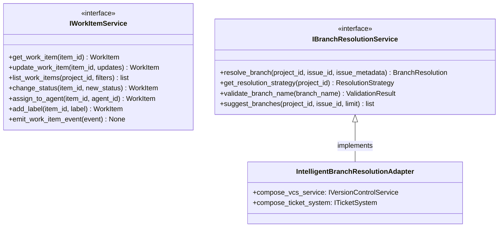

# Work Coordination Output Ports

This documentation covers the output ports for work item coordination and branch resolution.

## Purpose

The work coordination output ports define contracts for:

- **IWorkItemService**: Extended work item operations with event emission
- **IBranchResolutionService**: Branch resolution decision making for work items

These ports handle work item state management and intelligent branch strategy.

## Interface Definition

### IWorkItemService

```python
class IWorkItemService(ABC):
    """
    Extended work item operations with event emission.

    Combines ticket operations with event notification.
    """

    @abstractmethod
    async def get_work_item(self, item_id: WorkItemId) -> WorkItem:
        """Retrieve work item."""
        pass

    @abstractmethod
    async def update_work_item(self, item_id: WorkItemId, updates: dict[str, Any]) -> WorkItem:
        """Update work item properties."""
        pass

    @abstractmethod
    async def list_work_items(self, project_id: ProjectId, filters: dict[str, Any] | None = None) -> list[WorkItem]:
        """Query work items."""
        pass

    @abstractmethod
    async def change_status(self, item_id: WorkItemId, new_status: WorkItemStatus) -> WorkItem:
        """Change work item status."""
        pass

    @abstractmethod
    async def assign_to_agent(self, item_id: WorkItemId, agent_id: str) -> WorkItem:
        """Assign work item to agent."""
        pass

    @abstractmethod
    async def add_label(self, item_id: WorkItemId, label: str) -> WorkItem:
        """Add label to work item."""
        pass

    @abstractmethod
    async def emit_work_item_event(self, event: CodetoreumEvent) -> None:
        """Emit domain event for work item state change."""
        pass
```

### IBranchResolutionService

```python
class IBranchResolutionService(ABC):
    """
    Branch resolution decision service.

    Determines whether to create new or reuse existing branches based on issue metadata.
    """

    @abstractmethod
    async def resolve_branch(
        self,
        project_id: ProjectId,
        issue_id: str,
        issue_metadata: Mapping[str, Any]
    ) -> BranchResolution:
        """
        Resolve branch for work item.

        Applies resolution strategies (exact match, parent issue, sibling, fuzzy match, create new).
        """
        pass

    @abstractmethod
    async def get_resolution_strategy(self, project_id: ProjectId) -> ResolutionStrategy:
        """Get configured branch resolution strategy."""
        pass

    @abstractmethod
    async def validate_branch_name(self, branch_name: str) -> ValidationResult:
        """Validate branch naming conventions."""
        pass

    @abstractmethod
    async def suggest_branches(
        self,
        project_id: ProjectId,
        issue_id: str,
        limit: int = 5
    ) -> list[BranchSuggestion]:
        """Suggest potential branches for work item."""
        pass
```

## Methods

### IWorkItemService Methods

| Method | Parameters | Return Type | Description |
|---|---|---|---|
| `get_work_item()` | `item_id: WorkItemId` | `WorkItem` | Retrieve work item |
| `update_work_item()` | `item_id, updates` | `WorkItem` | Update work item |
| `list_work_items()` | `project_id, filters` | `list[WorkItem]` | Query work items |
| `change_status()` | `item_id, new_status` | `WorkItem` | Change work item status |
| `assign_to_agent()` | `item_id, agent_id` | `WorkItem` | Assign to agent |
| `add_label()` | `item_id, label` | `WorkItem` | Add label |
| `emit_work_item_event()` | `event: CodetoreumEvent` | `None` | Emit event |

### IBranchResolutionService Methods

| Method | Parameters | Return Type | Description |
|---|---|---|---|
| `resolve_branch()` | `project_id, issue_id, issue_metadata` | `BranchResolution` | Resolve branch strategy |
| `get_resolution_strategy()` | `project_id` | `ResolutionStrategy` | Get configured strategy |
| `validate_branch_name()` | `branch_name` | `ValidationResult` | Validate naming |
| `suggest_branches()` | `project_id, issue_id, limit` | `list[BranchSuggestion]` | Suggest branches |

## Events Emitted

- **WorkItemUpdatedEvent** — When work item properties change
- **WorkItemCreatedEvent** — When new work item created
- **BranchResolvedEvent** — When branch resolution complete

## Error Contracts

- **WorkItemNotFoundError** — When work item doesn't exist
- **InvalidBranchNameError** — When branch name invalid
- **ResolutionFailedError** — When branch resolution fails
- **AgentNotFoundError** — When assigning non-existent agent
- **ExternalServiceError** — When external service fails

## Adapter Implementations

| Adapter Class | Type | File Path | Notes |
|---|---|---|---|
| `WorkItemServiceAdapter` | Production | `adapters/secondary/` | Work item service implementation |
| `IntelligentBranchResolutionAdapter` | Production | `adapters/secondary/` | Intelligent branch resolution |
| `SimpleStrategyBranchResolutionAdapter` | Production | `adapters/secondary/` | Simple branch strategy |
| `MockWorkItemServiceAdapter` | Testing | `adapters/testing/` | In-memory work item service |
| `MockBranchResolutionAdapter` | Testing | `adapters/testing/` | In-memory branch resolution |

## Diagram


