# Bootstrap Wiring: Simulation System Startup Sequence

Complete documentation of how the Simulation Implementation wires all 53 adapters and 11 application services through a 6-phase bootstrap sequence.

## Bootstrap Overview

The Simulation Implementation bootstrap is implemented in:
```
src/codetoreum/infrastructure/simulation/bootstrap.py
  - SimulationApplicationBootstrap (main orchestrator)
  - SimulationAdapters (container for all 35+ output adapters)
  - SimulationServices (container for 11 application services)
  - SimulationPorts (container for 18 input port implementations)
```

The bootstrap is called from test runners and scenario loaders to prepare a complete, wired system for testing.

## 6-Phase Bootstrap Sequence

### Phase 0: Create Simulation Engine

**Purpose**: Set up timing control and simulation-specific configuration

**What happens**:
1. Create `SimulationEngine` with clock and configuration
2. Create `SimulationClock` with speed multiplier (default: 100x)
3. Initialize timing state for fast-forwarding
4. Set up scenario configuration from YAML or defaults

**Code**:
```python
# Phase 0: Create simulation engine
engine = SimulationEngine(
    config=config,  # SimulationConfig with speed_multiplier
    clock=SimulationClock(speed_multiplier=100.0),
)
```

**Output**: Configured simulation engine ready for adapter creation

---

### Phase 1: Create Infrastructure (Early for Event Subscriptions)

**Purpose**: Set up event bus, logging, and error handling BEFORE adapters

**Why Early**: Adapters need to subscribe to domain events during instantiation. The event bus must exist before Phase 2.

**What happens**:
1. Create `EventBus` (pub/sub for domain events)
2. Create `ErrorRegistry` (error ID management)
3. Create logger configuration
4. Create `CausalLinkRegistry` (event tracing)
5. Create `BootstrapDegradedModeState` (failure tracking)

**Code**:
```python
# Phase 1: Create infrastructure (early for event subscriptions)
event_bus = EventBus()
error_registry = ErrorRegistry()
causal_link_registry = CausalLinkRegistry()
degraded_mode = BootstrapDegradedModeState()
```

**Output**: Wired infrastructure ready for adapter subscriptions

---

### Phase 2: Create Output Port Adapters (35 Testing Adapters)

**Purpose**: Instantiate all mock and in-memory adapters for output ports

**Dependencies**: Requires Phase 1 (event bus must exist)

**How It Works**:
- Uses `AdapterResolver` for dependency injection
- `AdapterResolver` understands adapter dependencies and instantiation order
- Each adapter is created and registered in `SimulationAdapters` container
- Adapters can subscribe to domain events during initialization
- Returns all 35+ adapters wired together

**Adapters Created** (35 total):
- **Ticket System**: `InMemoryTicketAdapter`
- **LLM Provider**: `MockLLMAdapter`
- **Container**: `FakeContainerAdapter`
- **Repository**: `InMemoryRepositoryAdapter`
- **Event Store**: `InMemoryEventStore`
- **Board Service**: `MockBoardAdapter`
- **Repair Cycle**: `MockRepairCycleAdapter`
- **... 28 more adapters**

**Code**:
```python
# Phase 2: Create adapters via resolver
resolver = AdapterResolver(
    event_bus=event_bus,
    config=config,
)
adapters = await resolver.create_all_adapters()
# Returns SimulationAdapters container with 35+ typed adapters
```

**Key Outputs**:
- `adapters.ticket_system: ITicketSystem` (InMemoryTicketAdapter)
- `adapters.llm_provider: ILLMProvider` (MockLLMAdapter)
- `adapters.container: IContainer` (FakeContainerAdapter)
- `adapters.board: IBoardService` (MockBoardAdapter)
- ... 31 more adapters, all typed as port interfaces

---

### Phase 3: Create Application Services (11 Services)

**Purpose**: Instantiate domain orchestration logic with dependencies injected

**Dependencies**: Requires Phase 2 (adapters must exist)

**Services Created** (11 total):
1. `WorkflowOrchestrator` — Coordinates multi-stage workflows
2. `ExecutionService` — Manages agent execution lifecycle
3. `AgentScheduler` — Queues and schedules executions
4. `PipelineManager` — Controls workflow progression
5. `ReviewService` — Handles code review cycles
6. `FeedbackProcessor` — Processes review feedback
7. `WorkspaceRouter` — Manages container workspaces
8. `ConfigurationService` — Manages configuration
9. `WorkItemService` — Work item operations
10. `AgentExecutionRecoveryService` — Recovery logic
11. `MultiProjectOrchestrator` — Multi-project coordination

**Dependency Injection Pattern**:
```python
# Example: ExecutionService receives all dependencies
execution_service = ExecutionService(
    ticket_system=adapters.ticket_system,
    llm_provider=adapters.llm_provider,
    container=adapters.container,
    event_store=adapters.event_store,
    board=adapters.board,
    # ... 30 more adapter dependencies
)
```

**Code**:
```python
# Phase 3: Create services
workflow_orchestrator = WorkflowOrchestrator(
    ticket_system=adapters.ticket_system,
    board=adapters.board,
    event_bus=event_bus,
    # ... more dependencies
)

execution_service = ExecutionService(
    workspace_router=workspace_router,
    ticket_system=adapters.ticket_system,
    # ... 30+ dependencies
)

# ... create remaining 9 services
```

**Output**: `SimulationServices` container with 11 fully-wired services

---

### Phase 4: Create Input Port Implementations (18 Mock Adapters)

**Purpose**: Wrap application services to implement HTTP request/response ports

**Dependencies**: Requires Phase 3 (services must exist)

**Input Ports Created** (18 total):
1. `MockOrchestrationCommandAdapter` — Wraps `WorkflowOrchestrator`
2. `MockWorkflowCommandAdapter` — Wraps `WorkflowOrchestrator`
3. `MockWorkflowQueryPort` — Wraps `WorkflowOrchestrator`
4. `MockWorkItemCommandAdapter` — Wraps `WorkItemService`
5. `MockWorkItemQueryAdapter` — Wraps `WorkItemService`
6. `MockExecutionCommandAdapter` — Wraps `ExecutionService`
7. `MockExecutionQueryAdapter` — Wraps `ExecutionService`
8. `MockAgentCommandAdapter` — Wraps agent-related service
9. `MockAgentQueryAdapter` — Wraps agent-related service
10. `MockConfigCommandAdapter` — Wraps `ConfigurationService`
11. `MockConfigQueryAdapter` — Wraps `ConfigurationService`
12. ... 7 more input ports

**Code**:
```python
# Phase 4: Create input ports (wrapping services)
orchestration_command = MockOrchestrationCommandAdapter(
    orchestrator=services.workflow_orchestrator,
)

work_item_command = MockWorkItemCommandAdapter(
    work_item_service=services.work_item_service,
    ticket_system=adapters.ticket_system,
)

# ... create remaining 16 input ports
```

**Output**: `SimulationPorts` container with 18 fully-wired input ports

---

### Phase 5: Create FastAPI App and Register Event Handlers

**Purpose**: Mount all input ports to HTTP endpoints and wire event subscriptions

**Dependencies**: Requires Phases 1-4 (all adapters and services)

**What Happens**:
1. Create FastAPI application instance
2. Import and mount simulation routers (for testing endpoints)
3. Register event handlers for domain events:
   - `BoardColumnEventHandler` — Work item column transitions
   - `ReviewEventHandler` — Review status changes
   - `PRReviewCycleEventHandler` — PR review workflows
   - `PRReviewCycleDispatchHandler` — PR dispatch logic
4. Wire input ports to HTTP endpoints
5. Configure CORS, middleware, exception handling
6. Return fully-configured FastAPI app

**Event Handler Registration**:
```python
# Phase 5: Register event handlers
event_bus.subscribe(
    WorkItemColumnChanged,
    BoardColumnEventHandler(
        agent_executor=services.execution_service.agent_executor,
        # ... dependencies
    )
)

event_bus.subscribe(
    ReviewStatusChanged,
    ReviewEventHandler(services.review_service)
)

# ... register more event handlers
```

**Endpoint Mounting**:
```python
# Mount all input port endpoints
app.include_router(
    create_router_for_port(orchestration_command),
    prefix="/api/orchestration",
)

app.include_router(
    create_router_for_port(work_item_command),
    prefix="/api/work-items",
)

# ... mount remaining input ports
```

**Code Example**:
```python
# Phase 5: Create FastAPI app
app = await create_app(
    adapters=adapters,
    services=services,
    ports=ports,
    event_bus=event_bus,
)
```

**Output**: Fully-configured FastAPI application ready for HTTP requests

---

## Bootstrap Wiring Diagram (Level 4 Mermaid Flowchart)

```mermaid
flowchart TD
    Start([Bootstrap Start]) --> Phase0["Phase 0: Simulation Engine<br/>━━━━━━━━━━━━<br/>• Create SimulationEngine<br/>• Create SimulationClock<br/>• Load configuration (YAML)"]
    
    Phase0 --> Phase1["Phase 1: Infrastructure<br/>━━━━━━━━━━━━<br/>• Create EventBus<br/>• Create ErrorRegistry<br/>• Create Logger<br/>• Create CausalLinkRegistry<br/>⚠️ EARLY: Event subscriptions needed!"]
    
    Phase1 --> Phase2["Phase 2: Output Port Adapters (35)<br/>━━━━━━━━━━━━━━━━━━━<br/>Depends on: Phase 1 (EventBus)"]
    
    Phase2 --> Phase2a["Create Ticket System<br/>InMemoryTicketAdapter"]
    Phase2a --> Phase2b["Create LLM Provider<br/>MockLLMAdapter"]
    Phase2b --> Phase2c["Create Container Runtime<br/>FakeContainerAdapter"]
    Phase2c --> Phase2d["Create Repository<br/>InMemoryRepositoryAdapter"]
    Phase2d --> Phase2e["Create Event Store<br/>InMemoryEventStore"]
    Phase2e --> Phase2f["Create Board Service<br/>MockBoardAdapter"]
    Phase2f --> Phase2g["Create 29 More Adapters<br/>Repair Cycle, Review Cycle,<br/>Storage, Config, Metrics, etc."]
    
    Phase2g --> Phase3["Phase 3: Application Services (11)<br/>━━━━━━━━━━━━━━<br/>Depends on: Phase 2 (Adapters)"]
    
    Phase3 --> Phase3a["Create WorkflowOrchestrator<br/>Inject: ticket, board, event_bus"]
    Phase3a --> Phase3b["Create ExecutionService<br/>Inject: 30+ adapter dependencies"]
    Phase3b --> Phase3c["Create AgentScheduler<br/>Inject: queue, event_bus"]
    Phase3c --> Phase3d["Create 8 More Services<br/>PipelineManager, ReviewService,<br/>WorkspaceRouter, ConfigService, etc."]
    
    Phase3d --> Phase4["Phase 4: Input Port Adapters (18)<br/>━━━━━━━━━━━━━━━━<br/>Depends on: Phase 3 (Services)"]
    
    Phase4 --> Phase4a["Create Command Ports (7)<br/>Wrap service methods as input ports"]
    Phase4a --> Phase4b["Create Query Ports (11)<br/>Wrap service queries as input ports"]
    
    Phase4b --> Phase5["Phase 5: FastAPI App<br/>━━━━━━━━━━━━<br/>Depends on: Phases 1-4"]
    
    Phase5 --> Phase5a["Create FastAPI instance"]
    Phase5a --> Phase5b["Mount Input Port Routers<br/>Orchestration, WorkItem,<br/>Execution, Agent, Config"]
    Phase5b --> Phase5c["Register Event Handlers<br/>BoardColumnEventHandler,<br/>ReviewEventHandler,<br/>PRReviewCycleEventHandler"]
    Phase5c --> Phase5d["Configure Middleware<br/>CORS, Exception Handling,<br/>Logging"]
    
    Phase5d --> Phase6["Phase 6 (Optional): Watchdog Services<br/>━━━━━━━━━━━━━━━━<br/>• Auto-advance clock<br/>• Stale lock watchdog<br/>• Execution timeout watchdog<br/>• SLA expiry watchdog<br/>• Column progression watchdog"]
    
    Phase6 --> End([Bootstrap Complete<br/>Ready for Testing])
    
    style Phase0 fill:#FFE4B5
    style Phase1 fill:#FFD700
    style Phase2 fill:#90EE90
    style Phase3 fill:#87CEEB
    style Phase4 fill:#DDA0DD
    style Phase5 fill:#F08080
    style Phase6 fill:#FFC0CB
    style End fill:#98FB98
```



---

## Detailed Bootstrap Process Code

### Complete Bootstrap Implementation

```python
# Location: src/codetoreum/infrastructure/simulation/bootstrap.py

class SimulationApplicationBootstrap:
    """Orchestrates 6-phase bootstrap of simulation system."""
    
    async def setup(self) -> FastAPI:
        """Execute complete 6-phase bootstrap."""
        
        try:
            # Phase 0: Create simulation engine
            logger.info("Phase 0: Creating simulation engine...")
            engine = self._create_engine(self.config)
            
            # Phase 1: Create infrastructure (EARLY)
            logger.info("Phase 1: Creating infrastructure...")
            infrastructure = self._create_infrastructure(engine)
            
            # Phase 2: Create adapters
            logger.info("Phase 2: Creating 35 adapters...")
            adapters = await self._create_adapters()
            
            # Phase 2b: Register causal links
            logger.info("Phase 2b: Registering causal links...")
            self._register_causal_links(adapters)
            
            # Phase 3: Create services
            logger.info("Phase 3: Creating 11 services...")
            services = await self._create_services()
            
            # Phase 4: Create input ports
            logger.info("Phase 4: Creating 18 input ports...")
            ports = self._create_ports()
            
            # Phase 5: Create FastAPI app
            logger.info("Phase 5: Creating FastAPI app...")
            app = await self._create_app()
            
            # Phase 5b: Validate causal links
            logger.info("Phase 5b: Validating causal link consistency...")
            self._validate_causal_links()
            
            # Phase 6+: Optional watchdogs
            self._start_optional_watchdogs()
            
            logger.info("Bootstrap complete!")
            return app
            
        except Exception as e:
            logger.error(f"Bootstrap failed: {e}", exc_info=True)
            raise
```

### Key Data Structures

```python
@dataclass
class SimulationAdapters:
    """All 35+ output port adapters."""
    ticket_system: ITicketSystem
    llm_provider: ILLMProvider
    container: IContainer
    board: IBoardService
    event_store: IEventStore
    # ... 30 more adapters
    
    # Type-safe accessor methods
    def ticket_as_mock(self) -> InMemoryTicketAdapter:
        """Get ticket adapter as mock (for test code)."""
        return cast(InMemoryTicketAdapter, self.ticket_system)

@dataclass
class SimulationServices:
    """All 11 application services."""
    workflow_orchestrator: WorkflowOrchestrator
    execution_service: ExecutionService
    agent_scheduler: AgentScheduler
    pipeline_manager: PipelineManager
    review_service: ReviewService
    feedback_processor: FeedbackProcessor
    workspace_router: WorkspaceRouter
    configuration_service: ConfigurationService
    work_item_service: WorkItemService
    # ... more services

@dataclass
class SimulationPorts:
    """All 18 input port implementations."""
    workflow_command: IWorkflowCommandPort
    workflow_query: IWorkflowQueryPort
    work_item_command: IWorkItemCommandPort
    work_item_query: IWorkItemQueryPort
    # ... 14 more input ports
```

---

## Dependency Graph

### Simplified Dependency View

```
Phase 1 (EventBus) ←─ Required by ─→ Phase 2 (Adapters)
                                            ↓
                                      Phase 3 (Services)
                                            ↓
                                      Phase 4 (Input Ports)
                                            ↓
                                      Phase 5 (FastAPI App)
                                            ↓
                                      Phase 6 (Watchdogs)
```

### Adapter Dependencies (Phase 2 Internal Order)

```
InMemoryEventStore (no deps)
InMemoryConfigStore (no deps)
InMemoryTicketAdapter (event_bus)
MockLLMAdapter (event_bus)
FakeContainerAdapter (event_bus)
InMemoryVersionControlService (event_bus)
MockBoardAdapter (ticket_adapter, event_bus)
MockRepairCycleAdapter (ticket_adapter)
InMemoryWorkflowConfigService (event_bus)
... (26 more adapters in dependency order)
```

### Service Dependencies (Phase 3 Internal Order)

```
WorkflowOrchestrator (ticket, board, event_bus)
  ↓
ExecutionService (orchestrator + 30 adapters)
  ↓
AgentScheduler (execution_service)
  ↓
PipelineManager (workflow_orchestrator)
  ↓
ReviewService (ticket_system, review_cycle)
  ↓
FeedbackProcessor (review_service)
  ↓
WorkspaceRouter (container, version_control)
  ↓
ConfigurationService (config_store)
  ↓
WorkItemService (ticket_system)
  ↓
... (more services)
```

---

## Bootstrap Configuration

### From Code

```python
# Create simulation with fast configuration
config = SimulationConfig.create_fast_config(
    name="test_workflow",
    speed_multiplier=100.0,  # 100x faster
)

bootstrap = SimulationApplicationBootstrap(config)
app = await bootstrap.setup()
```

### From YAML

```python
# Load scenario from YAML
config = SimulationConfig.from_yaml("scenarios/demo.yaml")

bootstrap = SimulationApplicationBootstrap(config)
app = await bootstrap.setup()
```

### YAML Configuration Example

```yaml
name: "smoke_test"
speed_multiplier: 10.0
auto_advance: false

# Optional: Override adapter selections
adapters:
  ticket_system: "in_memory"
  llm_provider: "mock"
  container: "fake"
  event_store: "in_memory"
  board: "mock"

projects:
  - name: "test-project"
    description: "Test project"

workflows:
  - name: "test-workflow"
    stages:
      - name: "analyze"
        agent_type: "architect"
        order: 1
      - name: "code"
        agent_type: "coder"
        order: 2
```

---

## Error Handling and Degraded Mode

The bootstrap includes degraded mode support for graceful degradation:

```python
@dataclass
class BootstrapDegradedModeState:
    """Tracks bootstrap phase failures."""
    failed_phases: dict[BootstrapPhase, str]
    
    def mark_failed(self, phase: BootstrapPhase, error: str) -> None:
        """Mark a phase as failed."""
        self.failed_phases[phase] = error
    
    @property
    def is_degraded(self) -> bool:
        """True if any phases failed."""
        return bool(self.failed_phases)
```

**Phases That Can Degrade**:
- Phase 6 (Auto-advance)
- Phase 6b (Stale lock watchdog)
- Phase 6c (Execution timeout watchdog)
- Phase 6d (SLA expiry watchdog)
- Phase 6e (Column progression watchdog)

**Phases That Fail Hard**:
- Phase 0-5 (Critical infrastructure)

If a watchdog (Phase 6+) fails, the system logs a warning but continues with degraded mode.

---

## Absorbed Content from PRODUCTION_BOOTSTRAP_WIRING.md

This document absorbs relevant bootstrap integration patterns from the renamed `PRODUCTION_BOOTSTRAP_WIRING.md`:

### Factories for Production Bootstrap (Future Phase 7)

When production bootstrap is created, the following factories from `codetoreum.adapters.primary.factories` will be available:

```python
# Two-step instantiation pattern
branch_resolution = create_branch_resolution_adapter(
    ticket_system=real_github_adapter,
    version_control=real_vcs_adapter,
    event_emitter=real_event_emitter,
)

workspace_router = create_workspace_router_with_branch_resolution(
    version_control=real_vcs_adapter,
    container=real_container_adapter,
    event_store=real_event_store,
    branch_resolution_service=branch_resolution,
)
```

The simulation bootstrap already includes these adapters (simulation versions), serving as a template for production bootstrap integration.

---

## Testing Bootstrap Behavior

### Verify Bootstrap Completeness

```python
# After bootstrap completes, verify all adapters are wired
adapters = bootstrap.adapters
assert isinstance(adapters.ticket_system, ITicketSystem)
assert isinstance(adapters.llm_provider, ILLMProvider)
assert isinstance(adapters.container, IContainer)
# ... verify all 35+ adapters

# Verify services are created
services = bootstrap.services
assert services.workflow_orchestrator is not None
assert services.execution_service is not None
# ... verify all 11 services

# Verify input ports are wired
ports = bootstrap.ports
assert ports.workflow_command is not None
assert ports.work_item_query is not None
# ... verify all 18 ports
```

### Monitor Bootstrap Phases

```python
# Bootstrap logs each phase
logger.info("Phase 0: Creating simulation engine...")
logger.info("Phase 1: Creating infrastructure...")
logger.info("Phase 2: Creating 35 adapters...")
logger.info("Phase 3: Creating 11 services...")
logger.info("Phase 4: Creating 18 input ports...")
logger.info("Phase 5: Creating FastAPI app...")
```

---

## Related Files and References

- **Bootstrap Implementation**: `src/codetoreum/infrastructure/simulation/bootstrap.py`
- **Adapter Resolver**: `src/codetoreum/infrastructure/adapters/resolver.py`
- **Adapter Factory**: `src/codetoreum/infrastructure/adapters/factory.py`
- **Configuration**: `src/codetoreum/infrastructure/simulation/simulation_config.py`
- **Simulation Engine**: `src/codetoreum/infrastructure/simulation/simulation_engine.py`
- **Port Specifications**: `documentation/architecture/ports/`
- **Adapters Reference**: [adapters.md](./adapters.md)
- **Overview**: [overview.md](./overview.md)

---

## Summary

The 6-phase bootstrap creates a complete, wired Simulation Implementation:

| Phase | What | How Many | Duration |
|-------|------|----------|----------|
| 0 | Simulation engine | 1 | < 1ms |
| 1 | Infrastructure | 4 components | < 1ms |
| 2 | Output adapters | 35+ | ~10-50ms |
| 3 | Services | 11 | ~20-100ms |
| 4 | Input ports | 18 | ~10-20ms |
| 5 | FastAPI app | 1 | ~50-200ms |
| **Total** | **Complete system** | **~70 components** | **~100-400ms** |

Total bootstrap time: **100-400ms** depending on adapter complexity and event subscription overhead.

Result: A production-quality simulation system ready for scenario testing.
