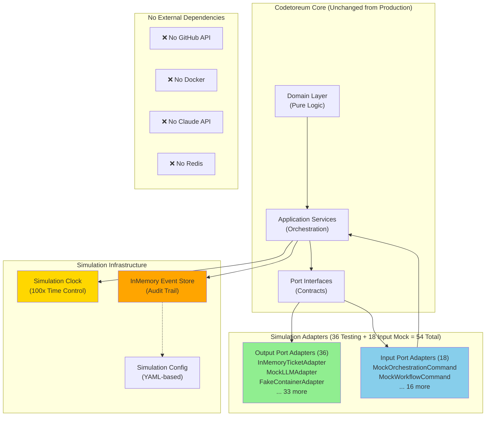

---
required_sections:
  - "## Purpose"
  - "## Architecture"
  - "## Adapter Selections"
  - "## Bootstrap Process"
  - "## Configuration"
  - "## Quick Start"
  - "## Limitations"
  - "## Diagram"
applies_to: "documentation/implementations/simulation/overview.md"
---

# Simulation Implementation: Complete Port Contract Implementation

## Purpose

The Simulation Implementation is a complete, working system that demonstrates all architecture tier port contracts using deterministic mock adapters and in-memory services. It is NOT a test harness or simplified version — it exercises the full work coordination pipeline with real domain logic, real application services, and real event flows.

**What it enables:**
- Fast, deterministic workflow execution without external dependencies (GitHub, Docker, Claude)
- Scenario-based testing to validate complex multi-stage pipelines
- Complete event audit trail through event sourcing for debugging
- 100x faster execution than real-time (time fast-forwarding)
- Reproducible behavior (same input → same output, no flakiness)
- Full exercise of all business rules and state transitions

**Who uses it:**
- Developers testing workflow orchestration logic
- QA validating end-to-end scenarios
- Platform engineers debugging production issues (via event replay)
- Product teams demonstrating features

**Key characteristics:**
- All 54 simulation/mock adapters implement the same port contracts as production
- Domain layer, application services, and event flows are identical to production
- Adapters provide deterministic responses (no randomness, configurable via YAML)
- Time is controlled — simulations advance at 100x speed by default
- In-memory storage — no database, Redis, or external services required

## Architecture

The Simulation Implementation fulfills the complete architecture by providing adapters for all output ports. It uses the same layered structure as production:

```
Input Ports (Mock Adapters) ──→ Application Services ──→ Output Ports (Mock Adapters)
                                      ↓
                                 Domain Layer
                            (Real models, events)
                                      ↓
                                  Event Bus (Real)
                                      ↓
                              Observability (Real)
```

**Key design decisions:**

1. **All Adapters are Mock** — Every port has a deterministic mock implementation:
   - Ticket system: `InMemoryTicketAdapter` (simulates GitHub Issues)
   - LLM provider: `MockLLMAdapter` (returns predefined responses)
   - Container: `FakeContainerAdapter` (simulates Docker execution)
   - Event store: `InMemoryEventStore` (no Redis required)
   - Board service: `MockBoardAdapter` (simulates GitHub Projects)
   - And 31 more adapters for other ports

2. **Real Business Logic** — The domain layer and application services are unchanged from production:
   - `WorkflowOrchestrator` executes the same logic
   - `ExecutionService` manages agent execution lifecycle identically
   - Domain events are immutable and fire the same way
   - Event handlers process events with real business rules

3. **Time Control** — Simulation clock allows fast-forwarding:
   - Operations that would take hours complete in seconds
   - Delays are simulated without actual waiting
   - Speed is configurable per scenario (1x to 100x)

4. **Determinism** — Same input always produces same output:
   - Mock adapters return deterministic responses from configuration
   - No external APIs introduce variability
   - Time advances predictably
   - Perfect for automated testing and debugging

## Adapter Selections

The Simulation Implementation selects mock adapters for all 40+ output ports:

| Port Interface | Adapter Class | File | Type |
|---|---|---|---|
| `ITicketSystem` | `InMemoryTicketAdapter` | `adapters/testing/in_memory_ticket_adapter.py` | Mock |
| `ILLMProvider` | `MockLLMAdapter` | `adapters/testing/mock_llm_adapter.py` | Mock |
| `IContainer` | `FakeContainerAdapter` | `adapters/testing/fake_container_adapter.py` | Mock |
| `IRepository` | `InMemoryRepositoryAdapter` | `adapters/testing/in_memory_repository_adapter.py` | Mock |
| `IEventStore` | `InMemoryEventStore` | `adapters/testing/in_memory_event_store.py` | Mock |
| `IMetrics` | `InMemoryMetricsAdapter` | `adapters/testing/in_memory_metrics_adapter.py` | Mock |
| `IStorage` | `InMemoryStorageAdapter` | `adapters/testing/in_memory_storage_adapter.py` | Mock |
| `IConfigStore` | `InMemoryConfigStore` | `adapters/testing/in_memory_config_store.py` | Mock |
| `INotifier` | `MockNotifierAdapter` | `adapters/testing/mock_notifier_adapter.py` | Mock |
| `IEncryptionService` | `SimpleEncryptionAdapter` | `adapters/testing/simple_encryption_adapter.py` | Simple |
| `IBoardService` | `MockBoardAdapter` | `adapters/testing/mock_board_adapter.py` | Mock |
| `IRepairCycle` | `MockRepairCycleAdapter` | `adapters/testing/mock_repair_cycle_adapter.py` | Mock |
| `IProjectManagerService` | `MockProjectManagerAdapter` | `adapters/testing/mock_project_manager_adapter.py` | Mock |
| `IPipelineLockService` | `InMemoryLockService` | `adapters/secondary/in_memory_queue_lock_service.py` | Mock |
| `IWorkflowConfigService` | `InMemoryWorkflowConfigService` | `adapters/testing/in_memory_workflow_config_service.py` | Mock |
| `IPipelineQueueService` | `InMemoryQueueService` | `adapters/testing/in_memory_queue_service.py` | Mock |
| `IEventEmitter` | `CapturingMockEventEmitter` | `adapters/testing/capturing_mock_event_emitter.py` | Mock |
| `IVersionControlService` | `InMemoryVersionControlService` | `adapters/testing/in_memory_version_control_service.py` | Mock |
| `IMessageBroker` | `InMemoryMessageBroker` | `adapters/testing/in_memory_message_broker.py` | Mock |
| `IDiscussionAdapter` | `MockDiscussionAdapter` | `adapters/testing/mock_discussion_adapter.py` | Mock |
| `IReviewCycle` | `MockReviewCycleAdapter` | `adapters/testing/mock_review_cycle_adapter.py` | Mock |
| `IPRReviewCycle` | `MockPRReviewCycleAdapter` | `adapters/testing/mock_pr_review_cycle_adapter.py` | Mock |
| `ICodeReviewService` | `InMemoryCodeReviewAdapter` | `adapters/testing/in_memory_code_review_adapter.py` | Mock |
| `IIdentityService` | `ConfigurableIdentityService` | `adapters/secondary/configurable_identity_service.py` | Mock |
| `IRepairCycleCheckpointStore` | `InMemoryCheckpointStore` | `adapters/testing/in_memory_checkpoint_store.py` | Mock |
| `ICIPipelineService` | `MockCIPipelineAdapter` | `adapters/testing/mock_ci_pipeline_adapter.py` | Mock |
| `IAgentRepository` | `InMemoryAgentRepository` | `adapters/testing/in_memory_agent_repository.py` | Mock |
| `IActiveWorkflowRunRegistry` | `InMemoryActiveWorkflowRunRegistry` | `adapters/testing/in_memory_active_workflow_run_registry.py` | Mock |
| `IWorkItemBranchTracker` | `InMemoryWorkItemBranchTracker` | `adapters/testing/in_memory_work_item_branch_tracker.py` | Mock |
| `IWorkItemService` | `MockWorkItemService` | `adapters/testing/mock_work_item_service.py` | Mock |
| `IAgentContainerRecoveryService` | `MockContainerRecoveryAdapter` | `adapters/testing/mock_container_recovery_adapter.py` | Mock |
| `ISystemicAnalysisService` | `MockSystemicAnalysisAdapter` | `adapters/testing/mock_systemic_analysis_adapter.py` | Mock |
| `IEnvironmentRepairService` | `MockEnvironmentRepairAdapter` | `adapters/testing/mock_environment_repair_adapter.py` | Mock |
| `IBranchResolutionService` | `MockBranchResolutionAdapter` | `adapters/testing/mock_branch_resolution_adapter.py` | Mock |
| `IAgentExecutor` | `ExecutionServiceAgentExecutor` | `adapters/testing/execution_service_agent_executor.py` | Mock |
| `ITracer` | `InMemoryTracer` | `adapters/testing/in_memory_tracer.py` | Mock |

**Input Port Adapters (18 mock implementations):**

All 18 input ports are implemented via mock adapters that wrap application services:

| Port Interface | Adapter Class | File |
|---|---|---|
| `IOrchestrationCommandPort` | `MockOrchestrationCommandAdapter` | `adapters/primary/input_port_adapters/mock/mock_orchestration_command_adapter.py` |
| `IAgentCommandPort` | `MockAgentCommandAdapter` | `adapters/primary/input_port_adapters/mock/mock_agent_command_adapter.py` |
| `IAgentQueryPort` | `MockAgentQueryAdapter` | `adapters/primary/input_port_adapters/mock/mock_agent_query_adapter.py` |
| `IWorkflowCommandPort` | `MockWorkflowCommandAdapter` | `adapters/primary/input_port_adapters/mock/mock_workflow_command_adapter.py` |
| `IConfigurationCommandPort` | `MockConfigCommandAdapter` | `adapters/primary/input_port_adapters/mock/mock_config_command_adapter.py` |
| `IConfigurationQueryPort` | `MockConfigQueryAdapter` | `adapters/primary/input_port_adapters/mock/mock_config_query_adapter.py` |
| `IExecutionCommandPort` | `MockExecutionCommandAdapter` | `adapters/primary/input_port_adapters/mock/mock_execution_command_adapter.py` |
| `IExecutionQueryPort` | `MockExecutionQueryAdapter` | `adapters/primary/input_port_adapters/mock/mock_execution_query_adapter.py` |
| `IWorkflowDefinitionCommandPort` | `MockWorkflowDefinitionCommandAdapter` | `adapters/primary/input_port_adapters/mock/mock_workflow_definition_command_adapter.py` |
| `IWorkflowQueryPort` | `MockWorkflowQueryAdapter` | `adapters/primary/input_port_adapters/mock/mock_workflow_query_adapter.py` |
| `IWorkItemCommandPort` | `MockWorkItemCommandAdapter` | `adapters/primary/input_port_adapters/mock/mock_work_item_command_adapter.py` |
| `IWorkItemQueryPort` | `MockWorkItemQueryAdapter` | `adapters/primary/input_port_adapters/mock/mock_work_item_query_adapter.py` |
| `ITaskQueryPort` | `MockTaskQueryAdapter` | `adapters/primary/input_port_adapters/mock/mock_task_query_adapter.py` |
| `IMetricsQueryPort` | `MockMetricsQueryAdapter` | `adapters/primary/input_port_adapters/mock/mock_metrics_query_adapter.py` |
| `IWorkspaceQueryPort` | `MockWorkspaceQueryAdapter` | `adapters/primary/input_port_adapters/mock/mock_workspace_query_adapter.py` |
| `IConfigurationServicePort` | `MockConfigServiceAdapter` | `adapters/primary/input_port_adapters/mock/mock_config_service_adapter.py` |
| `IAuditQueryPort` | `AuditQueryAdapter` | `adapters/primary/audit_query_adapter.py` |
| `IWorkflowRunQueryPort` | `MockWorkflowRunQueryAdapter` | `adapters/primary/input_port_adapters/mock/mock_workflow_run_query_adapter.py` |

## Bootstrap Process

The Simulation Implementation uses a 6-phase bootstrap sequence to wire all adapters and services together. See [bootstrap-wiring.md](./bootstrap-wiring.md) for detailed diagrams and code examples.

**6-Phase Bootstrap Summary:**

1. **Phase 0**: Create simulation engine (clock, timing control, configuration)
2. **Phase 1**: Create infrastructure (event bus, logger, error registry) — created early to enable event subscriptions
3. **Phase 2**: Create 36 output port adapters via `AdapterResolver` (all mock/in-memory implementations)
4. **Phase 3**: Create 11 application services with dependencies (workflow orchestrator, execution service, etc.)
5. **Phase 4**: Create 18 input port implementations (mock adapters wrapping application services)
6. **Phase 5**: Create FastAPI app and mount routes, register event handlers, wire infrastructure

**Result**: A complete, wired application ready for scenario testing.

## Configuration

The Simulation Implementation is configured via `SimulationConfig` with these key options:

**Python Configuration:**
```python
from codetoreum.infrastructure.simulation.simulation_config import SimulationConfig

# Fast configuration for unit tests (100x speed)
config = SimulationConfig.create_fast_config(
    name="test_workflow",
    speed_multiplier=100.0,
)

# Realistic configuration for demos (1x speed)
config = SimulationConfig.create_realistic_config(
    name="demo_workflow",
)

# Load from YAML file
config = SimulationConfig.from_yaml("scenarios/demo.yaml")
```

**Key Configuration Fields:**
- `name`: Scenario name (for logging)
- `speed_multiplier`: Time acceleration (1.0 = real-time, 100.0 = 100x faster)
- `auto_advance`: Whether to auto-advance time
- `auto_advance_interval_seconds`: How often to advance
- `adapter_selection`: Which adapters to use (all simulation adapters by default)

**Scenario YAML Configuration:**
```yaml
name: "workflow-scenario"
speed_multiplier: 10.0
auto_advance: true
auto_advance_interval_seconds: 30

# Projects, workflows, agents, work items defined below
projects:
  - name: "test-project"
    # ...
```

See [scenarios.md](./scenarios.md) for complete scenario configuration examples.

## Quick Start

### Running Simulation Tests

```bash
# Install dependencies
poetry install

# Run simulation test suite
poetry run pytest tests/simulation/ -v

# Run a specific scenario
poetry run pytest tests/simulation/test_scenarios.py::test_smoke_scenario -v
```

### Running a Scenario Programmatically

```python
from codetoreum.infrastructure.simulation import (
    SimulationApplicationBootstrap,
    SimulationRunner,
)
from codetoreum.infrastructure.simulation.simulation_config import SimulationConfig
import asyncio

async def main():
    # Create configuration
    config = SimulationConfig.create_fast_config("demo")
    
    # Create runner
    runner = SimulationRunner(config)
    
    # Define scenario
    async def scenario(sim):
        # Access adapters and services
        ticket_adapter = sim.adapters.ticket_as_mock()
        
        # Add work items
        await ticket_adapter.add_work_item(
            project_id="test-project",
            title="Implement feature",
            description="Feature description",
        )
        
        # Advance time
        await sim.advance_time(timedelta(minutes=5))
        
        # Make assertions
        sim.assert_event_occurred("WorkItemColumnChanged")
    
    # Run scenario
    result = await runner.run(scenario)
    assert result.success
    print(f"Scenario completed in {result.elapsed_seconds}s (speed: {result.speed_multiplier}x)")

asyncio.run(main())
```

### Starting Simulation Server

```bash
# Start simulation server on port 8000
poetry run python -m codetoreum.cli.simulation_server \
    --scenario scenarios/demo.yaml \
    --host 0.0.0.0 \
    --port 8000

# Access simulation endpoints
curl http://localhost:8000/api/work-items
curl http://localhost:8000/api/workflows
curl http://localhost:8000/api/executions
```

## Limitations

**By Design (Simulation-Specific):**
- No real GitHub interactions — all ticket operations are simulated
- No real container execution — agent execution is mocked
- No real Claude API calls — LLM responses come from mock patterns
- Time is controlled (not real-time) — advances at configured speed
- No persistence across restarts — all data is in-memory
- Responses are deterministic — no variability for testing purposes

**Not Yet Supported:**
- Jira integration (only GitHub simulated) — use real GitHub adapter in production
- Kubernetes support (only Docker-compatible simulation) — use Kubernetes adapters in production
- Horizontal scaling (single-node only) — multi-node clustering not implemented

**Expected Differences from Production:**
- Agent execution returns predefined mock responses (not real Claude API)
- GitHub Projects columns are simulated (not real GitHub API)
- Performance metrics are simulated (not real system metrics)
- Event latency is near-zero (no network delays)

## Diagram

**Component Architecture — Simulation Implementation:**



**Bootstrap Wiring — Phases 0-5:**

See [bootstrap-wiring.md](./bootstrap-wiring.md) for the detailed 6-phase bootstrap diagram.

## See Also

- [Implementations Overview](../README.md) — All implementation tiers
- [Bootstrap Wiring](./bootstrap-wiring.md) — 6-phase bootstrap sequence with flowchart
- [Adapters Reference](./adapters.md) — Complete mapping of all 54 adapters
- [Scenarios Reference](./scenarios.md) — All 10 scenario directories and 80 YAML files
- [Architecture: Ports](../../architecture/ports/) — Port interface specifications
- [Architecture: Domain](../../architecture/domain/) — Domain models and events
