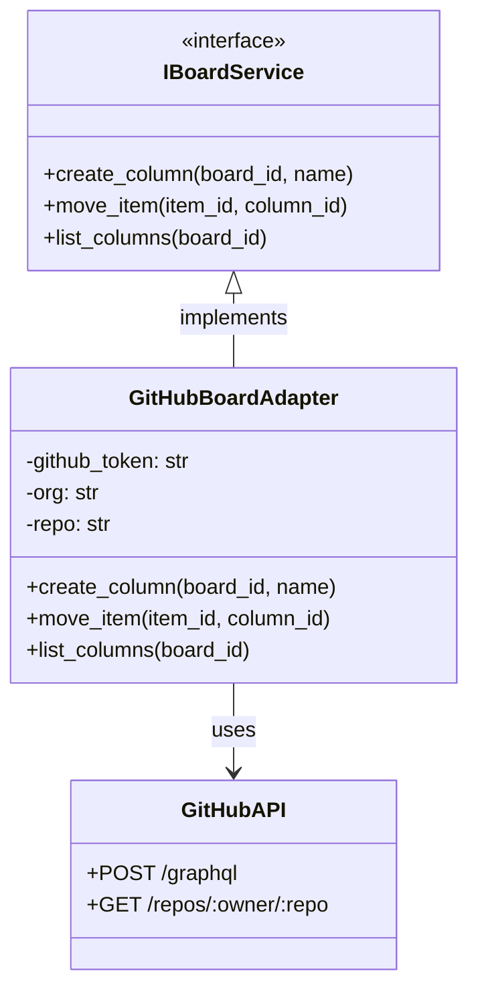
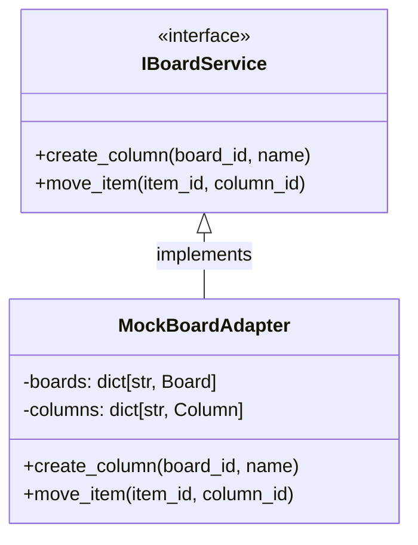

---
required_sections:
  - "## Purpose"
  - "## Implementation Strategy"
  - "## Configuration"
  - "## Error Handling"
  - "## Testing"
  - "## Source"
  - "## Diagram"
required_elements:
  - "mermaid"
  - "python code block"
applies_to: "documentation/implementations/**/*adapter*.md"
---

# Adapter Documentation Template

Adapter documentation describes how a specific implementation fulfills one or more port contracts. Each adapter shows the "glue" connecting domain logic to external systems or mock implementations.

## Purpose

One or more paragraphs describing:
- What port(s) this adapter implements
- What external system or service it connects to (if production) or what it simulates (if mock)
- Why this adapter exists
- When it's used (production vs. testing)

Example: "GitHubBoardAdapter implements IBoardService by translating Codetoreum board operations (create column, move item, etc.) into GitHub GraphQL mutations. It's used in production to synchronize with GitHub's native project boards."

Example (mock): "MockBoardAdapter implements IBoardService with deterministic, in-memory responses. Used in simulation testing to enable fast, repeatable testing without GitHub dependencies."

## Implementation Strategy

Explain how this adapter fulfills the port contract:
- What external API or service does it call?
- What translation happens between domain types and external system types?
- What are the key design decisions?
- How does it handle concurrency or complex scenarios?

For production adapters:
- External API or service documentation links
- Authentication and credential handling
- Rate limiting and resilience patterns

For mock adapters:
- How it simulates behavior
- What deterministic responses it provides
- How configuration controls its behavior

Example: "GitHubBoardAdapter makes GraphQL queries using the GitHub API. It translates WorkItem domain objects to GitHub Issues, columns to Labels, and transitions to issue updates. Resilience is handled by the ResilientBoardServiceDecorator wrapper."

## Configuration

Document required parameters and environment variables:

```python
class GitHubBoardAdapter(IBoardService):
    def __init__(
        self,
        github_token: str,          # Required: GitHub API token
        org: str,                   # Required: GitHub organization
        repo: str,                  # Required: Repository name
        timeout_seconds: int = 30,  # Optional: API timeout (default 30s)
        rate_limit_per_minute: int = 60,  # Optional: Rate limit
    ):
        ...
```

Include:
- Parameter names and types
- Which parameters are required vs. optional
- Default values for optional parameters
- Environment variable names (if applicable)
- Constraints or allowed values

## Error Handling

Document error scenarios and how this adapter handles them:

- **External system unavailable**: Describe fallback behavior (retry, timeout, etc.)
- **Invalid configuration**: What happens if required parameters are missing?
- **Permission errors**: How does the adapter signal authentication failures?
- **Malformed responses**: How are unexpected external API responses handled?
- **Serialization errors**: How does the adapter handle type mismatches?

Example: "GitHubBoardAdapter catches GitHub API errors and translates them to port-standard exceptions (NotFound, ValidationError). Network timeouts trigger a circuit breaker after 3 failures within 60 seconds, then fail fast. All errors are logged with full context (event_id, error response, retry count)."

## Testing

Describe how this adapter is tested:

- **Unit tests**: What does the adapter test in isolation?
- **Integration tests**: How is the adapter tested with other components?
- **Mock testing**: If this is a production adapter, how is it mocked in tests?
- **Coverage**: What test scenarios exist?

Example: "GitHubBoardAdapter is tested via contracts tests that verify it implements IBoardService correctly. Mock responses are used to simulate GitHub API behavior. Separate tests verify error handling (API failures, timeouts, invalid responses). The adapter is wrapped in ResilientBoardServiceDecorator which is tested separately for circuit breaker behavior."

## Source

File path and class information:

**File Path**: `src/codetoreum/adapters/secondary/github/board_adapter.py`

**Class**: `class GitHubBoardAdapter(IBoardService):`

**Related Files**:
- Configuration: `src/codetoreum/config/github_config.py`
- Tests: `tests/unit/adapters/secondary/github/test_board_adapter.py`
- Wiring: Instantiated in `infrastructure/simulation/bootstrap.py` or production bootstrap

## Diagram

Include a Mermaid diagram showing:
- The adapter class
- The port interface it implements
- External system(s) it interacts with (if production)
- Key methods and their data flows



For mock adapters, show the in-memory state:



## Production vs. Mock

If this adapter has both production and mock variants, include a comparison:

| Aspect | Production | Mock |
|---|---|---|
| External System | Real GitHub API | In-memory dict |
| Latency | 100-500ms | < 1ms |
| Determinism | No (depends on state) | Yes (deterministic) |
| Dependencies | GitHub credentials, network | None |
| Use Case | Production, staging | Testing, development |

## Cross-References

This template applies to adapter documentation in:
- `documentation/implementations/simulation/adapters.md`
- Any future implementation documentation files

## Notes

- Adapter documentation is typically discovered via code introspection
- Each adapter is listed in the port documentation's "Adapter Implementations" section
- Adapters are organized by type: production (real external systems), secondary (alternative vendors), testing (mocks)
- The adapter-to-port mapping ensures complete port coverage
