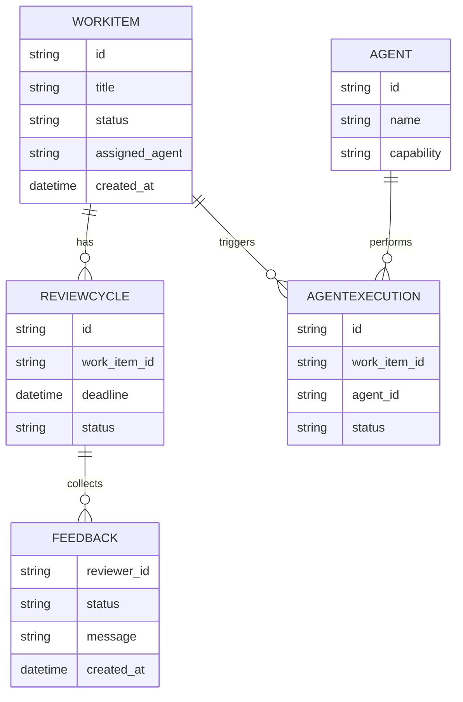
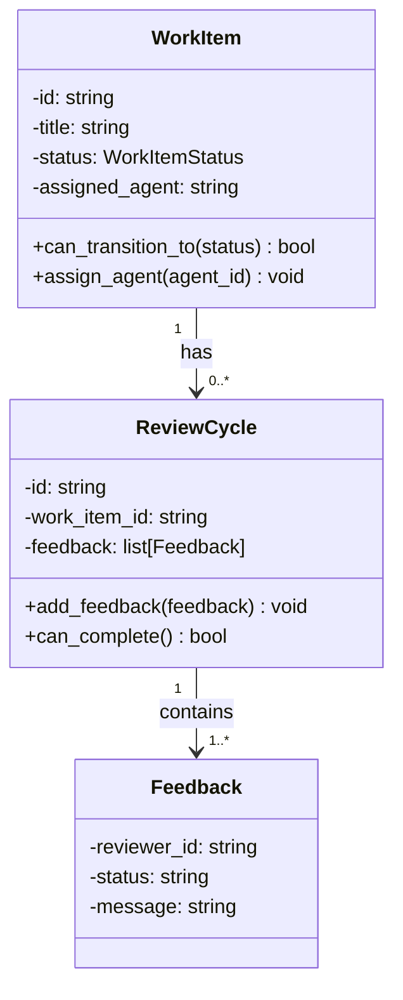

---
required_sections:
  - "## Overview"
  - "## Model Definitions"
  - "## Invariants"
  - "## Events"
  - "## Relationships"
  - "## Examples"
  - "## Diagram"
required_elements:
  - "mermaid"
  - "python code block"
applies_to: "documentation/architecture/domain/*.md"
---

# Domain Documentation Template

Domain documentation describes pure business logic: entities, value objects, aggregates, domain events, and the invariants that enforce business rules. Domain documentation is part of the architecture tier because domain models are technology-agnostic and referenced by all other layers.

## Overview

One or more paragraphs describing:
- What business domain this documentation covers (e.g., "work item management", "code review")
- What concepts are defined
- Why these concepts matter to the business
- How they relate to Codetoreum's overall purpose

Example: "The Work Item domain encompasses the lifecycle of tasks, issues, and features tracked in the system. WorkItem aggregates represent individual units of work, with states managed through transitions. Each transition emits domain events that trigger agent executions and board synchronization. Invariants ensure work items remain in valid states and that transitions respect workflow rules."

Example: "The Review domain models code review cycles where reviewers assess agent-generated changes. ReviewCycle aggregates track review state, collected feedback, and completion criteria. Domain invariants ensure reviews progress through valid state sequences and that decisions are based on sufficient feedback. Review events trigger notifications and merge decisions."

## Model Definitions

Include Python dataclass or ABC definitions for key entities and value objects:

```python
from dataclasses import dataclass, field
from typing import List, Optional
from enum import Enum

class WorkItemStatus(Enum):
    """Enumeration of work item states."""
    OPEN = "open"
    IN_PROGRESS = "in_progress"
    REVIEW = "review"
    DONE = "done"

@dataclass
class WorkItem:
    """A unit of work (issue, task, feature)."""
    id: str
    title: str
    description: str
    status: WorkItemStatus = WorkItemStatus.OPEN
    assigned_agent: Optional[str] = None
    labels: List[str] = field(default_factory=list)
    created_at: datetime = field(default_factory=datetime.utcnow)
    updated_at: datetime = field(default_factory=datetime.utcnow)
    
    def can_transition_to(self, new_status: WorkItemStatus) -> bool:
        """Check if transition is allowed."""
        # Business rule: can only move forward in workflow
        valid_transitions = {
            WorkItemStatus.OPEN: [WorkItemStatus.IN_PROGRESS],
            WorkItemStatus.IN_PROGRESS: [WorkItemStatus.REVIEW, WorkItemStatus.OPEN],
            WorkItemStatus.REVIEW: [WorkItemStatus.DONE, WorkItemStatus.IN_PROGRESS],
            WorkItemStatus.DONE: [],
        }
        return new_status in valid_transitions.get(self.status, [])

@dataclass(frozen=True)
class Feedback:
    """Immutable code review feedback."""
    reviewer_id: str
    status: str  # "approved", "requested_changes", "commented"
    message: str
    created_at: datetime = field(default_factory=datetime.utcnow)
```

Include:
- Class definitions (dataclasses, enums)
- Field names, types, and default values
- Docstrings explaining purpose
- Methods that enforce business logic (with invariants)
- Use `@dataclass(frozen=True)` for immutable value objects

**Pattern**: Use dataclasses for all domain models. Frozen dataclasses for value objects (immutable). Regular dataclasses for entities (mutable by design).

## Invariants

Document the business rules that these models must maintain:

- **WorkItem Invariant 1**: A work item cannot be in DONE state if it's still assigned to an agent
- **WorkItem Invariant 2**: A work item can only transition to valid states according to workflow rules
- **WorkItem Invariant 3**: Once DONE, a work item cannot transition back to earlier states
- **ReviewCycle Invariant 1**: A review cycle must have feedback from at least 2 reviewers before completion
- **ReviewCycle Invariant 2**: A reviewer cannot provide feedback twice (second feedback replaces first)
- **ReviewCycle Invariant 3**: Feedback must be provided within the review deadline

Include:
- What the invariant is (one sentence)
- Why it matters (business rule or constraint)
- How it's enforced (validation method, dataclass field constraint, exception thrown)

Example enforcement:

```python
@dataclass
class ReviewCycle:
    """A code review cycle for agent-generated changes."""
    feedback: List[Feedback] = field(default_factory=list)
    
    def add_feedback(self, feedback: Feedback) -> None:
        """Add or replace feedback from a reviewer."""
        # Invariant: one feedback per reviewer
        existing = next((f for f in self.feedback if f.reviewer_id == feedback.reviewer_id), None)
        if existing:
            self.feedback.remove(existing)
        self.feedback.append(feedback)
    
    def can_complete(self) -> bool:
        """Invariant: at least 2 reviewers must approve."""
        approvals = sum(1 for f in self.feedback if f.status == "approved")
        return approvals >= 2
```

## Events

Document domain events that these models may emit:

- **WorkItemStatusChangedEvent** — Emitted when a work item transitions to a new status. Triggers board reconciliation and agent scheduling.
- **WorkItemAssignedEvent** — Emitted when an agent is assigned to work on a work item. Triggers workspace preparation.
- **ReviewCycleCreatedEvent** — Emitted when a new review cycle begins. Triggers reviewer notifications.
- **ReviewFeedbackReceivedEvent** — Emitted when a reviewer provides feedback. May trigger auto-completion if consensus is reached.
- **ReviewCompletedEvent** — Emitted when review cycle finishes (approved or rejected). Triggers merge or rework.

Include:
- Event class name
- When/why it's emitted (which model method triggers it)
- What subscribers typically react (event handlers)
- Whether the event is emitted exactly once or potentially multiple times

**Pattern**: Events are frozen dataclasses, immutable once created. Every state change that matters to the broader system must emit an event.

## Relationships

Explain how these domain models relate to each other and to other domains:

- **WorkItem → ReviewCycle**: One work item can have multiple review cycles (one per version)
- **ReviewCycle → Feedback**: A review cycle aggregates feedback from multiple reviewers
- **WorkItem → Agent**: An agent is assigned to a work item (1:1 during execution)
- **WorkItem → Board Column**: A work item's position on the board reflects its status

Create a relationships table:

| Model A | Relationship | Model B | Cardinality | Notes |
|---|---|---|---|---|
| WorkItem | has | ReviewCycle | 1:N | One work item can have multiple review cycles |
| ReviewCycle | collects | Feedback | 1:N | One cycle collects feedback from many reviewers |
| WorkItem | assigned to | Agent | N:1 (exclusive) | Only one agent works on a work item at a time |
| WorkItem | maps to | BoardColumn | N:1 | Multiple items can be in same column |
| WorkItem | triggers | AgentExecution | 1:N | One item can trigger multiple agent executions |

Include:
- What models relate
- Type of relationship (composition, association, etc.)
- Cardinality (1:1, 1:N, N:N)
- Any constraints or notes

## Examples

Provide code examples showing how these models are used:

```python
# Example 1: Create a work item
work_item = WorkItem(
    id="GH-123",
    title="Implement user authentication",
    description="Add JWT-based auth to API",
    status=WorkItemStatus.OPEN,
)

# Example 2: Transition work item to in progress
if work_item.can_transition_to(WorkItemStatus.IN_PROGRESS):
    work_item.status = WorkItemStatus.IN_PROGRESS
    # This state change would trigger WorkItemStatusChangedEvent in real code

# Example 3: Create a review cycle
review_cycle = ReviewCycle(
    id="REV-456",
    work_item_id="GH-123",
    deadline=datetime.utcnow() + timedelta(days=1),
)

# Example 4: Add reviewer feedback
feedback = Feedback(
    reviewer_id="reviewer-001",
    status="approved",
    message="Looks good, well tested.",
)
review_cycle.add_feedback(feedback)

# Example 5: Check if review can complete
if review_cycle.can_complete():
    # Emit ReviewCompletedEvent (in application service)
    pass
```

Include:
- Creating instances with valid data
- Calling methods that enforce invariants
- Checking conditions before state changes
- Showing error cases (what happens if invariant is violated)

## Diagram

Include a Mermaid diagram showing domain models and relationships:

**Entity Relationship Diagram**:



**Class Diagram** (if showing inheritance or aggregation):



Keep diagrams focused on relationships and data structure. Don't over-complicate with every field or method.

## Bounded Contexts

If this documentation covers multiple bounded contexts, explain the boundaries:

Example: "The Work Item context manages the lifecycle and status of work items. The Review context manages code review cycles independent of work item status. They communicate through domain events (ReviewCompletedEvent triggers work item status change) rather than direct coupling."

## Cross-References

This template applies to:
- `documentation/architecture/domain/models.md` — Entities and value objects
- `documentation/architecture/domain/events.md` — Domain events and their flow

## Notes for Implementers

- Domain models are pure: no I/O, no external dependencies, no framework coupling
- All mutable state changes happen through domain methods that enforce invariants
- Every significant state change emits a domain event
- Events are frozen (immutable) for audit integrity
- Domain documentation is written before application service documentation (services orchestrate domain models)
- Invariants are enforced at the model boundary, not in application code
