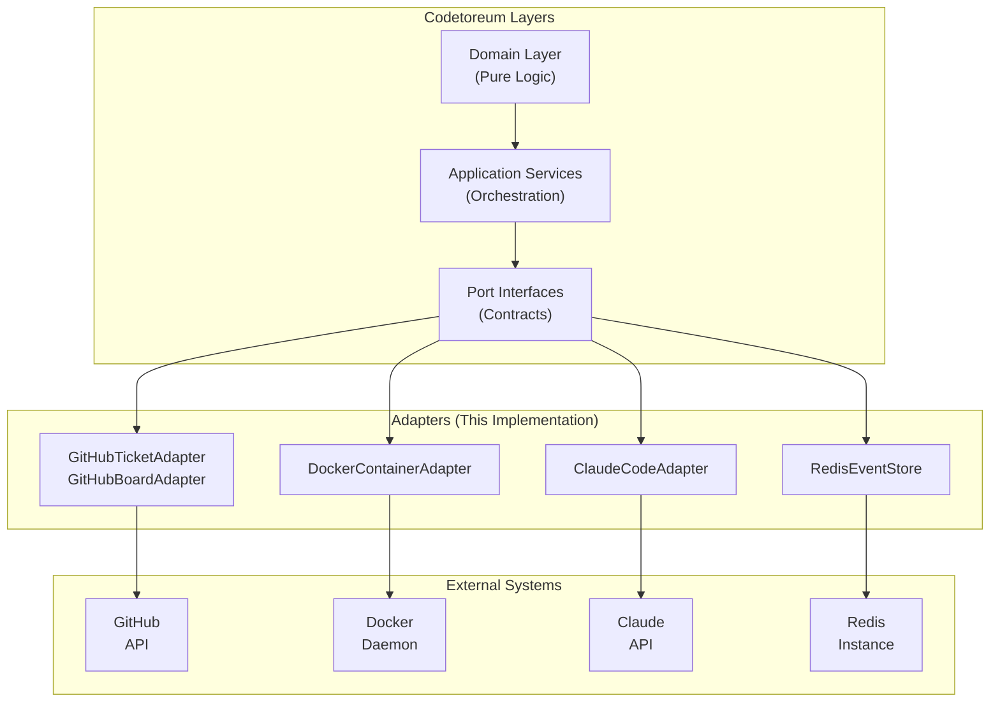
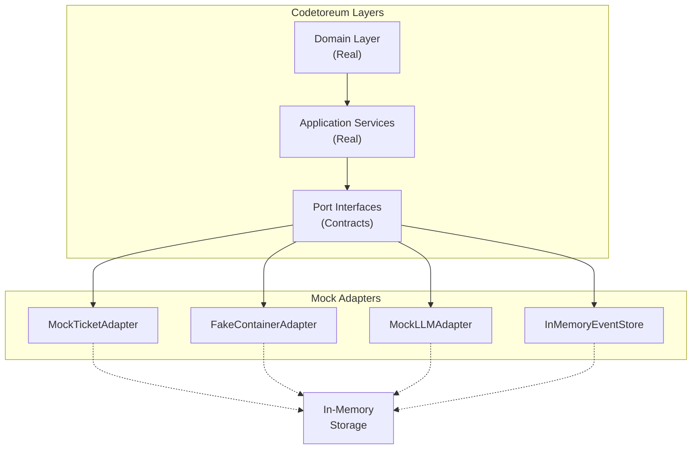

---
required_sections:
  - "## Purpose"
  - "## Architecture"
  - "## Adapter Selections"
  - "## Bootstrap Process"
  - "## Configuration"
  - "## Quick Start"
  - "## Limitations"
  - "## Diagram"
required_elements:
  - "mermaid"
  - "python code block"
applies_to: "documentation/implementations/**/*.md"
---

# Implementation Documentation Template

Implementation documentation describes how a complete, working system is assembled from adapters that fulfill the architecture tier contracts. Each implementation makes specific technology choices and wiring decisions.

## Purpose

One or more paragraphs describing:
- What this implementation demonstrates or enables
- Who uses it (developers, QA, production, etc.)
- What problems it solves
- Key characteristics (speed, fidelity, resource usage, etc.)

Example: "The Simulation Implementation provides a complete, deterministic model of Codetoreum using mock adapters. It enables fast, repeatable testing without external dependencies (GitHub, Docker, Claude). Developers and QA use it for scenario testing and debugging. The simulation is 100x faster than real execution because time can be fast-forwarded."

Example (production): "The Production Implementation connects Codetoreum to real GitHub, Docker, and Claude Code instances. It's deployed on Kubernetes with PostgreSQL persistence, Redis event store, and Prometheus monitoring. It serves live agent orchestration for project teams."

## Architecture

Explain how this implementation fulfills the architecture:

- How it satisfies port contracts
- What layer it implements (simulation = complete all layers with mocks, production = complete all layers with real adapters)
- Key design decisions
- What trade-offs were made

Example: "The Simulation Implementation uses:
- MockTicketAdapter for ITicketSystem (GitHub logic simulated)
- FakeContainerAdapter for IContainer (Docker logic simulated)
- MockLLMAdapter for ILLMProvider (Claude responses mocked)
- InMemoryEventStore for IEventStore (no Redis)
- InMemoryConfigStore for IConfigStore (no database)

This allows tests to run deterministically and 100x faster while exercising all business logic."

## Adapter Selections

Create a table mapping each output port to the adapter(s) used in this implementation:

| Port Interface | Adapter Class | File | Type | Notes |
|---|---|---|---|---|
| `ITicketSystem` | `GitHubTicketAdapter` | `adapters/secondary/github/ticket_adapter.py` | Production | GitHub Issues via GraphQL |
| `IContainer` | `DockerContainerAdapter` | `adapters/secondary/docker/container_adapter.py` | Production | Docker daemon via socket |
| `ILLMProvider` | `ClaudeCodeAdapter` | `adapters/secondary/anthropic/llm_adapter.py` | Production | Claude Code API/CLI |
| `IBoardService` | `GitHubBoardAdapter` | `adapters/secondary/github/board_adapter.py` | Production | GitHub Projects board |
| `IEventStore` | `RedisEventStore` | `adapters/secondary/redis/event_store.py` | Production | Redis with event persistence |
| ... (list all 40+ output ports) | ... | ... | ... | ... |

Include:
- Port interface name
- Adapter class that implements it
- File path relative to repository root
- Type (Production, Secondary, Testing, Mock)
- Brief rationale or notes

If an implementation is partial (doesn't cover all ports yet), mark incomplete entries as "TBD" or "Planned".

## Bootstrap Process

Document how adapters are instantiated and wired together:

```python
async def create_app() -> FastAPI:
    # Phase 1: Read configuration from environment/database
    config = await load_configuration()
    
    # Phase 2: Instantiate output port adapters
    ticket_adapter = GitHubTicketAdapter(token=config.github_token)
    container_adapter = DockerContainerAdapter(host=config.docker_host)
    llm_adapter = ClaudeCodeAdapter(api_key=config.claude_api_key)
    
    # Phase 3: Wire adapters through resilience decorators
    resilient_board = ResilientBoardServiceDecorator(
        GitHubBoardAdapter(token=config.github_token),
        timeout=30.0,
        retry_count=3,
    )
    
    # Phase 4: Create application services
    workflow_orchestrator = WorkflowOrchestrator(
        ticket_system=ticket_adapter,
        board_service=resilient_board,
        container=container_adapter,
        # ... more dependencies ...
    )
    
    # Phase 5: Create event bus and wire handlers
    event_bus = EventBus()
    event_bus.subscribe(WorkflowStartedEvent, WorkflowEventHandler(workflow_orchestrator))
    event_bus.subscribe(ReviewStatusChangedEvent, ReviewEventHandler(...))
    
    # Phase 6: Create FastAPI app and mount routes
    app = FastAPI()
    app.include_router(work_item_routes)
    app.include_router(workflow_routes)
    
    return app
```

If bootstrap is complex, describe it in phases:

1. **Configuration Phase**: Load environment, database, secrets
2. **Adapter Instantiation**: Create each output port adapter
3. **Resilience Wrapping**: Apply circuit breakers, rate limits
4. **Service Creation**: Instantiate application services
5. **Event Bus Wiring**: Connect events to handlers
6. **Route Mounting**: Expose input ports via HTTP

## Configuration

Document how this implementation is configured:

**Environment Variables**:
```bash
GITHUB_TOKEN=ghp_xxxxx                 # GitHub API token
GITHUB_ORG=my-org                      # GitHub organization
DOCKER_HOST=unix:///var/run/docker.sock # Docker daemon socket
CLAUDE_API_KEY=sk_xxxxx                # Claude API key (or use Claude Code)
REDIS_URL=redis://localhost:6379       # Redis event store
DATABASE_URL=postgresql://...          # PostgreSQL for configuration
SIMULATION_SPEED_MULTIPLIER=100        # For simulation only
```

**Configuration Files**:
- `config/production.yaml` — Production settings
- `.env.example` — Environment variable template
- `docker-compose.yml` — Service dependencies

**Startup Checklist**:
- [ ] All required environment variables are set
- [ ] External services (GitHub, Docker, Redis, PostgreSQL) are accessible
- [ ] Credentials have appropriate permissions
- [ ] Port mappings are correct
- [ ] Storage directories exist and are writable

Include links to upstream documentation (GitHub API docs, Docker documentation, etc.) for each external service.

## Quick Start

Provide step-by-step instructions to get this implementation running:

**Production Implementation**:
```bash
# 1. Clone repository
git clone https://github.com/your-org/codetoreum.git
cd codetoreum

# 2. Set up environment
cp .env.example .env
# Edit .env with your credentials

# 3. Start dependencies
docker-compose up -d

# 4. Install Python dependencies
poetry install

# 5. Run database migrations
poetry run alembic upgrade head

# 6. Start the application
poetry run uvicorn src.codetoreum.adapters.primary.fastapi_app:app --reload
```

**Simulation Implementation**:
```bash
# 1. Clone repository
git clone https://github.com/your-org/codetoreum.git
cd codetoreum

# 2. Install Python dependencies
poetry install

# 3. Run a simulation scenario
poetry run python -m src.codetoreum.cli.simulation_cli scenarios/demo.yaml

# 4. Run all simulation tests
poetry run pytest tests/simulation/ -v
```

Include:
- Prerequisites (Python version, Docker, etc.)
- Installation steps
- Running the implementation
- Verifying it works

## Limitations

Clearly document what this implementation does **not** support:

**Simulation Limitations**:
- No real GitHub interactions (simulated)
- No real container execution (mocked)
- No real Claude API calls (mocked responses)
- Time is controlled (not real-time)
- No persistence across restarts (in-memory)

**Production Limitations** (if any):
- Requires GitHub organization (no Jira support yet)
- Requires Docker daemon (no Kubernetes support yet)
- Single node only (no horizontal scaling)
- PostgreSQL database required (no MongoDB support)

This section is important for **setting expectations**. Be explicit about what users should not try to do with this implementation.

## Diagram

Include a Mermaid diagram showing:
- Key adapters and their interactions
- External systems (if production)
- Information flows



For simulation, show the all-mock structure:



## Cross-References

This template applies to:
- `documentation/implementations/simulation/overview.md`
- `documentation/implementations/production/overview.md` (when created)
- Any future implementation documentation

## Verifying Implementation Completeness

To verify this implementation covers all ports:

```python
from src.codetoreum.ports.output import *

# Verify each port has an adapter
assert hasattr(bootstrap, 'ticket_adapter')  # ITicketSystem
assert hasattr(bootstrap, 'board_adapter')   # IBoardService
# ... one check per port ...
```

## Notes

- Implementation documentation is typically created after all architecture tier documentation
- Implementations are concrete — they must actually work, not be hypothetical
- Each implementation can emphasize different priorities (speed, fidelity, ease of development, etc.)
- New implementations can reuse existing adapters or create new ones
