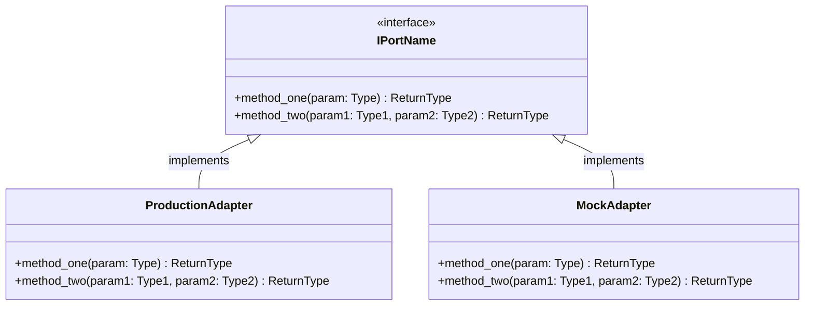

---
required_sections:
  - "## Purpose"
  - "## Interface Definition"
  - "## Methods"
  - "## Events Emitted"
  - "## Error Contracts"
  - "## Adapter Implementations"
  - "## Diagram"
required_elements:
  - "mermaid"
  - "python code block"
applies_to: "documentation/architecture/ports/**/*.md"
---

# Port Documentation Template

Port documentation files contain one or more port interface definitions, organized by functional domain.

## Purpose

One or more paragraphs describing:
- What responsibility this port represents
- What architectural boundary it defines
- What external system or service this port abstracts
- Why this port exists as a separate interface

Example: "ITicketSystem is the vendor-agnostic abstraction over issue tracking systems. It hides the difference between GitHub Issues, Jira, Linear, and other platforms, allowing Codetoreum to support multiple ticket systems through adapter substitution."

## Interface Definition

Show the complete Python ABC definition with full type signatures:

```python
from abc import ABC, abstractmethod
from typing import List, Optional

class IPortName(ABC):
    """One-line description of the port's responsibility."""

    @abstractmethod
    async def method_one(self, param: Type) -> ReturnType:
        """Method description."""
        pass

    @abstractmethod
    async def method_two(self, param1: Type1, param2: Type2) -> ReturnType:
        """Method description."""
        pass
```

Include all abstract methods visible in the actual port interface. Type hints are required for clarity.

## Methods

Create a table documenting all methods:

| Method | Parameters | Return Type | Description |
|---|---|---|---|
| `method_one()` | `param: Type` | `ReturnType` | What this method does |
| `method_two()` | `param1: Type1, param2: Type2` | `ReturnType` | What this method does |

Include:
- Method name (with parentheses for clarity)
- Parameter list (types abbreviated if in interface definition above)
- Return type
- One-sentence description of what the method does

## Events Emitted

List domain events that calling this port's methods may trigger:

- **EventName** — When/why it's emitted, link to domain event documentation
- **OtherEventName** — When/why it's emitted, link to domain event documentation

If this port never emits events (e.g., it's purely informational), state "This port does not emit domain events."

## Error Contracts

Document expected exceptions and error scenarios:

- **PortError** — Base exception for all port errors
- **NotFoundError** — When requested resource doesn't exist
- **AlreadyExistsError** — When creation conflicts with existing resource
- **TimeoutError** — When external system doesn't respond within timeout
- **ValidationError** — When input doesn't meet constraints

Include:
- Exception type
- Condition that triggers it
- What the caller should do to handle it

## Adapter Implementations

Create a table listing all known adapters that implement this port:

| Adapter Class | Type | File Path | Notes |
|---|---|---|---|
| `MockBoardAdapter` | Testing | `adapters/testing/board/mock_board_adapter.py` | In-memory implementation for simulation |
| `GitHubBoardAdapter` | Production | `adapters/secondary/github/board_adapter.py` | Uses GitHub GraphQL API |

Include:
- Adapter class name
- Implementation type (Production, Secondary, Testing, Mock)
- Source file path relative to repository root
- Brief description of how this adapter fulfills the port contract

If no adapters exist yet, state "No adapter implementations yet" and note that Phase 3 will add them.

## Diagram

Include a Mermaid classDiagram showing:
- The port interface (abstract class with methods)
- All implementation classes listed in the Adapter Implementations section
- Relationships between port and implementations



Keep diagrams readable — if more than 5-6 implementations, consider grouping by type (production, testing) or splitting across multiple diagrams.

## Cross-References

This template applies to all port documentation files:
- `documentation/architecture/ports/input/agent-management.md`
- `documentation/architecture/ports/input/work-item-management.md`
- ... (and all other port group documentation files)

## Notes

- Port documentation is typically written as part of Phase 4 (Architecture Tier - Port Contracts)
- Each port group file documents 3-8 related port interfaces
- Port content is decomposed across the 7 port group files by functional domain
- Adapters are discovered via code introspection in `src/codetoreum/adapters/`
