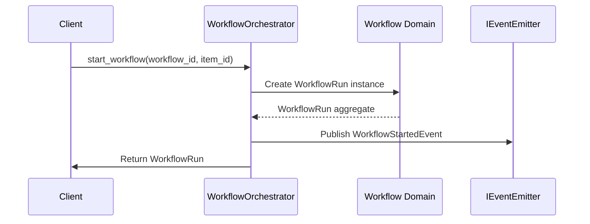
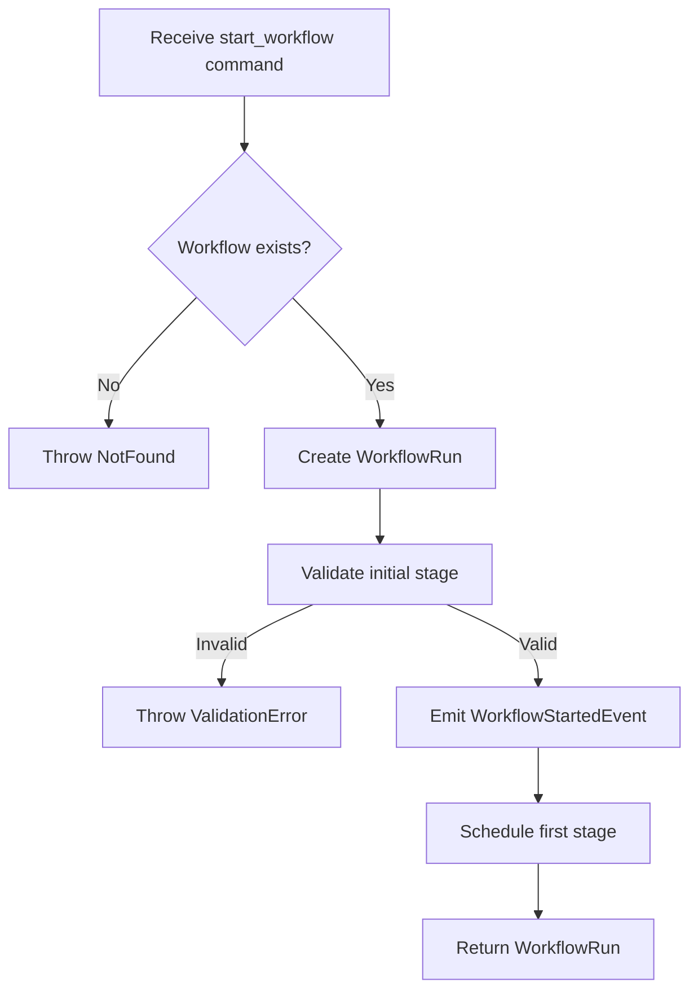

---
required_sections:
  - "## Responsibility"
  - "## Dependencies"
  - "## Key Methods"
  - "## Events Emitted"
  - "## Error Handling"
  - "## Workflow"
  - "## Source"
required_elements:
  - "mermaid"
  - "python code block"
applies_to: "documentation/architecture/application-services/*.md"
---

# Service Documentation Template

Application service documentation describes orchestration logic that coordinates between domain models, external systems (via ports), and domain events.

## Responsibility

One or more paragraphs describing:
- What use case this service implements
- What problem it solves
- What domain objects it operates on
- How it transforms state from input to output

Example: "WorkflowOrchestrator manages the lifecycle of workflow executions. It receives workflow start commands, creates execution instances, manages stage transitions, schedules agent executions, and emits domain events to track progress. It is the primary coordinator between client commands and domain models."

Example: "ReviewService manages code review cycles. It receives review start commands, creates ReviewCycle aggregates, collects feedback from reviewers, determines completion criteria, and coordinates merge decisions. It coordinates between the domain review model and the ICodeReviewService port for external review system interactions."

## Dependencies

List what this service depends on:

**Port Dependencies**:
- `ITicketSystem` — Fetch and update issue details
- `ICodeReviewService` — Manage PR review state
- `IEventEmitter` — Publish domain events

**Domain Dependencies**:
- `WorkItem` aggregate
- `ReviewCycle` aggregate
- `ReviewFeedback` value object

**Service Dependencies** (if any):
- `AgentScheduler` — Queue agent executions
- `WorkspaceRouter` — Prepare container contexts

Include:
- Port interfaces the service uses
- Domain aggregates and value objects
- Other application services it orchestrates with

Example: "WorkflowOrchestrator depends on IBoardService (to sync board state), IWorkItemService (to update work items), IEventEmitter (to publish events), and the domain aggregates Workflow, WorkItem, and Agent. It uses AgentScheduler to queue executions and WorkspaceRouter to prepare contexts."

## Key Methods

Document the service's public methods:

```python
class WorkflowOrchestrator:
    async def start_workflow(
        self,
        workflow_id: str,
        work_item_id: str,
        context: ExecutionContext,
    ) -> WorkflowRun:
        """Start a new workflow execution."""
        pass

    async def advance_stage(
        self,
        run_id: str,
        next_stage_id: str,
    ) -> WorkflowRun:
        """Transition workflow to the next stage."""
        pass

    async def complete_workflow(
        self,
        run_id: str,
        result: WorkflowResult,
    ) -> WorkflowRun:
        """Mark workflow as complete."""
        pass
```

Include:
- Method signatures with type hints
- Async nature (all service methods are async)
- Parameters and return types (using domain types)
- Brief description of what the method does

| Method | Input | Output | Purpose |
|---|---|---|---|
| `start_workflow()` | `workflow_id`, `work_item_id`, `context` | `WorkflowRun` | Initiate a new workflow execution |
| `advance_stage()` | `run_id`, `next_stage_id` | `WorkflowRun` | Transition to next stage |
| `complete_workflow()` | `run_id`, `result` | `WorkflowRun` | Mark workflow as complete |

## Events Emitted

List all domain events this service publishes:

- **WorkflowStartedEvent** — When a new workflow execution begins. Subscribers: WorkflowEventHandler, BoardEventHandler
- **StageTransitionedEvent** — When workflow transitions to a new stage. Subscribers: WorkflowEventHandler
- **WorkflowCompletedEvent** — When workflow finishes (success or failure). Subscribers: BoardEventHandler, NotificationHandler

Include:
- Event class name
- When/why it's emitted
- What subscribers typically react
- Invariants the event maintains (e.g., "emitted exactly once per workflow")

Principle: **Every state change must emit a domain event.** If a method modifies state, it must emit at least one event.

## Error Handling

Document error scenarios and recovery:

- **WorkflowNotFound**: What if the workflow doesn't exist? Throw error or create? How does caller handle?
- **StageNotFound**: What if the specified next stage doesn't exist? Validation error?
- **InvalidTransition**: What if the stage transition violates workflow rules? BusinessRuleViolation error?
- **Downstream Failure**: What if a dependent service (e.g., AgentScheduler) fails? Retry? Fail workflow?

Example: "WorkflowOrchestrator validates all inputs before making changes. If a stage transition violates workflow rules (e.g., trying to go backwards), it throws WorkflowError. If AgentScheduler fails to queue an execution, the orchestrator emits WorkflowFailedEvent and leaves the workflow in a recoverable state so the user can retry."

## Workflow

Include a Mermaid sequence diagram or flowchart showing a typical operation:



Or a flowchart for complex logic:



Keep diagrams focused on the service's core workflow. For complex orchestration, consider multiple diagrams.

## Source

File path and class information:

**File Path**: `src/codetoreum/application/workflow_orchestrator.py`

**Class**: `class WorkflowOrchestrator:`

**Related Files**:
- Domain: `src/codetoreum/domain/models/workflow.py`
- Events: `src/codetoreum/domain/events/workflow_events.py`
- Tests: `tests/integration/application/test_workflow_orchestrator.py`
- Event Handler: `src/codetoreum/application/event_handlers/workflow_event_handler.py`

## Cross-References

This template applies to:
- `documentation/architecture/application-services/services.md`
- Individual service documentation files (if created)

## Integration with Event Handlers

When an application service emits a domain event, event handlers typically subscribe and react:

Service: Emits `ReviewCycleStartedEvent`
Handler: `ReviewEventHandler` receives event, updates review state, may trigger notifications

This reactive pattern decouples the service from downstream effects while maintaining consistency through the event log.

## Notes

- Application services are documented in Phase 5
- Each service orchestrates one or more domain aggregates
- Services are tested via integration tests with mock adapters
- Services emit events for all state changes, enabling event sourcing and audit trails
