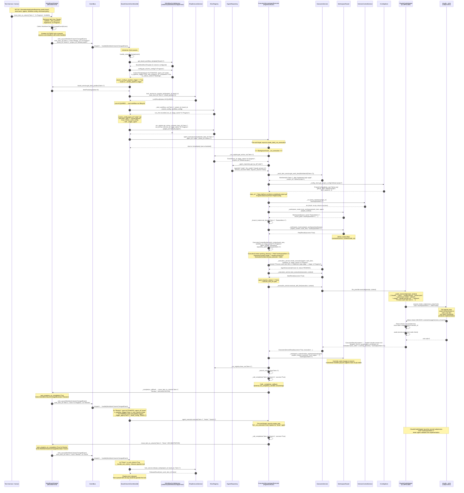

# Smoke Scenario — Execution Call Chain

## What This Scenario Tests

The smoke scenario is the baseline validation for the board automation engine.
It exercises a two-agent pipeline — `coder` then `tester` — triggered by moving
a work item to the `In Progress` column on a five-column board:

```
Backlog → Ready → In Progress* → Review → Done
                  (coder)        (tester)
```

`In Progress` is the pipeline trigger column. Moving a work item there acquires
the pipeline lock, fires the coder agent, auto-progresses the item to `Review`,
fires the tester agent, and auto-progresses to `Done` — all without human
intervention. If this scenario fails, no other scenario is worth running.

**Simulation parameters:**
- Speed multiplier: 100×
- 3 work items seeded in `Backlog`
- Board: `board-1`
- Project: `default-project`
- Agents: `coder` (claude-sonnet-4-6), `tester` (claude-sonnet-4-6)

---

## Mermaid Sequence Diagram



---

## Key Data Flowing Through Each Step

| Step | Data |
|------|------|
| Trigger | `work_item_id="item-1"`, `from_column="Ready"`, `to_column="In Progress"`, `board_id="board-1"`, `project_id="default-project"` |
| Lock acquisition | `board_position=0` (item's position in column) |
| Run registry | `run_id`, `stage_name="In Progress"`, `project_id="default-project"` |
| Project config lookup | `project_id="default-project"` → `github_org="demo-org"`, `github_repo="default-project"` |
| Repo clone path | `/workspace/item-1` |
| ExecutionContext | `working_directory=Path("/workspace/item-1")`, `model="claude-sonnet-4-6"`, `timeout_seconds=3600` |
| Claude CLI command | `["claude", "--print", "--output-format", "stream-json", "--permission-mode", "default", "--model", "claude-sonnet-4-6", "--verbose", "<prompt>"]` |
| Completion callback | `success=True` → `move_item_to_column("item-1", "Review", ORCHESTRATOR)` |
| Second agent | `agent_id="tester"` — same full chain, same working directory |
| Exit column | `to="Done"` → lock released |

---

## Known Gaps

**GAP 1: `AgentScheduler` queue consumer for QUEUED items**
The `AgentScheduler` is wired and consumes `WorkItemColumnChangedEvent` via
`WorkflowOrchestrator`, but the queue-dequeue path when a lock comes back as
`LockStatus.QUEUED` is not yet covered by simulation tests. When multiple items
move to the pipeline trigger column concurrently, the second item is queued; the
consumer that grants the lock and retriggers execution after the first item exits
has not been exercised end-to-end. In this scenario only one item is in the
trigger column at a time, so this gap does not affect smoke test outcomes.

> **Note on double-dispatch in tests:** Both `BoardColumnEventHandler` (BCEH) and
> `WorkflowOrchestrator` subscribe to `WorkItemColumnChangedEvent`. BCEH calls
> `execute()` directly; WO enqueues to `AgentScheduler` → `execute()`. In
> simulation fixtures the `AgentScheduler` is stopped after seeding so that only
> BCEH's direct execution path runs. In production the AgentScheduler's deferred
> call arrives after BCEH has already cleared the run registry, logs "No active
> run found", and silently no-ops — correct behaviour but noisy.

**GAP 2: GitHub board column → `board_id` mapping in webhook adapter**
`GitHubWebhookAdapter._map_column_to_stage()` contains a documented `TODO #370`:
it cannot reliably map GitHub project column IDs to internal board IDs. In
simulation, the trigger is issued directly via `MockBoardAdapter.move_item_to_column()`
and emits `WorkItemColumnChangedEvent` with the correct `board_id`. In
production, this mapping must be resolved before the board automation cascade
fires.
